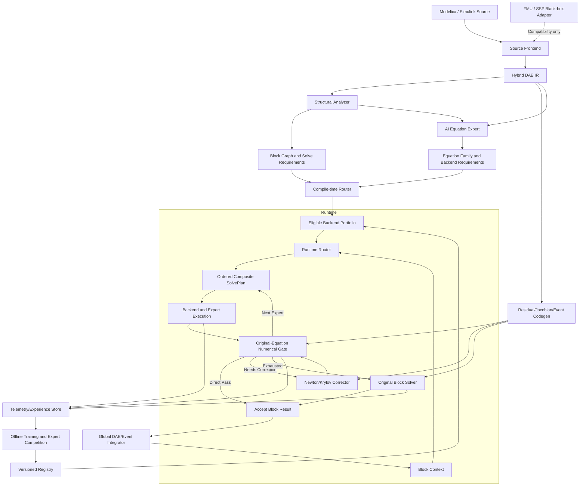
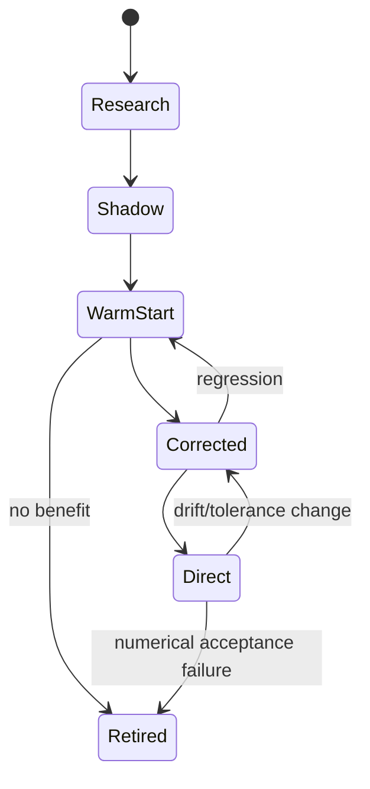

# SMAVE AI Solver 设计规范

## 1. 文档目的

本文档是 SMAVE AI Solver 的主设计规范，整合近年 AI 方程求解、PINN、神经预条件器、learned multigrid、神经算子、PDE foundation model、传统 DAE 编译与数值求解技术，定义可实施、可验证、可回退的 Equation-MoE 神经求解系统。

研究证据、论文加速口径和详细笔记保存在 [`kb/`](kb/)；本文档负责给出统一系统边界、模块职责、接口、不变量、运行流程和验收标准。若知识库中的探索性建议与本文档冲突，以本文档为准，直到形成新的架构决策并同步修订本文档。

## 2. 目标与非目标

### 2.1 总体目标

对可获取源方程语义的 Modelica/Simulink 模型，尤其是由多物理域、多时间尺度、稀疏/稠密子结构、连续/离散事件和不同数值性质共同组成的大型复杂方程组：

1. 提取统一 Hybrid DAE IR，保留原方程、事件、约束和原求解计划；
2. 将大型方程组分解为可独立分析、组合求解和局部回退的 BLT/SCC/子系统方程块；
3. 建立“AI 方程专家”，根据结构、数值状态、历史证据、成本和硬件，判定每个方程块可使用哪些求解后端以及如何组合；
4. 把符号化简、直接法、Newton/Krylov、稀疏预条件器、AMG、专用物理求解器、AI warm-start、学习预条件器、learned multigrid、神经算子和未来加速后端统一纳入 Expert ABI；
5. 由两级 Router 生成带顺序、预算、校正器、gate 和 terminal fallback 的可执行 SolvePlan，而不是只选择单一模型；
6. 对每个 AI 或近似候选使用由原方程重新计算的 residual、约束、分支和误差 gate 验收；
7. 候选路径失败时继续下一个后端或回退原 block solver，不破坏原模型求解能力；
8. 通过持续积累方程家族、后端性能画像和专家证据，使相似新模型能够更快获得可靠加速；
9. 在满足准入条件的方程块和运行域内，实现指定精度、成功率和端到端加速目标；
10. 通过 correction-budget sweep 解释 candidate、corrector、原方程 gate 和数值续接
    的完整成本耦合与 break-even；
11. 在 family、conditioning、规模、拓扑、容差和硬件 shift 下校准成本与接受概率，
    报告 complete-cost regret，并在 learned routing 前执行 OOD 结构硬过滤；
12. 在相同数值合同和完整计时边界下对比强外部 hybrid solver/preconditioner，并取得
    provider-controlled 原生 x86-64 与原生 CUDA 离散 GPU 证据；
13. 扩展大规模稀疏、非线性、ODE/DAE 和 operator workload，同时验证完整路径并行、
    batch 摊销和异构 placement。

### 2.2 指标适用边界

项目区分两类承诺：

**通用数值验收承诺**：对任何可成功编译并可由原工具求解的模型，系统必须能够保留或重建原求解路径；AI 不适用、Router 不确定或 gate 失败时，允许退化为纯经典求解。

**条件加速承诺**：只有通过 AI 加速准入的 `方程家族 × 运行域 × 容差 × 硬件 × 专家版本` 才适用下列目标：

- `REQ-ACC-001`：指定 QoI 的混合绝对/相对误差不超过 `0.01% = 10^-4`；
- `REQ-SUC-001`：Top-k AI/混合专家在进入完整原 block solver fallback 前的调用级通过率 `>95%`；
- `REQ-GATE-001`：错误接受率必须达到项目定义的近零门槛，首版要求在与训练和调参样本不重叠的验收集上为 `0` 次错误接受，并报告统计置信上界；
- `REQ-PERF-001`：同硬件、同精度、计入路由/gate/传输/fallback 后，端到端墙钟优于调优后的最佳经典基线；
- `REQ-FALL-001`：任何 AI 失败不得阻止原 block solver 被调用，也不得静默放宽原收敛条件；
- `REQ-SCALE-001`：必须在至少一个真实稀疏大型方程族上报告规模、内存、setup、迭代、P99 和端到端扩展曲线，不能以小型 fixture 或 FMU 数量代替规模证据；
- `REQ-PLAN-001`：必须证明方程专家可在结构不同的方程族间选择或组合至少两类经典后端与一类 AI/加速后端，并保留可审计的选择依据和 terminal fallback。
- `REQ-CORR-001`：每个纳入主张的 correctable expert 必须执行至少四类有序
  correction budget，并报告接受率、校正收敛、续接概率、完整成本和 break-even；
- `REQ-COST-001`：完整成本必须独立记录 candidate/inference、queue/transfer、
  corrector、gate、后续数值路径、terminal fallback 和总墙钟，并用 reach probability
  重构期望成本；
- `REQ-SHIFT-001`：Router 必须在 family、conditioning、规模、拓扑以及适用的
  tolerance/hardware shift 上报告成本/通过率 calibration、尾部误差和 complete-cost
  regret；
- `REQ-OOD-STRUCT-001`：结构不兼容、未验证拓扑、域外规模/条件或未知硬件必须在
  learned route 获得权限前被硬过滤；embedding、uncertainty 或 Router 分数不能绕过；
- `REQ-EXT-BASE-001`：至少一个固定 revision 的强外部 hybrid learned-solver、
  learned-preconditioner 或算法选择方法必须在同输入、同精度、同 gate、同失败协议和
  完整成本边界下比较；
- `REQ-NATIVE-X86-001`：原生 x86-64 性能主张必须来自 provider-controlled 主机、
  成功 workflow、完整 commit/job/machine provenance、原始样本、hash 和 attestation；
- `REQ-NATIVE-CUDA-001`：CUDA 性能主张必须来自原生离散 GPU 执行，计入冷/热 setup、
  transfer、residency、queue、candidate、corrector、gate 和 fallback；仿真、远程非原生
  执行或纯 kernel benchmark 不满足要求；
- `REQ-WORKLOAD-001`：大规模稀疏、非线性、ODE/DAE 和 operator 四类 workload
  必须各有独立、可重放、跨规模或跨难度证据；
- `REQ-FULLPATH-PAR-001`：并行证据必须分别报告 candidate、corrector、verification
  和数值续接，并在资源对称条件下同时给出 gate-only 与 full-path scaling；
- `REQ-BATCH-001`：batch 证据必须覆盖 batch size、等待、冷/热、组装、传输、推理、
  corrector、gate、fallback、amortization 和 break-even；
- `REQ-PLACEMENT-001`：异构 placement 必须按 workload、artifact、shape、dtype、
  residency 和完整路径成本授权；设备失败后必须从原始请求状态继续经典路径。

`>95%` 不指第一神经专家命中率，也不指整条轨迹完全无 fallback；统计单位必须明确为 block invocation、time step、trajectory 或 job。

### 2.3 非目标

- 不以部署、运维或服务可用性等非求解器基础设施扩展研究边界；项目里程碑与论文
  评分只由求解算法、数值正确性、路由质量、完整路径性能、求解器内部并行和异构
  计算证据决定；
- 本文档中的 `gate` 仅表示原方程 residual、约束、分支或离散缺陷的数值验收，
  `fallback` 仅表示当前候选失败后继续下一条数值求解路径；
- 不承诺任意复杂模型都存在满足 `0.01%`、`>95%` 且显著加速的 AI 解；
- 不以 FMU 黑盒替代源方程知识；FMI 仅用于兼容、部署和差分测试；
- 不把 FMI/SSP master、模型封装协议或跨 FMU 调度作为 Equation-MoE 的核心求解路线；除非直接服务于黑盒兼容或验证，不继续以协议覆盖率代替大型方程组求解能力；
- 不通过枚举参数、初值和输入函数空间建立正确性主张；
- 不把低 PINN training loss、低监督 MSE 或 Router 高置信度当作运行时证书；
- 不允许未经验证的在线学习改变当前版本的数值验收行为；
- 不要求所有专家都是神经网络，经典方法始终属于专家池；
- 不把跨平台动态库、稳定 C ABI、安装后宿主、服务部署或协议覆盖率作为研究目标；
  这些接口只维护调用兼容性和实验复现，并必须复用同一数值路径。

### 2.4 当前 P0 关闭合同

README 的四项最高优先级是合取关系，不能以其中一项的局部正结果替代另一项：

| P0 | 规范需求 | 必须同时具备的关闭证据 |
|---|---|---|
| `D-P0-1` correction-budget 与完整成本 | `REQ-CORR-001`、`REQ-COST-001` | budget sweep、分项成本、reach-weighted 重构、break-even、配对区间、负结果 |
| `D-P0-2` distribution shift 与 OOD | `REQ-SHIFT-001`、`REQ-OOD-STRUCT-001` | shift matrix、calibration、complete-cost regret、结构过滤 coverage/误拒/危险放行 |
| `D-P0-3` 外部基线与原生硬件 | `REQ-EXT-BASE-001`、`REQ-NATIVE-X86-001`、`REQ-NATIVE-CUDA-001` | 强外部方法、provider-hosted x86-64、native CUDA 完整路径及 provenance |
| `D-P0-4` workload、并行、batch、placement | `REQ-WORKLOAD-001`、`REQ-FULLPATH-PAR-001`、`REQ-BATCH-001`、`REQ-PLACEMENT-001` | 四类 workload、资源对称 scaling、batch break-even、CPU/CUDA placement |

任一证据缺失时，对应 P0 保持开放。Apple Metal/ANE、ARM64、本地 dry-run、单一小型
Poisson、纯 gate kernel 或纯设备 kernel 都不能替代其未覆盖的关闭证据。

## 3. 核心设计原则

1. **源方程是真值来源**：训练、验证和 fallback 均以原方程 IR 为准。
2. **AI 加速求解过程，不取代正确性定义**：优先学习初值、预条件器、误差传播和高复用算子。
3. **局部替换、局部验证、局部回退**：fallback 粒度为最小可独立重求解的 block/SCC。
4. **结构路由先于神经路由**：编译器能确定的问题不交给 learned Router 猜测。
5. **组合专家优于单模型崇拜**：同一求解路径可以串联 foundation encoder、PINN 初值、Newton、GNP/UGrid 和经典 solver。
6. **高倍加速必须解释口径**：区分完整场/QoI、CPU/GPU、在线/离线、单次/摊销和 residual/解误差。
7. **先低风险后高权限**：Research → Shadow → Warm-start → Corrected → Direct。
8. **原方程定义数值验收**：训练目标不能充当 runtime gate；原方程验收表达式需单独生成并做 golden test。
9. **性能按端到端评估**：包括 setup、Router、batch、Tensor inference、gate、corrector、fallback 和数据传输。
10. **版本化可回滚**：IR、Router、专家、归一化、验证域和运行时必须作为兼容版本集合发布。
11. **C++ 单一实现语言**：项目自有的编译前端、IR、Router、专家适配、训练控制、验证器、runtime、CLI 与测试统一使用 C++20；不引入 Python 实现、Python 运行时或 Python 构建步骤。第三方模型可通过稳定的 ONNX/TensorRT 等二进制接口接入，但不得使 Python 成为构建、验证或部署依赖。
12. **嵌入接口与内部实现隔离**：跨软件边界只暴露稳定 C ABI、固定宽度标量、opaque handle 和显式所有权；不得暴露 STL、异常、RTTI、内部类布局或编译器相关名称修饰。

### 3.1 实现语言与工具链

- 语言标准：C++20；公共 ABI 使用显式版本和稳定的数据契约；
- 构建系统：CMake，测试通过 CTest 注册；
- 首版仅依赖 C++ 标准库，新增数值、图编译或 Tensor 依赖必须证明必要性并固定版本；
- 训练与离线工具同样由 C++ CLI 驱动；若调用第三方训练引擎，只能通过 C/C++ API、独立进程协议或不可变 artifact 交换；
- CPU、GPU/NPU 与 runtime gate 共享类型和容差契约，gate 默认使用 `double` 或原求解器同等精度；
- 所有示例、golden test 和一键复现实验必须在不安装 Python 的环境中完成。

## 4. 研究成果的统一利用方式

| 研究方向 | 项目中的职责 | 默认权限 | 不直接承担 |
|---|---|---|---|
| OpenModelica/DAE 编译 | flattening、index reduction、BLT/SCC、residual/Jacobian | 权威基础层 | AI 预测 |
| PDEformer/PROSE/Poseidon | 方程图 embedding、家族检索、专家初始化 | Router/Initializer | 最终正确性 |
| PINN/物理约束学习 | 无标签 residual、约束损失、局部候选和 warm-start | Warm-start/Corrected | 全模型证明 |
| CEGIS/主动学习 | residual 最大化、困难域和事件边界反例 | 离线训练 | 在线直接放宽域 |
| NeuralPCG/GNP | 学习稀疏预条件器或其作用 | Corrected | 绕过 Krylov residual |
| UGrid/learned iterator | 学习 smoother/coarse correction/误差传播 | Corrected | 任意非线性 DAE 直接求解 |
| FNO/Geo-FNO/GINO | 固定方程族的摊销场/QoI 专家 | Candidate/Corrected | 默认 `0.01%` Direct |
| Newton/Krylov/IDA/KINSOL | 非线性、DAE 和线性收敛控制 | 权威校正/fallback | 跨实例学习 |
| ILU/AMG/稀疏直接法 | 稳健经典专家 | 常驻 fallback | 学习复用 |
| 区间/SMT/可达性 | verified cell、误差和属性证书 | E4 子域 | 大规模默认路径 |

高加速比神经算子与高可信学习型迭代器分别进入不同权限层。论文报告值只用于候选技术排序，不能自动继承为本项目性能承诺。

## 5. 总体架构



### 5.1 控制面与数据面

**控制面**负责模型编译、专家训练、竞赛、验证域、证据晋级、registry、发布和回滚。

**数据面**负责低延迟 Router、Tensor batch、专家执行、runtime gate、corrector、fallback 和 telemetry。数据面不在线更新权重。

### 5.2 系统主线与 FMI 边界

系统主线是“源方程理解 → 大型方程组结构分解 → AI 方程专家判型 → 多后端组合求解 → 原方程在线验收 → 局部 fallback”，而不是构建通用 FMI master。

AI 方程专家不直接输出数值解。它输出可审计的 `EquationAssessment`：

- 方程块类别：线性/非线性、显式/隐式、ODE/DAE、稀疏性、对称性、正定性、刚性、事件/非光滑性和多速率属性；
- 规模与代价：未知量数、非零元、带宽、填充风险、Jacobian 复用周期、预计调用次数、内存和数据搬运成本；
- 可用后端集合：结构证明可用的经典后端、证据覆盖的 AI 后端、专用物理后端和必须保留的原 solver；
- 组合关系：initializer、preconditioner、iterator、direct candidate、corrector、validator 和 fallback 的合法顺序；
- 风险与证据：适用域、OOD 风险、事件邻近度、容差、硬件、专家版本和证据等级。

FMI/SSP 位于边界适配层，仅承担：

1. 无源方程时的 `blackbox-degraded` 兼容；
2. 与外部仿真工具交换模型或部署已验证组件；
3. 生成轨迹用于差分测试、回归和数据采集；
4. 在明确需要时验证有限的生命周期与通信语义。

FMI 黑盒不能进入 Direct 方程专家权限，不能提供方程级 residual 证书，也不能因为 master 支持了更多协议特性而视为核心目标取得进展。研发优先级必须先满足大型方程组、后端组合、Router 证据和端到端加速退出条件，再按真实互操作需求扩展 FMI。

当前规模判型将 block 分为 `tiny (≤8)`、`small (≤64)`、`medium (≤1024)` 和 `large (>1024)`，并同时报告 dense/sparse 存储下界估算。dense direct 只有在方形、估算矩阵内存不超过 64 MiB，且规模较小或结构足够稠密时才能进入候选；medium/large sparse block 默认保留 Krylov、稀疏直接和 mandatory original fallback，不因“direct 更稳健”而无条件分配 $O(n^2)$ 存储。该规则是保守 CPU 基线，不替代基于 fill、ordering、NUMA/GPU memory 和实测 profile 的工业内存规划。

当前 large 线性 CPU 路径在 `n>1024` 时不再保留 dense 数值矩阵：常系数或上下文参数线性方程按每行 incidence 局部提取系数并直接装配 CSR，Krylov true residual、Jacobi、IC(0)、ILU(0) 与 ordered sparse direct 均读取同一 CSR。large SPD 使用“数值对称 + 正对角 + 非正非对角 + 弱对角占优 + 每个结构连通分量至少一行严格占优”作为 M-matrix SPD 的保守充分条件，不以稀疏规模执行 dense Cholesky；条件不满足时不得声称 SPD，Router 转入非 SPD 或 fallback 路径。large nonsymmetric 路径排除仍需 dense factors 的 ILUT，优先 `GMRES+CSR ILU(0)`。

`reproduce-large-sparse` 提供 `SMAVE_LARGE_SPARSE_EVIDENCE 2`：二维五点 Poisson 的 1089/1681/2401 unknown scale curve 报告 nnz、理论 dense bytes、实际 CSR bytes、compile/assemble/IC(0) setup/PCG 时间、迭代与 final residual，并对最大规模执行 32 次完整 Runtime 记录 median/P99；独立 1089 unknown convection–diffusion 非对称族证明首选 `GMRES+CSR ILU(0)`。Apple 构建可选注册 `accelerate-sparse-qr-cpu-v1`：CSR/dense 输入转换为 CSC 并按行均衡，调用公开 Accelerate Sparse QR；factor status、有限值、确定性已知解数值秩探针和原线性 backward-residual gate 全部通过后才可返回候选。Runtime 顺序固定为 Krylov → 平台工业 QR → 内置 ordered threshold-pivot → eligible dense direct → terminal fallback，失败候选不把状态传给后续路径。`reproduce-industrial-sparse` 提供 `SMAVE_INDUSTRIAL_SPARSE_EVIDENCE 1`，覆盖 `west0479`（479×479，去重后 1888 nnz）和 `dw1024`（2048×2048，10114 nnz）及秩缺陷拒绝。该证据只说明当前 macOS/CPU 的公开 Accelerate QR 集成可运行，不等同于 KLU/UMFPACK/PARDISO/MUMPS、跨平台工业模型、分布式稀疏代数、NUMA/GPU 或成熟工业性能。

large smooth nonlinear algebraic block 具有显式 CSR 与 matrix-free 两类经典候选。`newton-krylov-csr-cpu-v1` 使用 `SparsityPattern::greedy_column_coloring` 和 `Expression::directional_derivative` 恢复显式 CSR，再按当前数值性质进入 `CSR IC(0) → PCG` 或 `CSR ILU(0) → restarted GMRES`。当 structural density `≥0.05` 或 estimated CSR bytes `≥64 MiB` 时，CompileRouter 另把 `newton-krylov-jfnk-cpu-v1` 置于更低风险优先级；其 `SolvePlan.backend_chain` 必须显式记录 damped Newton、directional-AD `J·v`、matrix-free diagonal preconditioner、true-residual restarted GMRES 和 runtime gate。operator-GMRES 通过同一 Expression forward AD 直接计算 `J·v`，显式 Jacobian nnz/bytes 必须保持 `0`；unsupported derivative 只让当前 operator application 使用 `sqrt(eps)·(1+||x||)/||v||` 尺度的一侧 directional finite difference。每次 Newton 线性化以每行对应未知量的 directional derivative 构造 inverse diagonal，存储严格为 O(n)；unsupported diagonal entry 使用单行 forward FD，非有限或绝对值不超过 `sqrt(eps)` 的 entry 局部取 identity，不得让整个预条件 setup 失败。GMRES 仍按未预条件的真实 operator residual 检查 convergence/stagnation。两种候选的 Newton 增量都必须经过真实 nonlinear residual 阻尼线搜索和最终 runtime gate。高密度/高内存块的 terminal fallback 也从原始 start 重跑 matrix-free Newton–GMRES，不允许失败后隐式分配显式 CSR；其他 large smooth block 的 terminal fallback 重跑 CSR Newton–Krylov。

`reproduce-large-nonlinear` 提供 `SMAVE_LARGE_NONLINEAR_EVIDENCE 5`。1089 unknown cubic nonlinear Poisson 报告 5313 nnz、7 colors、5 次 Newton 共 35 AD batches、0 FD fallback、76 次内层 PCG与 CSR 93,728 bytes；同规模 nonlinear convection–diffusion 报告 7 次 Newton、108 次内层 GMRES。独立 1025 unknown、54,325 structural-nnz、约 5.17% density 的循环耦合族必须由 Equation Expert 首选 JFNK，并断言计划链为 `damped Newton → directional AD J·v → matrix-free diagonal preconditioner → restarted GMRES true residual → gate`。当前证据报告 explicit Jacobian bytes `0`、23 operator applications（21 AD、2 nondifferentiable-point FD fallbacks）、3 次 diagonal setup 共 3075 entries（3074 AD、1 FD）、1 个弱对角 identity 替代、8200 bytes 对角存储、`jfnk-gmres-diagonal-cpu-v1` 和 gate `direct_accept`。三类均要求 fallback count 0 且 terminal fallback 保留。当前 matrix-free 路径不声明成熟 physics/AMG/learned preconditioner、arbitrary external-call AD、reverse mode 或分布式 Newton–Krylov；当前证据也不覆盖 non-smooth/event algebraic block。

接触/互补使用独立 `SMAVE_COMPLEMENTARITY_1` IR 和受限源构造 `complementarity(z, gap_expression)`。首版只接受 $w=Mz+q$ 的常系数线性 gap，并要求 $(M+M^T)/2$ 正定，从而限定为唯一解的强单调 LCP；非线性、未知名字、重复 pair、非正定对称部分在编译期拒绝。`route_complementarity` 生成 `projected-gauss-seidel-cpu-v1 → fischer-burmeister-newton-cpu-v1 → enumerated-active-set-terminal-cpu-v1`，最后一项只在 $n\le20$ 时可用且不受 allowlist 移除。PGS、半光滑 Newton 和 active-set 均从原始 start/IR 独立执行；候选必须同时通过原 gap 表达式与矩阵形式一致性、$z\ge0$、$w\ge0$ 和 $|z_iw_i|$ gate。`reproduce-complementarity` 提供三条接受路径、失败状态隔离、IR round-trip、CLI assessment/solve、非单调拒绝和非线性拒绝证据。该实现不是一般接触 DAE：不覆盖 Coulomb 摩擦锥、冲击/恢复系数、时变几何、动态 active-set、非唯一/非单调 NCP、大规模稀疏 LCP 或 GPU 接触 kernel。

large semi-explicit index-1 DAE 的普通 Backward-Euler step 使用独立 joint CSR pattern：前 `n_state` 行由 `x_i - x_i^previous - h f_i(x,z,t)` 的 state diagonal 与 derivative expression incidence 构成，后 `n_algebraic` 行由 constraint incidence 构成。运行期缓存 derivative/constraint Expression AST，并复用同一确定性列 coloring；每种颜色的隐式状态 residual 方向导数为 `seed_i-h·Df_i`，代数行为 `Dg_i`。初始化、事件投影和大型 algebraic rank proxy 同样通过 EquationSystemEvaluator 使用 Expression directional AD；单色 unsupported 时仅该色执行一次 forward finite difference，并在 telemetry 中区分 AD/fallback batches。随后按当前 joint Jacobian 判型进入 `CSR IC(0)+PCG` 或 `CSR ILU(0)+GMRES`，增量仍需真实 DAE residual 阻尼线搜索；事件 guard/root、reset 事务和提交 gate 不变。

`reproduce-large-dae` 提供 `SMAVE_LARGE_DAE_EVIDENCE 3`：1089 states + 1 algebraic nonlinear reaction–diffusion DAE 的 5314-nnz joint Jacobian 必须只有 7 colors，三个普通步的 21 batches 必须全部为 AD。`reproduce-large-dae-initialization` 提供 `SMAVE_LARGE_DAE_INITIALIZATION_EVIDENCE 3`：1090 unknown 联合初始化与 1089-algebraic active initial-event projection 的对角结构均必须为 1 color/1 AD batch，并继续覆盖稀疏 rank gate和奇异拒绝；独立 `abs(0)` 初始化必须记录首个 FD fallback batch，离开不可微点后恢复 AD 并收敛。`reproduce-large-dae-events` 提供 `SMAVE_LARGE_DAE_EVENT_EVIDENCE 3`：1090 unknown 横截事件的 endpoint/bisection probes 与最终共同 root solve 必须全部使用 sparse Newton，62 个 Jacobian batches 必须全部为 AD，同时报告 event time、guard residual、投影和 rank gate。small/medium 仍保留 dense 数值秩；large gate 只能以成功稀疏分解作为离散检查点的非奇异充分证据，失败必须拒绝。经典 sparse Newton 首选 IC(0)+PCG 或 ILU(0)+GMRES，若预条件器或 Krylov 路径不可用，可进入同一 CSR 的 ordered threshold-pivot direct，不允许隐式分配 dense Jacobian。这些证据不声明 fully implicit、高指数、一般大型 grazing 定位、动态接触/互补 DAE 或任意外部函数 AD；静态强单调线性互补由独立 `SMAVE_COMPLEMENTARITY_1` 路径覆盖。

fully implicit 路径使用独立、可向后读取 v1 的 `SMAVE_FULLY_IMPLICIT_DAE_2`，不改变 `IndexOneDaeIR v4` 的 ABI。前端接受受限一阶 residual form `F(t,x,der(x),z)=0`，将 `der(x)` 规范化为与 state 绑定的 derivative symbol；每个 state 必须至少具有一个 derivative incidence，总 equation 数必须等于 state+algebraic 数。IR validation 分别对普通 step 的 `x+z` incidence 和初始化/事件投影的 `xdot+z` incidence 要求完美匹配，并保存受限方向事件 `when scalar-comparison then reinit(state, expression)`。Equation Expert 生成 event-aware `dae-fully-implicit-first-order-smooth` assessment；`route_fully_implicit_dae` 产出 builtin corrected candidate `fully-implicit-csr-newton-krylov-cpu-v1`，其 backend chain 为 fixed-state derivative/algebraic initializer、colored directional-AD CSR、PCG-IC(0) 或 GMRES-ILU(0)、damped Newton、directional root localizer、atomic reinit consistency projector、original DAE residual gate，terminal fallback 固定为 `fully-implicit-dense-newton-cpu-v1`。初始化固定 state `start`，联合求解 `xdot0,z0`；Backward Euler residual 在候选点绑定 `der(x)=(x_{n+1}-x_n)/h`，普通步 directional residual 对 state 同时传播 `seed` 和 derivative `seed/h`，所以非对角质量矩阵可直接进入 coloring AD。步内 crossing 使用从已提交状态出发的一致 DAE 子步二分定位；同根事件按 priority/source order 原子执行无冲突 reset，随后固定 post-reset state 联合求解 derivative+algebraic，并在原 residual gate 通过后一次性提交。初始化、普通步、root 子步和投影的 sparse 失败都从各自原始 candidate 重跑 dense Newton，任何失败不得泄漏候选状态。`reproduce-fully-implicit-dae` 提供 1090-unknown coupled-mass 大型证据；`reproduce-fully-implicit-dae-events` 提供 v2 round-trip、event-aware assessment/plan、root 精度、原子 reset、投影和报告证据；`reproduce-fully-implicit-cli` 要求 assessment 与执行报告 plan id、backend chain、solver backend、gate 和 mandatory fallback 一致。该路径暂不支持用户 `initial equation` 自由度选择、grazing/接触事件、变步 BDF、index reduction、高指数、外部函数 AD ；learned DAE preconditioner 仅用于普通步，不进入初始化、root 或事件投影。

高指数首版使用独立 `SMAVE_INDEX2_DAE_1`，限定为一阶 Hessenberg 结构 $\dot x=f(x,\lambda),\;0=g(x)$，其中 $g$ 必须对 state 为仿射且约束数等于 multiplier 数。前端执行一次结构明确的 constraint differentiation，生成隐藏约束 $g_xf(x,\lambda)=0$，并要求 hidden Jacobian $g_xf_\lambda$ 满秩；这是真实 index reduction，不允许仅把 index 标签改为 1。初始化用 $g_xg_x^T$ 投影 state start，再以隐藏约束 Newton 求 multiplier。普通 Backward-Euler 步联合求 dynamics 与原 constraint；提交前必须同时通过原 dynamics residual、原 $g(x)$ residual、隐藏 residual 和 hidden-rank gate。Equation Expert 生成 `index2-differentiated-constraint-newton-cpu-v1`，其链为 state projector、一次符号约束微分、hidden-rank gate、directional-AD KKT Newton 和三重原方程 gate；mandatory `index2-dense-kkt-terminal-cpu-v1` 从已提交原 candidate 以 dense finite-difference KKT 重跑且不受 allowlist 移除。`reproduce-index-two-dae` 覆盖 IR round-trip、CLI、初值投影、隐藏乘子初始化、AD 步、不可微 fallback、rank 奇异拒绝及非线性约束拒绝。边界不包括一般 Pantelides、dummy derivative、index-3 多体、非仿射约束、高指数事件、稀疏 KKT 或任意外部函数 AD。

全隐式普通步的可选学习预条件器复用通用 `LearnedMultigridArtifact` 层次，但由 `SMAVE_DAE_MULTIGRID 3` wrapper 增加 residual-family 契约；v1/v2 继续只解释为 `semi-explicit-index1-step`。全隐式训练器从原 residual gate 通过的场景恢复 joint Jacobian，拒绝非近对称或非 SPD 样本，再训练递归 Galerkin V-cycle。artifact-aware Router 将 artifact hash 纳入 block fingerprint/plan id，并仅在 source hash、`fully-implicit-first-order-step` family、joint dimension 和 artifact 校验全部匹配时选择 `fully-implicit-learned-multigrid-pcg-cpu-v1`。执行期每次 Newton 的当前 CSR Jacobian必须再次通过 SPD 与相对训练 fine operator drift 门禁；随后 learned V-cycle 仅作为 PCG 预条件器，阻尼线搜索与原方程 residual gate保持权威。任何 artifact、OOD、SPD、drift、Krylov 或线搜索失败均从原始 candidate 重跑经典 IC(0)/ILU(0) CSR Newton，不在失败状态上续跑，dense terminal fallback 不可移除。初始化、事件 root 子步和 reset consistency projection 暂不使用 learned artifact。`reproduce-fully-implicit-dae-multigrid` 和对应 CLI 目标覆盖 artifact v3 round-trip、计划选择、真实 learned-PCG 迭代、step OOD、source mismatch、损坏 artifact 和计划一致性；当前结论限定于 CPU、8-state SPD 训练族，尚不是工业规模 AMG。

## 6. 源前端与 Hybrid DAE IR

### 6.1 前端策略

Modelica 首版复用 OpenModelica Compiler API/后端表示；Simulink 前端读取块、端口、连续/离散状态、采样时间、代数环、零交叉和 reset 语义。若只有 FMU，则进入 `blackbox-degraded` 模式：允许轨迹代理、差分测试和受限部署，但不能声明方程级验证等级，也不参与需要源 residual/Jacobian 的方程专家主路径。

当前 C++ 基线提供 `SMAVE_FMI_BLACKBOX_4`：原生读取 FMI 2.0/3.0 `.fmu` ZIP 或已解包目录，校验 archive、descriptor identity、ME/CS/SE 接口、变量元数据、默认实验和能力属性。IR 除 v3 的 source hash、接口、数组维度和 derivative 元数据外，新增 Scheduled Execution input Clock 的可选 UInt32 priority；SE 接口下每个 input Clock 必须声明 priority，非 Clock 不得携带该字段。旧 `SMAVE_FMI_BLACKBOX_1/2/3` 可只读升级：v1 缺失 derivative，v1/v2 缺失数组维度，旧 SE Clock 以兼容 priority 0 读取但不构成 source-declared priority 证据。平台候选与黑盒权限边界保持不变。

FMI 3 Scheduled Execution 当前提供显式 opt-in 的确定性周期执行切片。宿主接受一个或多个标量 input Clock，查询 interval/shift，并为 horizon 内的全部 activation 建立队列；同一时刻先按更小数值代表更高优先级的静态 Clock `priority` 排序，再按 value reference 和名称稳定 tie-break，随后依次调用 `ActivateModelPartition`。报告逐 activation 保存时刻、Clock、value reference、priority，并汇总 interval/shift/priority 与回调平衡。缺失 priority、非法 interval/shift、周期基准不符、错误 status、非有限输出或回调不平衡均硬拒绝。该切片不实现 Clock 依赖图、并发线程、抢占式执行、动态 priority/周期重配置、aperiodic Clock 或跨 FMU 调度。

受限 native smoke 只接受 package hash 绑定 XML/resources/binary 的 `.fmu`、显式执行授权、整数个宏通信步和受支持的类型化 I/O；解包目录不得直接执行。FMI 2.0 Co-Simulation 路径接受标量 Real input/parameter/output，兼容 host tuple 与 legacy platform binary directory，要求 `Instantiate→SetupExperiment→Enter/ExitInitializationMode→Set/GetReal→DoStep→Terminate/FreeInstance` 完整符号；OK/Warning 表示完成请求步，`Discard` 仅在接口声明 `canHandleVariableCommunicationStepSize=true`、可调用 `fmi2GetRealStatus(lastSuccessfulTime)` 且返回有限、严格位于当前时间与目标通信点之间的时间时接受，宿主从该内部事件点继续剩余区间，每个宏步最多切分 1024 次并只在原通信点采样。`Pending` 仅在声明 `canRunAsynchronuously=true`、同时提供 `fmi2GetStatus`/`fmi2CancelStep` 且完成状态与 `stepFinished` 回调一致时接受；回调上下文使用原子状态，并记录通知是否来自非调用线程；宿主以 1 ms 轮询，并使用默认 100 ms、允许调用方配置为 1–60000 ms 的期限等待，超时先取消再失败。error/fatal、缺失 status query、零进展、越界时间、NaN/Inf、错误版本、缺失 output 和未授权执行均拒绝。若声明 `canGetAndSetFMUstate=true`，首步必须保存、执行、恢复、重放并满足输出误差 `≤10^-12`。该 CS 基线不支持并发多 FMU、任意第三方回调线程模型、跨实例 deadline 协调或通用 rollback 协商、数组或非 Real I/O；FMI 2 Model Exchange 则从 derivative 元数据推导连续状态并执行与 FMI 3 同等级的 RK4、root、time-event、reset 与 replay 门禁。FMI 3.0 Co-Simulation 执行器从安全临时目录加载精确 host binary，要求 instantiate、initialization、set/get、doStep、terminate/free 的完整符号和 OK/Warning status。接口仅在声明 `hasEventMode=true` 时启用事件 ABI；FMU 在已完成通信点请求事件后，宿主执行 `EnterEventMode→UpdateDiscreteStates` 有界固定点（最多 1024 轮）`→EnterStepMode`。固定点若给出有限、绝对、严格未来且不超过 horizon 的 `nextEventTime`，宿主把下一个宏步切到该时间，到达时必须收到 event request，再继续到原通信端点；不接受过去/越界时间。若接口声明 `canReturnEarlyAfterIntermediateUpdate=true`，宿主允许宏通信步内严格前进的 `earlyReturn`，以 `lastSuccessfulTime` 切成最多 1024 个子步，并在原通信端点采样；未声明却请求事件/early return、termination、continuous-state/nominal 变更、无进展时间、incomplete step、NaN/Inf 和缺失输出均拒绝。Model Exchange 执行器在初始化后先执行 `UpdateDiscreteStates` 有界固定点，再进入 continuous-time mode，查询连续状态和 event indicator 数量，接受最多 1024 个 indicator 的显式 ODE 基线。 初始化输入和采样输出支持 FMI 2 标量 Real/Integer/Boolean/Enumeration，FMI 3 全部数值标量、Boolean/Enumeration、标量 String/Binary，以及固定 extent 或冻结结构参数 extent 的全部数值、Enumeration、Boolean、String 和 Binary 数组；整数输入必须有限、精确且在 ABI 范围内，Boolean 与 Clock 输入必须精确为 `0` 或 `1`，非实数数值输出归一化为报告 double；64 位整数必须处于 IEEE-754 安全整数域。String 通过可重复的 `--string-input name=value` 输入；FMI 3 Binary 通过可重复的 `--binary-input name=hex` 输入，拒绝奇数长度和非十六进制。标量与数组返回指针均在下一次 FMI 调用前复制，并分别写入 smoke report v2 的 `STRING_SAMPLE`、`BINARY_SAMPLE`、`STRING_ARRAY_SAMPLE` 与 `BINARY_ARRAY_SAMPLE`；Binary 单值上限为 16 MiB。初始化或后续事件固定点可给出有限、严格未来且不超过 horizon 的绝对 `nextEventTime`；宿主固定步 RK4 的四个 stage 调用 setTime/setContinuousStates/getContinuousStateDerivatives。端点变号 indicator 从宏步起点重复 RK4 并二分到 `10^-12` 时间宽度；端点同号且远离零时，以黄金分割最小化 `|indicator|`，仅在内部最小值 `≤10^-8` 且两侧 prominence `>10^-8` 时接受单个光滑孤立 grazing root。所有候选按 `(root_time, indicator_index)` 选择最早事件，执行 `EnterEventMode→UpdateDiscreteStates` 有界固定点，允许 continuous-state value change 后重读状态，再进入 continuous-time mode、重算全部 indicator并继续剩余区间。若 FMU 声明 continuous-state nominal changed，宿主立即调用 FMI 2/3 对应 `GetNominalsOfContinuousStates`，要求返回数量与固定 state count 一致、全部有限且严格为正；报告记录更新次数、最小和最大 nominal。拒绝未达到零的近切触、非孤立/平坦或单步多极值保证、零/负/NaN nominal、过去或越过 horizon 的 time event、termination、非有限 indicator/derivative/state 和 completedIntegratorStep 的额外 step event。FMI 2/3 路径若声明 state save/restore，也执行相同首步 replay 门禁，并分别报告全部 root、grazing root 与 nominal 更新。FMU state、instance、library 和临时目录在异常路径均清理。该路径仍不改变黑盒权限，不支持运行期 continuous-state count 变化、FMI 2 CS 并发异步调度、跨实例 deadline 协调、无 `lastSuccessfulTime` 的内部事件或通用 rollback 协商、Scheduled Execution Clock 依赖图、并发抢占与动态 priority/周期重配置、运行期结构参数重配置、带反馈迭代/事件/rollback/异步 deadline 的一般 SSP master；当前同进程加载也不是恶意代码沙箱或第三方 FMU 兼容性证明。

独立的 `simulate-ssp` 提供受限 SSP 1.0 多 FMU master。SSP ZIP 必须在根部含单一 `SystemStructure.ssd`，只有一个顶层 `System`，至少两个直接子 `Component`，每个 source 为 `resources/*.fmu` 且是 FMI 2.0 或 FMI 3.0 Co-Simulation；同一系统可混用两个版本。Component connector 必须逐名匹配 FMU input/output metadata，FMI 2 只接受 scalar Real，FMI 3 只接受 scalar Float64；连接要求 output→input、单 driver、全部 input 被连接、无 self-edge，按 SSP source order 稳定拓扑排序，反馈环拒绝。顶层 SSP Unit 解析 8 个 BaseUnit 指数、factor 与 offset；自动转换要求源/目标 unit 都存在、维度相同，且 connector unit 名称及 SSD BaseUnit 数值定义与对应嵌入 FMU UnitDefinitions 完全一致。宿主先将源值映射到 SI 再映射到目标 unit；`suppressUnitConversion=true` 时保留原值。Connection 随后可携带至多一个 scalar `LinearTransformation`，严格计算 `target=factor*source+offset`；全部系数、中间值和结果均要求有限。宿主安全提取嵌套 FMU并限制总解压字节，每个实例保持独立临时目录/动态库/lifecycle；在 `t=0` 和每个通信点按拓扑顺序传播 direct-feedthrough 信号。FMI 3 只在 `DoStep` 完整到达目标通信点、接口声明 `hasEventMode=true` 且未 termination/early return 时接受 `eventHandlingNeeded`；对应实例执行 `EnterEventMode→UpdateDiscreteStates` 最多 1024 轮固定点→`EnterStepMode`。固定点拒绝 termination 和 nominal/continuous-state change；有限、绝对、严格未来且不超过 horizon 的 `nextEventTime` 被保存为全局候选。每个宏步选择所有实例最早的 candidate 与原通信端点中的较早者；内部 candidate 只有在所有 FMI 2/3 接口均声明 `canHandleVariableCommunicationStepSize=true` 时才允许，随后全部实例以相同子步推进、要求候选来源在到点请求 event、完成本地固定点、执行一次拓扑传播并继续剩余宏步。每个宏步最多 1024 个子步。这仍不做跨实例 superdense event fixed point。FMI 2 Discard/Pending、FMI 3 early return/incomplete step、跨实例 deadline、rollback、并发 stepping、参数绑定、SignalDictionary、其他 mapping transformation、层级 System、系统级 connector 和其他变量类型均拒绝。`SMAVE_SSP_REPORT 5` 绑定 package/component hash、各组件 FMI 版本、连接 unit、单位变换和显式变换系数、逐组件及汇总 event/time-event/离散迭代次数、内部切分、step order、全部通信点样本和 exchange count；`reproduce-ssp` 以两个真实 FMI 2 实例、FMI 2→FMI 3 混合实例、单位/线性变换实例、上游 FMI 3 event 实例及 FMI 3 time event→FMI 2 variable-step 实例证明基础终点 `A.y=2.3,B.y=4.9`、变换终点 `B.y=277.75`、事件后 `A.y=22.3,B.y=44.9`、内部 `t=0.15` 传播和双运行逐字节一致，并负向拒绝未授权执行、反馈环、connector/FMI metadata 不匹配、未声明 event mode、early return、缺少任一组件可变步能力、维度不兼容和 SSD/FMU unit 定义不一致。

FMI 3 Clock 严格按标准标量语义处理，导入器拒绝带 `Dimension` 的 Clock。Model Exchange smoke 使用独立 `SetClock/GetClock` 传递激活值；初始化离散固定点结束后，对标量 Clock output 调用 `GetIntervalDecimal/GetShiftDecimal`，只接受合法 qualifier、有限正 interval 以及有限且满足 `0 <= shift < interval` 的 shift，并将三者写入确定性报告。该查询证据不激活模型分区，不实现 Scheduled Execution，也不把 Clock 当作 Boolean 数组扩展。

FMI 3 Model Exchange 若同时声明 `canGetAndSetFMUState=true` 与 `canSerializeFMUState=true`，首步 replay 必须执行 `GetFMUState→SerializedFMUStateSize→SerializeFMUState→FreeFMUState→DeserializeFMUState→SetFMUState`，因此回放实际从反序列化的新 state handle 恢复。serialized payload 必须为 1 byte–16 MiB，反序列化必须返回非空 handle，随后全部采样输出仍满足原 replay 门禁；报告记录是否尝试、是否通过和字节数。缺少基础 state capability、零/过大 payload、损坏载荷、缺失 ABI 或失败 status 均拒绝。该证据证明单个自有 FMU 的进程内字节往返，不承诺跨 FMU 版本、跨平台、长期持久化或分布式迁移兼容性。

FMI 2 对应使用规范拼写 `canGetAndSetFMUstate`、`canSerializeFMUstate` 以及 `SerializedFMUstateSize/SerializeFMUstate/DeSerializeFMUstate` ABI，基础 Model Exchange 与基础 Co-Simulation 都执行相同的释放原 handle、反序列化新 handle和完整首步 replay 门禁。自有 C++ Model Exchange fixture 的 payload 为 35 bytes，Co-Simulation fixture 为 32 bytes；FMI 3 两类基础接口的 fixture payload 均为 32 bytes。损坏 magic 与只有序列化能力而无基础 state 能力均拒绝。当前 serialized-state 证据覆盖 FMI 2/3 基础 Model Exchange 和基础 Co-Simulation，但不外推到 event-mode、early-return、Pending 等事件或异步 Co-Simulation 路径，也不承诺跨版本、跨平台迁移或长期持久化兼容性。

### 6.2 IR 必需实体

```text
ModelIR
  model_id, source_hash, frontend_version
  variables[]
  equations[]
  events[]
  modes[]
  blocks[]
  solve_plan
  source_map
  capabilities
```

`VariableIR`：标识符、类型、因果性、variability、单位、nominal、范围、初值、导数/离散关系。

`EquationIR`：规范化表达式 DAG、residual 形式、源位置、变量 incidence、约束类型、模式条件、可微性和操作符标签。

`BlockIR`：BLT/SCC 标识、未知量、上下文量、方程、采用规范 CSR 表示的 Jacobian 稀疏模式、线性/非线性、DAE index、事件关联、原 solver 配置和 fallback handle。结构元数据必须按 `O(rows + nnz)` 存储和遍历，不能要求大型方程块分配 `O(rows × columns)` 的稠密 incidence 矩阵。

`EventIR`：guard、方向、优先级、pre 状态、reset map、模式转换和事件迭代规则。

### 6.3 IR 不变量

- `INV-IR-001`：每个可加速 block 必须存在可执行 `runtime_residual`；
- `INV-IR-002`：每个 block 必须存在原 solver handle 或明确的父级 fallback；
- `INV-IR-003`：变量排列、缩放、单位和模式必须包含在 block fingerprint；
- `INV-IR-004`：事件相关方程不得在不同模式间无标识共享专家输出；
- `INV-IR-005`：任何 IR/codegen 变更必须使关联专家版本失效或重新验证。
- `INV-IR-006`：CSR `row_offsets` 必须从 0 开始、单调并以 `nnz` 结束；每行列号必须严格递增、唯一且不越界；
- `INV-IR-007`：`smave.ir.v1` 仅允许读入，必须先按 v1 稠密语义核验已有 fingerprint，再升级为 v2 CSR 并重算 fingerprint；所有新写出 IR 只能是 v2；
- `INV-IR-008`：IR CSR 与 large 线性数值 CSR 必须保持同一变量/方程排列；即使内置 CSR matvec、IC(0)、ILU(0) 和 sparse direct 已可执行，也不得外推为一般非线性 Jacobian、DAE 内层系统或工业外部稀疏后端已全面迁移。

### 6.4 方程规范化与指纹

规范化包括变量 alpha-renaming、无量纲化、常量折叠、公共子表达式、交换操作排序、图 canonicalization 和参数/拓扑分离。指纹由以下部分组成：

$$
f_b=H(f_{AST},f_{incidence},f_{Jacobian},f_{unit},f_{mode},f_{solver}).
$$

精确指纹用于缓存和兼容检查；embedding 用于相似专家检索，两者不可混用。

### 6.5 动态库嵌入与结构化方程 ABI

#### 6.5.1 交付边界

构建系统新增共享库与 SDK 交付：Linux `libsmave.so`、macOS `libsmave.dylib`、Windows `smave.dll`，公共头文件为 `include/smave/c_api.h`，可选 C++20 包装为 `include/smave/cpp_api.hpp`。CLI 必须改为调用同一公开嵌入层或其下方的公共 service，不得维护功能不同的私有求解路径。CMake 安装包必须导出 include、library、版本文件和 `SMAVEConfig.cmake`/pkg-config 元数据。

当前安装已导出 `SMAVE::smave`、`SMAVE::cpp`、SameMajorVersion 的 `SMAVEConfigVersion.cmake` 与基于 `pcfiledir` 的 `smave.pc`。安装后 verifier 将 SDK 复制到不同 prefix，再分别通过 `find_package(SMAVE CONFIG)` 配置/编译/运行纯 C 和 C++20 RAII consumer，并通过 `pkg-config smave` 配置/编译/运行纯 C consumer，以机器拒绝源树、构建树或原 prefix 的绝对路径泄漏。该证据证明当前 macOS 安装元数据和 RAII 包装可消费、可搬迁，不替代尚未完成的 Linux/Windows 包验证、不同编译器/CRT 矩阵或发行签名。

本节定义目标架构和验收契约，不表示当前内部 C++ API 已具备 ABI 稳定性。共享库、公共头文件和 capability bit 只有完成对应方程族的结构化输入、统一求解路径、原方程 gate、fallback 与安装后宿主测试后才允许发布。

C ABI 只允许固定宽度整数、`double`、POD descriptor、函数指针和 opaque handle。所有公开结构首字段包含 `struct_size` 和 `abi_version`，库提供 `smave_get_abi_version`、`smave_query_capabilities` 和兼容性检查；新增字段只能尾部扩展，旧字段语义不得改变。ABI major 不兼容时必须拒绝，minor 扩展由 `struct_size` 协商。

capability 必须按“方程族 + descriptor 版本 + 可用后端/精度 + gate/fallback 完整性”报告，不能只用一个笼统的共享库可用标志。宿主必须能在分配大对象或注册 callback 前查询最低/最高受支持 ABI 版本及缺失原因；未通过该方程族安装后验收的 capability 必须保持关闭。导出符号使用平台白名单/version script，公开枚举值和状态码只追加不重排，ABI 基线由机器可读 symbol/size/alignment 快照锁定。

#### 6.5.2 生命周期、错误与资源契约

```text
smave_library_create(config, allocator, &library)
smave_equation_builder_create(library, family, &builder)
smave_equation_builder_add_*(builder, descriptor)
smave_equation_builder_finalize(builder, &problem)
smave_solver_create(library, problem, solve_options, &solver)
smave_solver_solve(solver, invocation, &result)
smave_result_get_*(result, output_view)
smave_*_destroy(handle)
```

- 所有句柄均为 opaque，创建与销毁必须成对且允许失败路径安全清理；
- 输入数组以只读 view 传入，descriptor 明确 shape、stride、index width、存储序、device 和生命周期；默认 finalize 后复制必要元数据，零拷贝数值 buffer 必须由调用方显式 opt-in 并保证调用期稳定；
- 输出由调用方预分配、两阶段 size query 或注册 allocator 获取，不允许跨 CRT 隐式 `new/delete`；
- C++ 异常不得越过 ABI；返回 `smave_status_t`，线程局部或 handle 级 `smave_get_last_error` 返回稳定错误类别、模块、消息和 trace id；
- 当前公共实现将该合同具体化为每线程、每 library 的有界 8 条错误栈：`smave_library_get_error_count/get_error/clear_errors` 以最新记录为索引 0，trace id 在 library 内跨线程单调分配，C 字符串在同线程同 library 的下一次栈修改前有效；C++ RAII accessor 返回字符串副本。只有能够确定 owner library 且没有非空 result 承载诊断的已覆盖失败路径入栈，查询错误不递归入栈。
- library/problem 为 finalize 后只读并可并发共享；solver/session 默认非并发，独立 session 可并行；callback 重入、线程亲和、取消和 deadline 必须在 descriptor 中显式声明；
- callback 失败、NaN/Inf、越界索引、错误 shape、生命周期违约和 ABI 不兼容均在状态提交前失败，不得泄漏部分 candidate。
- descriptor 中的数组统一使用带 `data/element_type/rank/extents/strides/memory_kind/ownership` 的 view；CSR/CSC 另带 index base、index width 和 canonical/sorted 标志，库不得猜测布局或隐式解析文本；
- callback 统一接收显式 user context、只读 invocation view、调用方提供的输出 view、取消 token 与诊断 sink；库必须在注册时记录其线程安全、可重入和线程亲和声明，调度器不得违反这些约束。

#### 6.5.3 结构化方程族接口

首版 ABI 至少提供以下 descriptor，且全部 lowering 到规范 Hybrid DAE IR/执行 IR：

1. `smave_linear_problem_desc`：dense/CSR/CSC、固定 32/64-bit index、单/多 RHS、对称/SPD、块分区、单位与 scaling；
2. `smave_nonlinear_problem_desc`：`residual(user,t,x,f)`、可选 dense/CSR Jacobian、J·v、稀疏模式、bounds、nominal 和调用方初值；
3. `smave_ode_problem_desc`：显式 RHS 或隐式 residual、可选质量矩阵/Jacobian、状态、参数、时间与容差；
4. `smave_dae_problem_desc`：`F(t,x,xdot,z)=0`、state/algebraic 排列、一致初始化自由度、`dF/dx + shift*dF/dxdot` 或 J·v；
5. `smave_event_desc`：guard、方向、priority、mode mask、reset/reinit callback、冲突集合和最大事件迭代；
6. `smave_complementarity_desc` 与 `smave_block_graph_desc`：互补变量/间隙、块端口、连接、采样时间/offset、多物理子系统和局部 fallback callback。

调用方可以只提供 residual/J·v，让 SMAVE 使用 directional AD 不可用时的受控 finite difference；也可以提供解析 Jacobian/稀疏结构以获得更高证据和性能。回调输出始终由独立 gate 复算；调用方标记的 SPD、稀疏性或单位只作为声明，数值探针不一致时必须降级或拒绝。

#### 6.5.4 Builder、IR 与 fallback

`EquationBuilder` 负责 descriptor 校验、变量排列固定、CSR canonicalization、单位/nominal 归一化、incidence/稀疏图建立、方程家族判型和 fingerprint 生成。文本前端和 ABI Builder 必须收敛到相同 IR 不变量、Router、Expert Registry、runtime gate、trace 和发布契约。

对调用方已有权威求解器的场景，ABI 允许注册 `original_solver`/`original_stepper` fallback callback。fallback callback 必须接收原始未提交状态而非失败专家的污染状态，并返回可由 SMAVE residual/constraint gate 验证的结果。未提供外部 fallback 时，只有 SMAVE 内建经典路径足以覆盖该方程族才允许 finalize；否则返回能力不足，不得创建一个无法满足 `REQ-FALL-001` 的 problem。

当前公共实现包括线性/非线性 solver fallback 与无事件 ODE/DAE stepper fallback。所有 callback 只在正式 plan 的内建候选失败或被 gate 拒绝后同步执行，从原始 problem 初值或最后完整提交状态的新鲜 buffer 开始，不接收失败 candidate。线性/非线性输出分别由原矩阵 residual/backward-error gate 和原 nonlinear residual gate 重新验证；ODE descriptor 必须返回 quarter/mid/three-quarter/end dense state，SMAVE 用原 RHS 执行两个 composite-Simpson defect gate；DAE descriptor 返回 endpoint state/derivative，SMAVE 执行 backward-Euler kinematic、原 residual 和适用的 index-2 hidden-rank/residual gate。callback failure、错误 descriptor、方程族或 eventful problem 误用、预取消/回调后取消和 gate rejection 均有稳定负向门禁。当前 stepper 不支持事件定位、reinit 或 hybrid mode change，也不提供异步 callback、callback 内 token 参数或跨进程 fallback。

#### 6.5.5 ABI 验收

- C 与 C++ 两个独立宿主只链接安装后的共享库，不包含内部头文件；
- 至少从 C 宿主构造 CSR SPD、非对称线性、非线性 residual、ODE+event、index-1 DAE 和 fully implicit DAE 六类问题；
- 每类结果与 CLI/原经典 solver 在同输入同容差下交叉验证，并检查 residual、事件时刻、约束和 fallback；
- 验证 32/64-bit CSR、空可选字段、旧 minor descriptor、错误 major、allocator 失败、callback 失败、取消、并发 session 和句柄销毁；
- Linux/macOS/Windows 至少各运行一个安装后 smoke；使用 ABI checker 固化导出符号白名单与 SONAME/install-name/DLL 版本；
- 动态库路径的性能报告必须包含 ABI marshal、callback、Router、gate 和 fallback 开销，不能只计内核求解时间。

#### 6.5.6 实现分层与代码落点

动态库能力按“稳定 ABI 外壳—结构化构建—统一求解服务—既有核心”四层实现，避免公共 ABI 直接依赖 CLI、解析器或内部 C++ 对象布局：

1. `include/smave/c_api.h` 只声明版本化 POD descriptor、callback、opaque handle 和 `SMAVE_API` 导出函数；按 linear、nonlinear、ODE、DAE、event、complementarity、block graph 提供类型化 builder 入口，禁止使用方程文本或表达式字符串作为结构化 ABI 的必填字段；
2. `src/c_api/` 实现参数/版本/所有权检查、异常到状态码转换、allocator 桥接、句柄生命周期、取消与诊断，不承载求解算法；
3. `src/equation_builder/` 将各类 descriptor canonicalize 并 lowering 到同一 Hybrid DAE IR，保留变量排列、稀疏模式、单位、nominal、callback 和 source map，并产生可复现 fingerprint；
4. `src/solver_service/` 暴露不依赖 CLI 的 compile/assess/create-session/solve/query-result 服务，统一调用 Router、Expert Registry、runtime gate、事务提交和内建/外部 fallback；CLI、C ABI 和 C++ wrapper 均只能复用该层；
5. `src/cpp_api/` 提供仅基于 C ABI 的 wrapper，不把内部类、STL 类型或异常约定升级为稳定 ABI；语言绑定也只能基于 C ABI 生成；
6. `tests/abi/hosts/` 放置安装后独立 C/C++ 宿主与跨语言 FFI fixture，`tests/abi/conformance/` 覆盖 descriptor 版本、错误输入、allocator、callback 重入、并发、取消、fallback 和导出符号，`tests/abi/differential/` 验证文本前端与结构化 ABI lowering 后的 IR/结果一致性。

各方程族的实现采用纵向增量：先增加 descriptor 与 builder lowering，再接入统一 solver service，最后补齐安装后宿主、负向测试和同精度性能对比。任何方程族只有在不解析文本的独立宿主能够完成构造、求解、结果读取、原方程 gate 和 fallback 后，才可在 capability bitset 中标记为可用。

实施门禁按以下顺序推进：先交付 ABI 基础设施和线性/非线性代数系统，再交付 ODE/DAE 与事件事务，最后交付互补、多物理块图、多速率和外部 fallback。每一阶段都必须先通过 ABI conformance 与同输入差分测试，再进入完整成本 benchmark；后续阶段不得阻塞已验收能力的 ABI 兼容性和独立发布。

| 里程碑 | 主要实现 | capability 开放条件 |
|---|---|---|
| ABI-0 基础设施 | 共享库目标、符号可见性、版本协商、opaque handle、allocator、错误栈、取消和安装包 | 安装后 C/C++ smoke、符号白名单、错误 major/minor 与 allocator fault 测试通过 |
| ABI-1 代数系统 | dense/CSR/CSC 线性 descriptor、非线性 residual/Jacobian/J·v callback、统一 solver service | 不解析文本的独立宿主通过原 residual gate、经典 fallback 和 CLI 差分测试 |
| ABI-2 动态系统 | 显式/隐式 ODE、index-1/fully implicit DAE、事件 guard/reset 与 state transaction | 轨迹、事件时刻、一致初始化、回滚、取消和并发 session 验收通过 |
| ABI-3 组合系统 | 互补条件、多物理块图、多速率、调用方 original solver/stepper fallback | 跨块约束、fallback 状态隔离、设备/精度能力查询和完整成本 benchmark 通过 |

公共调用状态机固定为 `library -> problem builder -> finalized problem -> solver/session -> result`。每个对象只允许由同一 ABI major 的创建/销毁函数配对管理；problem finalize 后不可变，solve 只能读取已固定的变量排列和 callback 契约；candidate 必须先写入事务 shadow state，经独立原方程 gate 接受后才能提交。该状态机由 C API 实现，C++ RAII 和其它语言绑定只能包装它，不能建立另一套对象生命周期或绕过 capability 与 gate。

#### 6.5.7 兼容性与发布规则

- 共享库只导出带 `SMAVE_API` 的 C 符号白名单，默认隐藏其余符号；Linux 使用 SONAME，macOS 使用 install name/current/compatibility version，Windows 使用稳定 DLL 名与导入库；
- ABI major 与发布兼容代际绑定，minor 版本只允许 descriptor 尾部扩展和新增独立入口；禁止改变既有字段大小、对齐、枚举值、所有权或 callback 语义；
- `smave_query_capabilities` 同时返回 ABI 版本、方程族、矩阵格式、index width、设备、精度、事件与 fallback 能力，使宿主在 create 前拒绝不支持的组合；
- 每个 problem 保存规范化输入摘要和 capability 决策，每次 solve 输出 trace id、实际后端、gate、fallback、迭代、误差与完整计时，保证嵌入调用与 CLI 同样可审计；
- 动态库不得在加载时启动网络访问、隐式下载模型或修改全局进程状态；模型与 RuntimeBundle 由配置显式提供并在 create 阶段验签，缺失能力返回稳定错误而不是静默换题。

## 7. 方程基础表征与专家检索

Equation Foundation Encoder 借鉴 PDEformer/PROSE/Poseidon 的多模态表示，但输出不是最终解，而是：

```text
EquationEmbedding
  structural_embedding
  operator_tokens
  sparsity_embedding
  physics_embedding
  numeric_profile
  family_candidates[]
  transfer_risk
```

输入包括 AST/计算图、incidence/Jacobian 图、单位/组件、参数域以及经典 solver 的少量 probe。输出用于：

- 检索 global/family expert；
- 初始化 instance adapter；
- 预测专家训练数据需求和 break-even；
- 为编译期 Router 提供先验；
- 聚类新的方程家族。

`INV-ENC-001`：embedding 相似不能授予 Direct 权限；新实例至少经过 shadow/验证。


## 8. Equation-MoE 两级 Router

Router 是 AI 方程专家的决策执行器。方程专家先把 `BlockIR + EquationEmbedding + NumericProbe + BackendTelemetry` 归纳为 `EquationAssessment`，Router 再把 assessment 转换为候选后端图和本次调用的有序 SolvePlan。

```text
EquationAssessment
  equation_family
  structural_properties
  numeric_properties
  scale_and_sparsity
  temporal_and_event_properties
  reusable_artifacts
  admissible_backend_roles[]
  forbidden_backend_roles[]
  required_corrector
  required_gate
  mandatory_fallback
  evidence_scope
```

后端不是互斥标签，而是可组合角色：

- `transform`：符号消元、缩放、重排、index reduction、Schur complement；
- `initializer`：continuation、历史解、PINN/监督模型、低精度或降阶初值；
- `linear_solver`：稀疏直接法、CG/MINRES/GMRES、专用 banded/block solver；
- `preconditioner`：Jacobi/ILU/AMG、神经逆作用、learned multigrid；
- `nonlinear_solver`：Newton、quasi-Newton、trust-region、固定点及专用物理迭代器；
- `integrator`：显式/隐式、自适应、刚性和多速率积分后端；
- `operator_candidate`：FNO/POD/latent operator 等 many-query 候选；
- `corrector`：原 Newton/Krylov、约束投影或高精度 refinement；
- `validator`：独立 residual、约束、branch、事件和 QoI gate；
- `fallback`：原工具或经验证的权威经典求解路径。

一个典型计划可以是“AI warm-start → Newton → learned preconditioner + GMRES → residual gate → AMG-GMRES → sparse direct fallback”，也可以完全不含 AI。方程专家的智能体现在判定哪些组合在当前方程块上合法、可能获益并有证据，而不是强制神经网络参与每次求解。

### 8.1 编译期结构 Router

编译期 Router 采用“确定性规则优先、学习模型补充”的方式，输出经过硬兼容性过滤的候选后端集合与合法组合约束。

输入特征：

- block 维度、方程类型、DAE index、BLT 位置；
- incidence/Jacobian 稀疏结构、对称性、正定性和谱 probe；
- 显式/隐式、线性/非线性、平滑/分段、单根/多根风险；
- 规则网格、多尺度结构、几何变化和 FFT 可用性；
- 事件、互补约束、状态重置和安全关键标签；
- 原 solver setup/apply/iteration profile；
- 预计调用次数、batch 潜力、训练 break-even；
- expert evidence level、硬件和容差兼容性。

硬规则示例：

```text
if symbolic_solvable:
    candidates = [SymbolicExpert, OriginalSolver]
elif event_or_reset:
    candidates = [EventExpert, OriginalSolver]
elif linear and SPD:
    candidates = [SparseDirect, NeuralPCG, UGridIfEligible, CG_AMG]
elif nonlinear and smooth:
    candidates = [WarmStart, PINNBlock, NewtonNeuralPC, OriginalNewton]
else:
    candidates = [OriginalSolver]
```

- `INV-CR-001`：Router 不得移除 Original Solver fallback；
- `INV-CR-002`：专家 evidence level 低于任务要求时不得进入相应权限路径；
- `INV-CR-003`：高指数 DAE 必须先经过 index reduction/一致初始化；
- `INV-CR-004`：多根、事件邻域或缺少严格验收合同的 block 默认禁止未经校正的 Direct。

编译期候选集合生成后必须执行 `StructuralOODFilter`。过滤器比较当前 block 与 expert
grant/certificate 中冻结的 equation family、变量/方程规模区间、稀疏拓扑摘要、
对称/SPD/DAE/event 属性、容差、dtype、硬件和版本。任何结构字段不兼容、证书未覆盖、
关键 probe 缺失或 OOD 距离超过授权阈值时，该 expert 在进入运行期 Router 前被移除，
并记录 `STRUCTURAL_OOD_REJECT` 及具体字段；Router 分数、embedding 相似、低预测成本或
历史通过率都不能恢复该权限。过滤器必须报告 eligible coverage、保守误拒、危险放行、
fallback 率和按 shift 维度分组的统计，以满足 `REQ-OOD-STRUCT-001`。

### 8.2 运行期数值 Router

运行期 Router 为一次 block invocation 生成有序 Top-k/多阶段 `SolvePlan`，而不是只输出一个 expert ID。Top-k 表示可尝试的候选路径数量；每条路径内部仍可由多个后端角色组成。

动态输入：

- 当前上下文、参数、模式、步长和容差；
- 前一步/continuation 解及预测误差；
- 最近 residual、Newton/Krylov 迭代和 fallback；
- Jacobian 条件/谱/漂移的低成本估计；
- OOD 距离、verified cell、分支和事件距离；
- 专家通过率、成本分布及 calibration；
- CPU/GPU/NPU 队列、batch、数据驻留和内存。

对于候选 action $a$ 及其后续路径 $V_{next}$，Router 估计完整验证成本：

$$
C_a = T_a^{setup}+T_a^{queue}+T_a^{transfer}+T_a^{candidate}
 +P_a^{corr}T_a^{corrector}+T_a^{gate}
 +(1-P_a^{pass})V_{next}+\lambda_{risk}R_a.
$$

其中 $P_a^{corr}$ 是需要校正的概率，$P_a^{pass}$ 是完成候选、可选校正和 gate 后的
最终通过概率；$V_{next}$ 包含后续候选链、数值续接和 terminal fallback。训练和报告
必须分别保留各时间分量、reach probability 及其乘积，不能把 corrector、transfer 或
fallback 隐藏在不可审计的单一推理时间中。

输出结构：

```text
SolvePlan
  plan_id
  block_fingerprint
  tolerance
  steps[]:
    expert_version
    backend_role: initializer | corrector | preconditioner | operator | direct | krylov | gate
    selection_reason
    backend_chain[]
    permission: direct | corrected | warm_start
    correction_budget
    gate_profile
    timeout
  terminal_fallback
```

Equation Expert 先产出 `EquationAssessment`，显式记录规模、结构 nnz/密度、结构与数值对称性、SPD/条件探针、内存估算、允许/禁止的后端角色和原因。Router 随后组合角色链，而不是把 AI 模型视为唯一 solver；例如 `AI initializer → Newton corrector → gate`、`learned preconditioner → PCG → gate` 或 `sparse direct → gate`。任一局部链失败只进入下一候选链，最终必须保留原 block solver。

风险优先级高于平均耗时。Router 不确定、calibration 失效或 telemetry 缺失时，必须选择更保守的计划。

### 8.3 请求条件 expert--budget 联合路由

静态 profile 只能给出某个 expert 或 work budget 的总体成本与通过率，不能表达同一方程块在不同参数、初值、数值 regime 或结构 probe 下的 action 排序变化。生产 Router 因此允许配置 `RequestConditionedRoutingModel`，对每个 `(expert_version, work_iterations)` action 分别预测本次请求的 attempt wall time、原方程 gate 通过概率与校准风险，再把全部合法 action 交给现有精确有界动态规划选择有序 Top-k cascade。对非线性 expert，`work_iterations` 表示 correction iterations；对 Krylov expert，它表示 maximum iterations；直接法使用 `0`。通用 equation-assessment 报告因此升级为 `SMAVE_EQUATION_ASSESSMENT 2`，并以 `WORK_ITERATIONS` 序列化该字段。

请求特征由声明式名称提取，当前公共实现支持 block unknown/equation 数、结构非零元与密度、OOD/event distance、对角条件估计以及显式 `BlockContext` 数值。训练前对每一维特征做有限值检查、均值中心化和正尺度标准化；每个 action 使用 ridge regression 预测 `log(attempt_wall_us)`，使用 L2 logistic regression 预测 gate acceptance。独立 calibration split 上的 cost 与 pass calibration error 写入 action predictor，并作为运行期 risk 的下界；held-out 请求不得参与拟合或校准。

对 action $a=(e,b)$，运行期形成

$$
\widehat C_a(x)=\exp\!\left(\beta_a^\top\widetilde x\right)
+\lambda_{risk}\widehat R_a(x),\qquad
\widehat P_a(x)=\sigma\!\left(\gamma_a^\top\widetilde x\right),
$$

其中 $\widetilde x$ 为标准化请求特征，$\widehat R_a$ 至少包含 disjoint calibration error 和原 expert/OOD risk。精确 DP 在至多 `top_k` 个 stage、同一 expert 至多选择一个 work budget、保留 terminal numerical fallback 的约束下最小化 reach-weighted complete cost：选择 action 时递归代价为 $\widehat C_a+(1-\widehat P_a)V_{next}$，跳过 action 时保留当前 $V_{next}$。有限 action 集上，该实现不是 beam search 或启发式排序；证据目标同时以单独实现的 exhaustive cascade enumeration 检查 DP 结果。

`reproduce-request-conditioned-joint-route` 冻结一个受控的 12-action 机制实验：3 个 12-variable nonlinear families、3 experts、4 budgets、192/96/192 个 training/calibration/held-out requests，每个 action/request 三次 production Runtime 测量。当前 held-out complete-cost regret 为 `1.178×`，优于 static profile 和 fixed action 的 `1.451×`；192 个 held-out requests 形成 44 个不同计划，92.2% 的请求相对参考特征改变计划；DP 与 exhaustive enumeration 零不一致，192 次 production solve 均通过原方程 gate且无 gate mismatch。该证据证明请求条件预测与精确联合选路机制，不外推到公共真实 solver portfolio、任意方程族或通用交互模型。

`reproduce-suitesparse-request-conditioned-route` 将同一机制扩展到公开稀疏矩阵：6/4/4 个 matrix-ID-disjoint training/calibration/held-out 矩阵，每个矩阵包含 4 种制造 RHS 与 `10^-6/10^-10` 两种相对容差；生产动作并集为 19 个 PCG/GMRES/直接法 expert--budget 动作，每个兼容动作重复 3 次。当前 conditioned/static/fixed held-out realized-oracle regret 分别为 `1.540×/1.884×/1.323×`，即请求条件模型优于静态画像但输给固定 SuperLU；median/p95/max cost error 为 `0.797/4.542/7.170`，Brier/ECE/max-action calibration error 为 `0.422/0.424/0.999`。32 个生产请求全部通过原方程 gate、零 gate/order mismatch，16 个请求进入终端数值级联；三次交错中位数的低预算动作交互与顺序差异最大为 `0.022/0.009`。因此该实验闭合了公共生产路径与审计证据，但明确否定“当前模型已优于强固定直接法”的主张。

生产 `verified_linear_solve` 将上述 action budget 解释落实到实际后端：PCG/GMRES
使用 `work_iterations` 作为最大迭代数，direct action 必须为 `0`；模型预算不得超过
调用方 `maximum_work_iterations`。CSR ILUT 使用 drop tolerance 与每个三角部分的
有界行填充，不分配 $O(n^2)$ 因子。每次 action 从零初值和原系统开始，记录计划预算、
实际迭代、墙钟与 gate residual；候选失败后不传递状态。Top-k 结束后执行不可被模型
删除的 `terminal-numerical-linear-cascade-v1`，再进入可选 caller fallback，所有路径
都必须重新通过原矩阵 residual/backward-error gate。该机制已由 production service
单测覆盖强制 PCG-Jacobi、GMRES-ILU(0)、CSR ILUT、低预算拒绝后完整预算 fallback、
无效特征/预算拒绝、取消停止和 CLI/C API 预算一致性；真实公共 portfolio 的策略收益
仍必须由后续实验测量，本文档不预先声明正结果。

#### 8.3.1 Correction-budget sweep 与 break-even

`REQ-CORR-001` 和 `REQ-COST-001` 对所有纳入论文或发布主张的 correctable expert
强制执行以下协议：

1. 在同一冻结请求集合上至少测试 no-correction、低、中和调用方上限四类有序预算；
   若合法预算少于四个，必须穷举全部合法预算并说明离散原因；
2. 每个 request/action/budget 从相同原始状态开始，以交错顺序重复，禁止把前一候选
   的状态、缓存或热身不对称地传给下一候选；
3. 逐请求记录 candidate、queue/transfer、corrector、gate、后续数值路径、terminal
   fallback、总墙钟、接受状态、迭代数和 residual；
4. 汇总每个预算的 pass probability、correction convergence、continuation probability、
   median/P90/P99 complete cost、cost-per-acceptance、paired bootstrap 区间和负结果；
5. break-even 定义为相对调优经典基线或下一条权威路径的完整成本交点，必须同时给出
   观测交点、区间和不达 break-even 的预算；
6. Router 使用的预算选择必须与 exhaustive expert--budget enumeration 比较，并以
   candidate-only、固定预算、无 gate fusion 和无后续路径成本为消融。

权威入口为 `reproduce-calibrated-correction-router`、
`reproduce-joint-route-budget-shift` 和 `reproduce-complete-cost-decomposition`。
单个受控 fixture 可以证明机制，但只有跨候选族和公共 workload 的 sweep 才能关闭 P0。

#### 8.3.2 Distribution-shift calibration 与 regret

`REQ-SHIFT-001` 的评估矩阵至少包含 family、conditioning、规模和拓扑 shift，并在
适用时加入 tolerance 与 hardware shift。训练、校准、held-out 和 OOD 集必须按完整
matrix/model/family ID 隔离。每个 shift cell 同时报告 cost error、pass calibration、
Brier/ECE 或等价校准量、static/fixed/conditioned/realized-oracle complete-cost regret、
计划变化率、fallback、失败和负迁移。`StructuralOODFilter` 的 coverage、误拒和危险
放行必须与 Router calibration 分开报告，不能用“最终由 gate 拒绝”替代结构过滤正确性。

权威入口为 `reproduce-router-shift`、`reproduce-router-shift-matrix`、
`reproduce-joint-route-budget-shift`、`reproduce-request-conditioned-joint-route` 和
`reproduce-suitesparse-request-conditioned-route`。

### 8.4 Router 训练

Router 的监督标签来自离线专家竞赛，而非人工指定：

1. 对代表性 context 执行所有结构兼容专家；
2. 由独立 gate 判断正确性；
3. 记录 setup、推理、校正、fallback、内存和设备成本；
4. 在满足原方程精度、约束和离散缺陷验收条件的路径中选择最低端到端成本；
5. 使用 cost-sensitive ranking/calibrated probability 训练 Router；
6. 对危险误路由施加远高于保守误路由的代价。

首版采用规则 + GBDT/小 MLP；积累跨模型方程图数据后再评估 GNN/Transformer Router。

## 9. 异构专家体系

### 9.1 Expert ABI

所有专家必须实现统一逻辑接口：

```text
match(BlockDescriptor) -> Capability
prepare(BlockIR, DomainSpec, DeviceSpec) -> ExpertArtifact
estimate(BlockContext, Tolerance) -> Estimate
solve(BlockContext, Tolerance, Budget) -> ExpertResult
validate_hint(ExpertResult) -> OptionalCertificate
update_offline(ExperienceSet) -> CandidateVersion
```

核心数据结构：

```text
Capability
  backend_roles
  supported_block_types
  required_structural_properties
  forbidden_structural_properties
  supported_domains
  supported_tolerances
  devices
  composable_before
  composable_after
  produces_artifacts
  consumes_artifacts
  evidence_level: E0..E4
  max_permission

Estimate
  pass_probability
  expected_setup_time
  expected_solve_time
  expected_correction_time
  risk_score
  ood_score

ExpertResult
  candidate
  status
  branch_id
  residual_hint
  uncertainty
  certificate
  telemetry
```

`Capability` 必须足以让编译期 Router 在不执行后端的情况下排除非法组合。例如 CG 要求 SPD 证据，某神经预条件器只能消费固定变量排列的稀疏矩阵，operator candidate 必须绑定方程家族与运行域，FMI 黑盒后端则固定缺失方程级 residual 能力。后端适配器不得用名称或训练标签隐式声明这些条件。

`validate_hint` 只能提供辅助证书，不能替代独立 Runtime Gate。

### 9.2 经典专家

包括符号消元、稀疏直接法、KLU/UMFPACK、CG/GMRES、ILU/AMG、Newton/KINSOL、IDA 以及原工具生成的 block solver。经典专家构成 fallback 基线，也参与 Router 竞赛，防止 AI 被无条件优先。

### 9.3 PINN Block / Warm-start Expert

对方程块

$$R_b(v_b;c_b)=0$$

预测候选根或初值 $\hat v_b=N_\theta(c_b)$。训练目标为：

$$
L=\lambda_sL_{solver}+\lambda_r\|W_bR_b(\hat v_b;c_b)\|^2
 +\lambda_cL_{constraint}+\lambda_bL_{branch}+\lambda_jL_{jacobian}.
$$

其中：

- 少量 solver label 锚定正确根；
- residual collocation 提供无标签训练信号；
- 硬参数化/增广拉格朗日编码约束；
- continuation、前一步解和 mode 保持分支；
- CEGIS 搜索 residual 最大、近奇异和事件边界反例。

权限策略：默认 Warm-start；通过长期 corrected 验证后才可申请 Direct。

### 9.4 Neural Preconditioner Expert

借鉴 NeuralPCG、GNP 和 Neural Poisson Solver，针对 $Ax=b$ 或 Newton Jacobian 系统学习：

- $z=P_\theta^{-1}r$ 的预条件器作用；
- 稀疏近似因子；
- 低维/deflation 子空间；
- 前一步预条件器的更新量。

外层 Krylov 始终计算真实 residual。若 learned preconditioner 导致停滞、非正定或成本超预算，则切换经典 ILU/AMG/直接法。

### 9.5 Learned Multigrid / Iterator Expert

借鉴 ICLR 2019 learned solver 与 UGrid：

- 学习 smoother、restriction、prolongation 或 coarse correction；
- 使原方程解保持迭代固定点；
- 每轮根据真实 residual 决定继续/停止；
- 使用 contraction/spectral probe 监控稳定性；
- 优先用于线性、规则或可识别多尺度的 block。

非线性 DAE 不把通用代数 block 专家直接当作 DAE 专家。当前除 smooth algebraic nonlinear block 外，另以 DAE 专用 wrapper 在受限 semi-explicit index-1 Backward-Euler 普通候选步的 Newton 线性化内层使用同一 V-cycle 数学核心；大型一致初始化、横截 root 定位、共同 root solve 和 reset 后投影可以使用经典 CSR Newton–Krylov，但学习型 V-cycle 不进入初始化或事件路径。

当前 C++20 基线实现 `SMAVE_LEARNED_MULTIGRID 2` 递归多层 SPD V-cycle artifact：训练器对场景矩阵求平均 fine operator，以固定相邻未知量聚合递归生成逐层 prolongation 和 Galerkin operator，直到最粗层不超过 4 个未知量，并精确保存最粗 inverse；在固定候选 weighted-Jacobi 权重上，用每个训练矩阵的全部 basis residual probe 选择最坏 contraction 最小的对称 pre/post smoother。只有最坏 contraction `<1`、所有 level operator/transfer 均通过 SPD/有限值/形状门禁且 artifact hash 完整时才注册为 `Corrected/E2` preconditioner。Runtime 外层仍为 PCG，每轮使用真实矩阵 residual，并保留 CEGIS verified cells、OOD 移除、停滞/崩溃拒绝及 IC(0)/Jacobi/direct/original fallback；v1 两层 artifact 只读规范化为 v2。该实现证明 learned iterator/multigrid 的安全接入契约，不代表一般 AMG coarsening、多层图网络或非线性 DAE multilevel solver。Apple 上另有受限 affine 预条件器设备执行：Metal 真实 command buffer/kernel 和 CoreML 的 Neural Engine compute-plan/prediction 都先过 CPU FP64 参考门，再经原方程 gate；它不是 multigrid GPU kernel、通用 NPU 图执行或性能承诺。

该 artifact 另有显式 `jacobian_mode`。对 smooth nonlinear algebraic block，训练场景必须先由原求解路径和独立 gate 接受，再在解点以中心差分提取 Jacobian；相对反对称误差必须在门槛内，对称化后必须通过 Cholesky。Runtime 每个 Newton 迭代重新构造当前 Jacobian并重复近对称/SPD 门禁，只有通过时才允许 V-cycle 作为 PCG preconditioner；PCG 对当前 Jacobian 与 Newton RHS 计算真实 residual，收敛增量仍经过阻尼线搜索和最终原方程 gate。当前 Jacobian 非 SPD、Krylov breakdown/stagnation、线搜索失败或 gate 失败都会拒绝学习专家。small/medium 原路径仍为 dense damped Newton；large smooth 原路径为上述经典 CSR Newton–Krylov，可在当前 Jacobian 非对称时使用 GMRES+ILU(0)。学习型 multigrid 权限仍只覆盖 SPD 子域，不扩张到 event/non-smooth block、一般非对称 learned preconditioner 或全域 SPD 证明。

DAE 使用独立 `SMAVE_DAE_MULTIGRID 1` wrapper，而不复用代数 `ModelIR` block identity。wrapper 绑定 `IndexOneDaeIR::source_hash`、joint state+algebraic 维度、训练步长闭区间、样本数与 `SMAVE_LEARNED_MULTIGRID 2` payload hash；训练样本显式给出 previous state、候选 state/algebraic、时间和步长，并且 joint Backward-Euler Jacobian 必须近对称、对称化后 SPD。普通候选步每个 Newton 迭代重新有限差分装配当前 joint Jacobian，重复相对对称与 Cholesky 门禁，以 learned V-cycle 预条件 PCG 求 Newton 增量，并对真实 DAE residual 执行阻尼线搜索。wrapper/payload/hash/source/维度不匹配、步长 OOD、非 SPD、PCG breakdown/stagnation、线搜索失败或迭代耗尽时，必须丢弃加速过程并从同一原始候选值重跑权威 Newton；large 原路径可以是经典 CSR Newton–Krylov。最终 DAE residual 与 `∂g/∂z` rank gate不得放宽。初始化、事件 root 二分、共同 root solve 和 reset 后投影不调用 learned 路径。该模式只声明 smooth semi-explicit index-1、当前 joint Jacobian 近对称 SPD 的普通候选步，不声明 fully implicit/高指数、一般非对称 learned preconditioner、event learned Newton 或通用 nonlinear DAE multilevel solver。

DAE 事件定位在端点变号路径之外支持受限光滑孤立 grazing root。仅当候选步两端对目标方向均明确 inactive 时，执行器才对 guard 的 signed value 做有界黄金分割搜索；内部峰值必须位于步内、相对两侧 probe 具有大于 guard tolerance 的 prominence，并且最终 guard residual 通过门禁。接受后仍重新执行权威 DAE root Newton、`∂g/∂z` 数值秩检查及原子 reset/代数流形投影，学习型多重网格不参与事件 Newton。`reproduce-dae-grazing` 要求报告 `GRAZING_EVENTS 1`、事件时刻约 `0.9`、projection/residual/rank gate 通过并双运行逐字节一致。该能力不覆盖非孤立或平坦 guard、单步多个未分辨极值、接触/互补问题、一般高指数或 fully implicit DAE。

### 9.6 Tensor Operator Expert

借鉴 FNO、Geo-FNO、GINO：

- 对稳定方程族学习参数/边界/几何到 full state 或 QoI 的算子；
- 使用 FFT、规则潜网格、图到网格映射或 latent operator；
- 必须先通过 many-query 和 break-even 评估；
- full-state 候选进入 residual/error gate；
- QoI-only 结果不得冒充完整状态，只能筛选、提供初值或服务容差允许的任务。

当前默认最大权限为 Corrected。只有项目自身在 `10^-4` QoI 门槛下取得 E3/E4 证据，才能进入 Direct。

### 9.7 Multi-root / Event Expert

负责：

- 多候选根生成和 continuation 分支选择；
- guard 定位、零交叉、事件次序和 reset；
- 模式专用专家切换；
- 接触、互补和分段非光滑系统的保守路由。

原事件语义始终是权威实现，普通平滑神经专家不得跨事件插值。

## 10. 组合求解算法

### 10.1 Block 调用主流程

```text
solve_block(block, context, tolerance):
    assert compatible(block.ir, runtime.version)

    eligible = compile_router.lookup(block.fingerprint)
    plan = runtime_router.route(eligible, context, tolerance, device_state)

    for step in plan.steps:
        if not registry.is_compatible(step.expert_version, block, runtime):
            continue

        result = expert.solve(context, tolerance, step.budget)

        if step.permission == warm_start:
            corrected = original_or_corrector.solve(initial=result.candidate)
            if runtime_gate.accept(corrected):
                record(WARM_START_ACCEPT)
                return corrected
            continue

        decision = runtime_gate.evaluate(result.candidate, context, step.gate_profile)

        if decision == DIRECT_ACCEPT:
            record(DIRECT_ACCEPT)
            return result.candidate

        if decision == NEED_CORRECTION:
            corrected = corrector.solve(result.candidate, step.correction_budget)
            if runtime_gate.accept(corrected):
                record(CORRECTED_ACCEPT)
                return corrected

    fallback = plan.terminal_fallback.solve(context, tolerance)
    assert runtime_gate.accept_or_original_status(fallback)
    record(FULL_FALLBACK)
    return fallback
```

- `INV-SOLVE-001`：没有 gate 的 candidate 不得写入全局状态；
- `INV-SOLVE-002`：专家异常、NaN、timeout 或设备错误等价于失败，不得传播；
- `INV-SOLVE-003`：fallback 使用不弱于原模型配置的容差；
- `INV-SOLVE-004`：全局积分器只接收带 mode/branch/event 元数据的结果。

### 10.2 非线性 DAE 组合路径

```text
Foundation expert retrieval
→ PINN/supervised warm-start
→ Newton outer iteration
→ NeuralPC/GNP or UGrid on Jacobian system
→ Krylov residual convergence
→ nonlinear residual + branch + constraint gate
→ classic preconditioner/original Newton fallback
```

PINN、神经预条件器和 Newton 分别解决初值、线性内层和最终非线性收敛，不能用单一网络替代全部层次。

### 10.3 重复线性系统路径

相邻仿真步若 Jacobian 拓扑固定且数值漂移较小：

1. 复用上一预条件器/子空间；
2. 由 neural update expert 预测修正；
3. Krylov 按真实 residual 迭代；
4. 漂移、停滞或 setup break-even 不满足时重建 AMG/ILU；
5. 将矩阵漂移与收益写入 Router telemetry。

### 10.4 Many-query 算子路径

仅当预计调用次数 $N$ 满足：

$$
N > N_{BE}=\frac{T_{data}+T_{train}+T_{validate}}
{T_{classic}-T_{operator+gate+correct}}$$

才创建 operator expert。若分母非正，则该专家不具备部署价值。

## 11. Runtime Gate 与精度定义

### 11.1 原方程复算实现

生成两个残差实现：

- `training_residual`：支持自动微分和 batch；
- `runtime_residual`：由方程 codegen 生成，使用求解器一致的精度、缩放和事件语义。

二者通过随机、边界、事件和已知解 golden tests 比较。运行时验收只信任后者。

### 11.2 缩放 residual

对于方程 $F_i(q)=0$：

$$
r_i=\frac{|F_i(q)|}{a_i+r_i^{rel}s_i},\qquad
\|r\|_\infty\le1.
$$

$s_i$ 来自 nominal、方程尺度和局部状态。需要逐方程报告，禁止只用聚合 MSE 掩盖弱方程。

### 11.3 backward error 与 forward error

小 residual 只表示 backward error 小。对线性/线性化系统：

$$
\frac{\|\hat x-x\|}{\|x\|}
\lesssim \kappa(A)\frac{\|b-A\hat x\|}{\|b\|}.
$$

因此 Direct gate 必须根据条件数估计、误差估计器或 verified cell 将 residual 转换为可接受的 forward/QoI error。条件数过高时，即使 residual 通过也只能进入 corrector。

### 11.4 `0.01%` QoI 门槛

对每个指定 QoI $y_j$：

$$
E_j=\frac{|\hat y_j-y_j^{ref}|}
{a_j^{QoI}+r_j^{QoI}|y_j^{ref}|}\le1,
$$

其中目标相对容差 $r_j^{QoI}=10^{-4}$，绝对容差用于参考量接近零的情况。设计配置必须列出：

- QoI 名称、单位、绝对/相对容差；
- 时间点、时间区间或积分/峰值定义；
- reference 的生成方法和精度；
- 事件时刻、相位、稳态和守恒的单独门槛。

单步 residual 达标不能自动证明全轨迹 QoI 达标。Direct 权限需要轨迹级独立验证或在线全局误差控制。

### 11.5 Gate 决策

```text
REJECT
  NaN/Inf, OOD, mode mismatch, branch mismatch,
  constraint violation, residual failure, timeout

NEED_CORRECTION
  residual close but forward-error bound insufficient,
  condition number high, unverified cell, Direct permission absent

DIRECT_ACCEPT
  permission valid, domain valid, residual/constraint/branch pass,
  forward/QoI error evidence sufficient
```

## 12. Tensor 加速与运行时调度

### 12.1 设备选择

- 小型、稀疏、低 batch block 默认 CPU SIMD/编译 C++；
- 中高维同构 block 按 fingerprint、专家和维度 bucket；
- 只有收益覆盖 queue、transfer 和 gate 成本时送 GPU/NPU；
- 模型、归一化、residual/Jacobian kernel 尽量设备常驻；
- fallback 与其他 batch 的 Tensor 推理允许异步，但状态提交保持确定顺序。

### 12.2 Batch Scheduler

```text
BatchKey = expert_version
         + block_family
         + shape_bucket
         + dtype
         + tolerance_class
         + mode
```

每个请求带 deadline。Scheduler 在最大 batch、最大等待时间和设备内存之间权衡；无法及时形成 batch 时允许 Router 改走 CPU 专家。

当前实现的 `TensorBucketScheduler` 提供 `auto`、`cpu`、`metal-gpu` 和 `coreml-neural-engine` 设备选择。`metal-gpu` 只执行学习线性预条件器的 FP32 affine batch，并检查 Metal command completion 与 CPU FP64 参考；`coreml-neural-engine` 只在 `MLComputePlan` 将 affine layer 首选到 `MLNeuralEngineComputeDevice` 时执行 CoreML 预测，并逐项检查 CPU FP64 参考。异构结果只作为 warm preconditioner action，随后由 CPU FP64 精修，并对每个 RHS 使用原方程 residual/constraint gate；设备不可用、计算计划不首选 ANE、参考门失败、shape/OOD 失败或原 gate 失败均从该实例的原始系统转入 CPU/Runtime fallback。`reproduce-device-execution` 提供实际 GPU command、ANE prediction 及两类求解候选通过原方程门的证据。当前实现进程内、按完整模型哈希隔离的 retained CoreML model residency，但不实现设备端 sparse direct、通用 CoreML 模型导入、跨进程 residency 或异步设备队列。

2026-07-19 的 ANE 审计发现旧实现虽然 scheduler 记录为一个 batch，却对每个样本分别生成、编译、加载 CoreML 模型并单独 prediction；两个 256 维样本的 apply 墙钟约 `55.7 ms`，且编译/加载未进入 device upload 指标。现改为按“artifact 工作目录 + 完整模型字节哈希”缓存 retained `MLModel`，只有 compute plan 明确首选 `MLNeuralEngineComputeDevice` 后才允许缓存；不同权重、shape 或 artifact 不共享模型。`coreml_neural_engine_affine_batch` 使用 `MLArrayBatchProvider` 一次提交同一 bucket，Tensor trace 新增 raw `device_kernel_us`，并把首次模型编译/加载、`MLMultiArray`/provider 构建计入 `device_upload_us`，输出提取计入 `device_download_us`；原 `kernel_us` 继续保守表示完整 device apply 墙钟而非纯 ANE kernel。

独立设备证据显示：冷态 2×256 batch 的 upload、ANE kernel、完整 apply、含系统组装/gate 总耗时分别约 `27.14 ms`、`0.54 ms`、`28.19 ms`、`31.67 ms`；同一 artifact 热态复用后分别约 `15.7 µs`、`359 µs`、`818 µs`、`4.24 ms`，两个实例均通过 FP64 affine reference 和原方程 gate，零 fallback。该结果证明 AI 拟合 inverse/preconditioner 可在 Apple Neural Engine 上真实 batch 执行，并修复了伪 batch 与漏计 setup；但当前 PDEBench 每族仅 3–60 个小型实例，CPU 专用完整路径多为 `0.4–2 ms`，ANE 热态调度加逐项原 gate 尚不能形成 100×。因此 ANE 只对足够大的常驻 bucket 开放性能 capability，小 batch 继续 Router 到 CPU/vDSP；不得把纯 `359 µs` device kernel 与包含 setup/gate 的传统完整时间直接相除。

tensor-native v3 将整个 bucket 表示为单个 `[batch,input] -> [batch,output]` CoreML 张量，而不是 `MLArrayBatchProvider` 的逐项 prediction。64×256 热态 affine 完整调用约 `0.51 ms`，相对 Accelerate FP64 DGEMM 参考约 `2.8–3.0×`；学习预条件器的 2×256 热态完整 solve（含组装与逐项原方程 gate）约 `4.0–4.8 ms`，与 v2 约 `4.26 ms` 同量级，仍不构成小 batch 性能胜出。冷态 64×256 完整 solve 的模型编译/加载仍使强制 ANE 只有约 `0.51–0.76×` CPU；因此它不能由 affine 微基准直接开放。Runtime 现在缓存变量/方程索引，并让常系数 batch 仅组装一份 matrix、逐 RHS 更新右端项，消除重复解析和矩阵复制后，已常驻的同形 64×256 ANE 完整路径（包含传输、逐项 gate、精修和 fallback 语义）稳定约为 CPU 的 `1.32×`。`TensorBucketScheduler("auto")` 只在 batch `>=64`、width `>=256` 且该 artifact/shape 的 ANE model 已经通过 compute-plan 验证并驻留时选择 ANE；冷态、较小或未证据化的 bucket 均路由 CPU。显式 `coreml-neural-engine` 保留用于冷/热实验和后续 crossover 扩展，auto 不得按纯 device kernel 或 affine 微基准猜测准入。

### 12.3 精度策略

- Router/embedding 可使用 FP16/BF16；
- candidate expert 可混合精度，但 gate 默认 FP64 或与原 solver 相同精度；
- iterative refinement 可用低精度 Tensor 解 + 高精度 residual；
- 安全关键和病态系统禁止未经验证的低精度 Direct；
- 所有 dtype 组合单独授予专家证据权限。

### 12.4 性能不变量

- `INV-PERF-001`：报告端到端时间，不能只报告 kernel；
- `INV-PERF-002`：同精度比较必须使用相同 QoI/residual 门槛；
- `INV-PERF-003`：训练和数据成本必须通过 break-even 报告；
- `INV-PERF-004`：Equation-MoE 必须与最佳单专家和调优经典基线比较。

### 12.5 原生 x86-64 与 CUDA 证据合同

`REQ-NATIVE-X86-001` 要求 x86-64 性能证据来自 provider-controlled 原生主机。每个
replicate 必须保存 CPU 型号、核心/线程、内存、操作系统、编译器、构建配置、完整
commit、workflow/run/job 标识、原始 timing、机器报告和 SHA-256；聚合必须重建统计并
绑定 artifact provenance/attestation。本地 ARM64、容器内架构模拟、交叉编译或仅通过
正确性测试不能形成 x86-64 性能证据。现有权威协议为
`.github/workflows/native-external-performance.yml` 和
`docs/NATIVE_EXTERNAL_PERFORMANCE.md`；在成功 hosted run 出现前，该需求保持开放。

`REQ-NATIVE-CUDA-001` 要求新增 native CUDA campaign，并满足：

1. 记录 GPU 型号、compute capability、显存、驱动、CUDA toolkit、库版本、功耗/时钟
   策略和 CPU host；
2. 对同一 workload 同时报告 CPU baseline 与 CUDA 路径，使用相同输入、精度、容差、
   gate、失败和资源合同；
3. 分离 cold setup、artifact/model load、host-device transfer、queue、device kernel、
   corrector、原方程 gate、fallback 和总墙钟；
4. 覆盖 single/batch、冷/热、驻留命中/未命中、显存不足、设备错误和 gate 拒绝；
5. 生成可重放 raw samples、evidence、manifest、hash 和 verifier，并证明后续路径从原始
   请求状态重跑；
6. 不得用 Metal/ANE、CUDA 仿真、远程非原生设备、纯 kernel microbenchmark 或未计
   transfer/gate/fallback 的数字关闭需求。

native CUDA target/workflow 尚未存在时，设计状态必须明确为 `OPEN`，而不是用通用
`GPU/NPU` 描述推定完成。

## 13. 数据与训练闭环

### 13.1 不枚举完整输入空间

训练空间分两层：

- **场景域**：参数、初值、控制器、扰动族和允许模式，用于定义应用边界；
- **block context 域**：求解器实际访问的上游量、前一解、步长、参数和模式，是专家真正学习的局部空间。

Sobol/LHS 只用于 seed，不构成覆盖证明。数据重点来自真实求解访问分布和验证器发现的困难点。

### 13.2 CEGIS 闭环

```text
Seed original-solver traces
→ Train candidate/warm-start/preconditioner
→ Verify with independent residual/gate
→ Search maximal residual/risk/fallback contexts
→ Solve counterexamples with original solver
→ Add to experience set
→ Retrain offline and revalidate
```

反例搜索包括 projected gradient、CMA-ES、贝叶斯优化、区间细分、事件边界定向采样和 adversarial closed-loop rollout。

### 13.3 数据契约

```text
ExperienceRecord
  record_id
  model_ir_version
  block_fingerprint
  context
  mode, branch, event_distance
  tolerance
  expert_plan
  candidates[]
  gate_results[]
  corrector_trace
  fallback_trace
  accepted_solution
  timing_breakdown
  device_profile
  provenance
```

数据切分按完整模型/方程家族/轨迹/参数组合进行，禁止把同一轨迹的时间点随机拆到训练和测试两侧。跨方程 foundation encoder 还需保留 `unseen-family` 测试集。

### 13.4 训练类型

| 专家 | 主要数据 | 训练目标 |
|---|---|---|
| Foundation Encoder | 方程图、符号、数值 probe、家族标签 | 对比学习、掩码建模、专家检索 |
| Router | 专家竞赛日志 | 约束成本排序、通过率校准、风险分类 |
| PINN Block | 少量真解 + residual 配点 | solver + residual + constraint + branch |
| Warm-start | 原迭代轨迹 | 初值距离、预期迭代减少 |
| Neural PC | 稀疏矩阵、residual、Krylov 轨迹 | residual reduction、condition surrogate、总成本 |
| Learned MG | 多尺度 residual/error | contraction、coarse correction、最终 residual |
| Operator | 方程族高保真轨迹/场/QoI | full-state/QoI + physics + correction cost |

### 13.5 候选版本与离线验证

- 训练生成 `CandidateVersion`；
- 验证程序从原方程复算 residual、约束和离散缺陷并产生证据包；
- 求解时只使用已完成数值验收的不可变 artifact；
- 新反例只进入下一离线训练版本，不在当前求解请求中改变权重。

本节约束训练数据与运行时数值验收之间的关系，不要求额外服务或部署架构。

## 14. 专家证据、生命周期与 Registry

### 14.1 证据等级

| 等级 | 证据 | 最大默认权限 |
|---|---|---|
| E0 | 只有训练/预测误差 | Research |
| E1 | 明确测试、硬件和成本，但无原 residual | Shadow/Candidate |
| E2 | 原 residual 控制最终解，报告总墙钟 | Warm-start/Corrected |
| E3 | 同硬件同精度含 setup，跨域和 fallback 测试 | Direct gate candidate |
| E4 | 声明连续域内有误差/收敛形式证书 | 证书域 Direct |

### 14.2 生命周期



晋级单位必须包含：

```text
ExpertGrant
  expert_version
  block_family
  domain_version
  tolerance_profile
  hardware_profile
  permission
  evidence_bundle
  artifact_hash
  resident_bytes
  expires_at
```

### 14.3 Registry

Registry 管理以下不可变 artifact：

- ModelIR/codegen version；
- block family schema/fingerprint version；
- normalization 和 feature schema；
- foundation encoder；
- compile/runtime Router；
- expert weights/kernels/adapters；
- gate profile 和 tolerance；
- evidence bundle 和 permission grant；
- fallback solver 配置。

场景数据另由 `DatasetStore` 保存为不可变内容寻址快照。`SMAVE_DATASET_MANIFEST_1` 绑定 dataset id、按相对路径字典序排列的完整文件清单、逐文件字节数/SHA-256、总字节数和 manifest hash；版本号等于该 manifest contract 的 SHA-256。导入拒绝空目录、符号链接、非普通文件及不安全路径，以 staging 目录写完并复验后 rename 发布；相同内容幂等返回既有版本，内容变化生成并存版本。读取时要求 observed file set 与 manifest 精确相等，并复验每个 payload，因此缺失、额外或篡改文件均拒绝。统一 CLI `ScenarioSource` 可让 affine warm-start、linear preconditioner、learned multigrid、DAE learned multigrid、latent Operator 训练、专家竞赛、family Router heldout 评估、validation、通用 benchmark 和 Operator benchmark 从 `--dataset-store + --dataset-manifest` 解析已验证版本目录；外部 manifest 必须与 store 内 manifest 文件摘要一致。快照训练分别生成 Affine v2、Linear Preconditioner v2、Learned Multigrid v3 和 Latent Operator v2，将 training dataset identity/version/manifest hash 纳入 artifact hash；DAE 快照训练额外生成 DAE Multigrid wrapper v2，并要求 wrapper v2 与内嵌 Learned Multigrid v3 hierarchy 逐字段绑定同一 training lineage，任一侧缺失或不一致均拒绝。统一 `SMAVE_VERIFIED_CELLS 2` 复制同一 lineage 并纳入 certificate hash，Expert 构造、注册、bundle 和 release payload 复验拒绝 lineage 不一致。普通目录训练保留旧 schema 生成兼容，且旧 schema 不得伪装携带 lineage。训练 lineage 与发布 validation lineage 明确独立，允许使用不同 dataset id/version；发布通过已签名 artifact/certificate 摘要绑定训练 lineage。快照竞赛生成 `SMAVE_COMPETITION 4` 并把 dataset lineage 纳入 report hash；目录模式保留 v3。快照 family Router 评估要求 source report 为 v4，并生成 `SMAVE_FAMILY_ROUTER_EVALUATION 3`，同时将 source/heldout dataset lineage 及两份 competition hash 纳入 report hash；目录模式保留 v2，禁止只绑定一侧 lineage。通用快照 benchmark 生成 `SMAVE_PERFORMANCE 2`，将序列化的 P50/P90/P99、迭代、paired bootstrap、安全统计和 dataset lineage 纳入 report hash；读取器拒绝未知字段、截断、尾部内容和 hash 不一致，目录模式保留 v1。validation 快照生成 Validation v3，Operator Benchmark 使用独立 v2 契约。ReleaseAudit v3 要求发布 validation/performance lineage 与输入 manifest 完全一致，canary parent 也必须逐字段一致。ReleaseManifest v2 对同一 validation lineage 签名，ReleaseStore 将 `dataset.manifest` 复制到不可变版本，并在激活、回滚及状态读取时复验 identity/hash；v2 audit 和 v1 manifest 只读兼容。当前仍是本地单进程文件系统基线，不处理并发 writer、远端 object store、ACL/加密、保留策略或分布式事务。

发布单位是 `RuntimeBundle`，Router 不得选择 bundle 外的 expert。支持 shadow、canary、原子切换和一键回滚。

### 14.4 防止专家爆炸

- 全局 backbone + family adapter + instance calibration；
- 对相似专家做蒸馏和合并；
- 长期无调用、无收益或被支配的专家退役；
- 设备端按热度加载；
- 新专家必须证明相对现有 portfolio 的增量收益；
- 经典 fallback 永远常驻。

当前 C++20 Runtime 在 Registry 兼容性门禁之后、真实 expert 调用之前执行单进程 CPU residency 门禁。`ExpertGrant.resident_bytes` 声明不可为零的 artifact 驻留大小；`ResidencyConfig` 固定设备、总字节预算和最小调用次数。每次请求先增加版本级 invocation heat：已驻留版本直接命中；冷版本低于阈值或大于总预算时拒绝；需要腾挪时按 `(heat,last_used,version)` 确定性排序，并且只允许更热的新版本逐出较冷版本。若空间被同热或更热版本占用则拒绝，Runtime 记录 `RESIDENCY` trace 后继续下一专家或终止到原 block solver，不能因为缓存压力取消经典 fallback。当前实现固定 `device=cpu`，不执行动态库卸载、权重页迁移、NUMA/GPU/NPU 内存管理、并发推理队列或跨进程 cache coherence；非 CPU 设备配置会显式失败。

## 15. 可观测性与审计

### 15.1 必需指标

**Router**：Top-1/Top-k、calibration、危险/保守误路由、路由耗时。

**专家**：direct/corrected/warm-start/fallback 比例，pass rate，OOD，版本和 family。

**数值**：逐方程 residual、forward/QoI error、条件估计、Newton/Krylov 迭代、分支和事件误差。

**性能**：assembly、setup、queue、transfer、inference、gate、correction、fallback、总墙钟和内存。

**生命周期**：训练成本、break-even、shadow 偏差、晋级、降级、回滚和 drift。

### 15.2 Trace

每次 solve 生成层级 trace：

```text
SimulationSpan
  TimeStepSpan
    BlockSolveSpan
      RouterSpan
      ExpertSpan(s)
      GateSpan(s)
      CorrectorSpan
      FallbackSpan
```

Trace 必须能重放错误接受、fallback 异常、事件错序和性能回归，但允许按模型 IP 策略脱敏。

当前 C++ Runtime 的 block trace 为每个计划候选输出结构化 `ATTEMPT`：expert version、`skipped/rejected/accepted/fallback`、具体原因、预测成本、迭代数和 residual；注册 expert 另输出 `RESIDENCY`，包含 CPU device、`loaded/hit/rejected`、artifact/resident bytes、调用热度及逐出版本。运行期结构硬过滤、驻留拒绝、Krylov/预条件器失败、gate 拒绝、expert 异常、shape/status 错误、corrector 不收敛和 terminal fallback 均必须形成最终记录；旧 `EXPERT` 列表只表示计划/尝试顺序，不能替代故障原因。该文本 trace 是本地可重放基线，不代表 OpenTelemetry collector、跨进程 trace context、集中存储或生产 retention 已完成。

### 15.3 错误接受定义

以下任一情况均为错误接受：

- runtime residual/约束本应失败但结果提交；
- QoI 超过授权门槛；
- 进入错误根/模式/事件分支；
- Direct grant 过期或不匹配硬件/容差/域；
- candidate 使用不兼容 IR/normalization；
- gate 自身与高精度参考不一致。

错误接受是最高优先级数值正确性事件；该候选必须停止参与结果返回并进入离线复盘。

## 16. 数值失败与路径继续

| 故障 | 运行时动作 | 后续动作 |
|---|---|---|
| Router 无候选/低置信 | 直接经典路径 | 收集 context |
| 专家 NaN/异常/timeout | 下一专家 | 标记版本健康度 |
| residual/约束失败 | corrector 或下一专家 | 写反例 |
| Krylov 停滞 | 继续经典 preconditioner 路径 | 更新适用域 |
| 条件数/漂移突增 | 禁止 Direct | 重建 Jacobian/AMG |
| 事件/模式变化 | 清空不兼容 cache | 路由 mode expert |
| GPU OOM/不可用 | CPU 专家/原 solver | 调整 batch/load |
| Registry 不兼容 | 不执行该候选 | 记录兼容性诊断 |
| Gate 异常 | 禁止候选返回 | 原 solver + 数值诊断 |
| 原 solver 也失败 | 保持原失败语义 | 输出诊断，不伪造解 |

系统不承诺修复原模型本身不可解或原 solver 无法收敛的问题，但必须避免 AI 掩盖此类失败。

## 17. 工程维护附录：数据与模型资产

本节只记录最低必要的工程维护约束，不构成研究贡献、论文实验要求或实施优先级。

- 默认支持本地编译、训练和部署；
- Registry 可只保存 artifact hash、embedding 和匿名性能统计；
- 原方程、参数和轨迹按项目访问控制；
- artifact、bundle、grant 和 evidence 均签名；
- telemetry 明确数据保留和脱敏策略；
- 不将未授权模型数据用于跨客户 foundation expert；
- Router/专家更新需要可审计审批和回滚记录。

## 18. 外部接口

### 18.1 编译接口

```text
smave compile model.mo --top Model --output model.ir
smave inspect model.ir --blocks --events --capabilities
smave codegen model.ir --residual --jacobian --fallback
smave assess-equation model.ir --block block-1 --scenario case.conf --output assessment.txt
smave import-fmu model.fmu --output model.fmi.ir --report import-report.txt
smave inspect-fmi model.fmi.ir
smave smoke-fmu model.fmu --end T --step H --input u=1 --allow-native-execution --output smoke.txt
smave smoke-fmu-me model.fmu --end T --step H --input p=1 --allow-native-execution --output smoke.txt
```

`assess-equation` 输出版本化 `SMAVE_EQUATION_ASSESSMENT` 报告，绑定 model source hash、block fingerprint、`EquationAssessment`、admissible/forbidden backend roles、候选 permission/cost/risk/selection reason、显式 `BACKEND_CHAIN` 和 mandatory terminal fallback。它与 `solve` 共用 config、competition/family profile、Registry、expert certificate 和 RuntimeBundle 兼容性检查，不能维护一套只用于展示的旁路 Router。fully implicit 路径的 `assess-implicit-dae` 使用同一 `EquationAssessment`/`SolvePlan` 类型和报告 schema；`simulate-implicit-dae` 从同一 Router 重新生成 plan 并把 plan id、backend chain 和 terminal fallback 写入执行报告。当前 C++ CLI 已实现 `compile`、`assess-equation`、`compile-implicit-dae`、`assess-implicit-dae`、`simulate-implicit-dae`、FMI 导入/检查和受限 smoke；本节其余命令属于目标接口，只有在对应 Phase 交付与测试通过后才能声明可用。

### 18.2 专家与训练接口

```text
smave profile model.ir --scenarios domain.yaml
smave train-expert block-family-id --type warm-start
smave compete block-family-id --experts all
smave validate expert-version --suite release
smave promote expert-version --permission corrected
```

### 18.3 运行接口

```text
smave solve model.ir --bundle production --scenario case.yaml
smave serve model.ir --bundle production
smave replay trace-id
```

### 18.4 兼容性接口

提供 C++20 runtime 与 ONNX/TensorRT 等具有 C/C++ API 的 Tensor backend，不提供 Python runtime。需要接回 Modelica/Simulink 时，可将完整 Equation-MoE runtime 或特定已验证专家包装为 FMU；FMU 是部署容器，不是验证知识源。

## 19. 配置契约

```yaml
model:
  source: models/System.mo
  top: System

domain:
  version: domain-v1
  parameters: {}
  initial_conditions: {}
  input_families: {}
  allowed_modes: []

tolerance:
  residual:
    relative: 1.0e-8
    absolute: 1.0e-10
  qoi:
    default_relative: 1.0e-4
    metrics: {}

routing:
  top_k: 4
  min_pass_probability: 0.95
  allow_direct: true
  require_original_fallback: true

devices:
  cpu: true
  gpu: auto
  max_batch_wait_us: 100

safety:
  ood_policy: fallback
  event_policy: original
  online_learning: false

telemetry:
  trace: true
  retain_context: redacted
```

Schema 需要版本化并拒绝未知数值控制字段，不能静默使用默认宽松值。

## 20. 验证与测试战略

### 20.1 测试层级

1. **IR 单元测试**：方程、单位、变量排列、模式和 source map；
2. **Codegen golden test**：training/runtime residual 与原工具参考；
3. **Expert contract test**：shape、dtype、异常、timeout、certificate；
4. **Gate test**：已知正确、错误根、约束违例、病态和事件点；
5. **Router test**：硬过滤、Top-k、calibration、保守降级；
6. **Fallback test**：逐专家失败仍到达原 solver；
7. **Numerical regression**：残差、QoI、轨迹、事件和长期稳定性；
8. **Performance regression**：cold/warm、CPU/GPU、single/batch、P50/P99；
9. **Adversarial/OOD test**：边界、分岔、近奇异、强扰动；
10. **Bundle compatibility test**：IR/Router/expert/gate/normalization 版本。

### 20.2 基准集合

- 小型显式/隐式代数环；
- 线性 SPD、非对称和病态稀疏系统；
- RC 热系统、非线性摆、Van der Pol；
- index-1 及经 index reduction 的 DAE；
- 恒温器/继电器/零交叉事件；
- Modelica Standard Library 机械、电气、热流体代表模型；
- Simulink 连续、离散、多速率和代数环模型；
- 参数扫描、闭环控制和 many-query 优化场景。

为满足 `REQ-WORKLOAD-001`，P0 主表必须把下列四类作为独立 coverage cell，而不是
把任意一个 Poisson fixture 外推到全部类别：

1. **大规模稀疏**：至少包含 SPD 与非对称公共稀疏系统，提供多个规模或 nnz 档位；
2. **非线性**：至少包含具有不同 Jacobian 条件、初值 basin 或非线性强度的方程族，
   计入外层与内层求解、校正和 gate；
3. **ODE/DAE**：至少分别包含连续动力学和 index-1 DAE，报告轨迹、约束、事件/步失败、
   初始化和完整积分成本；若事件不适用必须明确标记，不得静默忽略；
4. **Operator/many-query**：至少包含 held-out 参数或场景、在线与摊销成本、训练/数据
   成本、校正、逐实例 gate 和查询 break-even。

每类都必须报告规模/难度、内存、setup、median/P90/P99、失败、数值续接、覆盖率和
适用边界。缺少任一类别时只能声明局部 coverage，不能关闭 P0。

`benchmark/` 的执行证据必须分成三层，禁止混写：

1. **资产完整性**：来源、字节数、checksum 和格式解析通过；
2. **传统基线执行**：权威工具可在固定版本、参数和超时下完成；
3. **SMAVE 等价对照**：SMAVE 与独立传统后端消费相同离散系统、RHS/初值、容差和观测量，并通过原方程 residual、已知解或轨迹 gate。

只有第 3 层才可写作“SMAVE 与传统方法正确性比对”。传统工具单独跑通、模型结构检查通过或数据文件存在，都不能替代第 3 层。为保证全量长基准可恢复，测试脚本应记录逐例 checkpoint、超时、失败原因和下载状态，且不得放入默认短时 CTest；这些测试工程措施不构成求解器研究贡献。

2026-07-18 的执行快照为：机器报告 `OVERALL_SMAVE_VS_TRADITIONAL_COMPLETE 1`，表示 benchmark 清单已全部执行且所有适用的共同成功案例均形成同输入性能比较，不表示所有案例成功或 SMAVE 全面更快。PETSc TS 27/27 基线通过，17/17 个独立方程案例完成正确性与 solve-time 对照，10 个框架/布局自测不制造速度比。OpenModelica MSL 7/7 完成轨迹和端到端对照，6 个适用模型共 535,728 次 SMAVE 线性调用且零 external fallback。COPS 的 Julia/Ipopt 传统基线和 KKT 线性层均完成 68/68；MadNLP full-NLP 完成 68/68 attempted、60 both-solved、57 agreement、12 个非 fallback-only 原生性能比较和 16,994 次 SMAVE KKT solve，另有 5 timeout、46 fallback-only、44 resource-gated 与 37,908 次 external fallback，这些路径不得计入 SMAVE 性能。SuiteSparse 39/39 均有刷新 checkpoint，31 个共同成功案例完成 agreement/性能比较，8 个 no-common-success 中 SMAVE 未过门控且传统侧也失败或直接法资源跳过，非法资产为 0。PDEBench 约 51 GB 的 7/7 权威文件通过 size、MD5 和 HDF5 解析，七族均完成同输入对比：Advection 150、Burgers 150、Diffusion-Sorption 150、DarcyFlow 3、shallow-water 60、2D incompressible NS 40、1D CFD 90 次求解。shallow-water、NS 和 CFD 证据明确限定为由真实数据场构造的受限离散子系统，不外推为完整 PDE 轨迹复现；七族当前 SMAVE 路径均慢于专用经典基线。

### 20.3 对比对象

每次发布至少比较：

1. 原模型默认 solver；
2. 调优后的最佳经典 solver；
3. 单个 AI 专家；
4. 固定专家级联；
5. 两级 Router Equation-MoE；
6. 至少一个固定 revision 的强外部 hybrid learned-solver、learned-preconditioner 或
   算法选择方法。

第 6 项必须与 SMAVE 消费相同离散系统、RHS/初值、容差和观测量，并计入准备、推理、
校正、验证、传输和失败路径。官方 HINTS 比较通过 `reproduce-hints-native-baseline`
绑定固定 upstream revision、架构、预训练权重和完整测试集；如果该方法不覆盖某类
方程，必须保留“不适用”而不是替换输入或放宽 gate。

只有第 5 项在同硬件、同精度下优于第 2–4 项，并对第 6 项给出同合同结果或可解释
负结果，才能证明融合架构相对内部与外部对照均有充分证据。强外部基线不要求 SMAVE
必须更快，但禁止省略失败、完整成本或负结果。

### 20.4 指标统计

- 按 invocation、time step、trajectory、job 分别报告；
- 报告 median/P90/P99/worst 和 bootstrap 区间；
- `REQ-SUC-001` 的分母只包含已通过加速准入的调用；
- 错误接受报告计数及置信上界，不以平均误差替代；
- validation v2 以所有非 full-fallback 提交作为 `safety_evaluations`，输出精确 Clopper–Pearson 单侧 `95%` 上界；开发报告分别记录“观测零错误”和“上界达标”，生产 ReleaseAudit 必须从计数重新计算并要求上界不超过 `5%`；
- 训练成本和 break-even 单独报告；
- 失败案例必须保存为可重放 trace。

P0 指标还必须包括：

- correction budget × expert × family 的接受率、校正收敛、续接概率、分项成本和
  cost-per-acceptance；
- family/conditioning/规模/拓扑/tolerance/hardware shift 的 cost/pass calibration、
  complete-cost regret、OOD coverage、误拒和危险放行；
- gate-only 与 full-path 的线程/进程 scaling、串行分数、资源对称性和效率；
- batch size 曲线、冷/热、等待、transfer、residency、amortization 和 break-even；
- CPU、provider-hosted x86-64、native CUDA 及其他设备的 provenance、原始样本和
  适用边界。

### 20.5 完整路径并行、Batch 与 Placement 验收

`REQ-FULLPATH-PAR-001` 要求同一 workload 同时测量：顺序完整路径、只并行 gate、
并行 candidate/corrector/gate 的完整路径和调优经典 baseline。双方线程数、进程数、
NUMA/GPU 资源和 warmup 必须对称；只并行 SMAVE、使用串行 baseline 的数字只能作为
诊断，不能形成主张。报告必须给出各组件并行分数、Amdahl 上限、speedup/efficiency、
P99、失败和原方程一致性。

`REQ-BATCH-001` 要求从 batch 1 到目标饱和区间形成曲线，记录 bucket wait、组装复用、
inference/solve、transfer、corrector、逐实例 gate、fallback 和总墙钟；必须同时报告
冷态、已驻留热态、batch 未形成及 deadline 改走 CPU 的路径。break-even 由完整路径
与同资源经典 baseline 的交点定义。

`REQ-PLACEMENT-001` 要求 Router 对每个 placement 记录选择原因、artifact/shape/dtype、
queue、residency、transfer、预测与实测成本、gate 和 fallback。设备候选失败时不得把
部分状态传给 CPU；后续路径必须从原始请求状态重跑。P0 至少要求 CPU 与 native CUDA
离散 GPU 的同合同结果；Apple Metal/ANE 可作为额外设备证据，但不能替代 CUDA。

## 21. 实施路线与交付物

当前路线以 README 四项 P0 为最高优先级，顺序为：correction-budget 完整成本闭合 →
distribution-shift calibration/regret/OOD 结构过滤 → 强外部基线与 native x86-64/CUDA →
四类 workload、完整路径并行、batch 和 placement。四项是合取退出条件；可并行执行，
但不能用某一项的正结果抵消另一项缺失。FMI/SSP 只按明确互操作用例维护，不作为
P0 退出条件，也不得挤占求解器机制和完整路径证据。

### Phase P0-A / D-P0-1：Correction-budget 与完整成本闭合

交付：统一 expert--budget sweep runner、分项完整成本 trace、reach-weighted 重构、
break-even 分析、固定预算/候选-only/无 gate fusion/无后续路径成本消融。

退出：`REQ-CORR-001` 和 `REQ-COST-001` 全部满足；至少一个非线性 correctable expert
和一个不同角色的候选族完成冻结请求集上的预算 sweep；生产 Router 与 exhaustive
expert--budget enumeration 的差异可解释；所有预算报告配对区间、尾延迟和负结果。
权威入口为 `reproduce-calibrated-correction-router`、
`reproduce-joint-route-budget-shift` 和 `reproduce-complete-cost-decomposition`。

### Phase P0-B / D-P0-2：Shift calibration、Regret 与 OOD 结构过滤

交付：family/conditioning/规模/拓扑 shift matrix、按 shift cell 的 cost/pass predictor
审计、`StructuralOODFilter`、coverage/误拒/危险放行报告和 complete-cost regret 主表。

退出：`REQ-SHIFT-001` 和 `REQ-OOD-STRUCT-001` 全部满足；训练/校准/held-out/OOD
按完整实例隔离；conditioned Router 同时与 static、fixed 和 realized oracle 比较；
所有结构不兼容实例在 learned permission 前被拒绝并保留原因；负迁移和 fallback 完整
报告。权威入口为 `reproduce-router-shift`、`reproduce-router-shift-matrix`、
`reproduce-joint-route-budget-shift`、`reproduce-request-conditioned-joint-route` 和
`reproduce-suitesparse-request-conditioned-route`。

### Phase P0-C / D-P0-3：强外部基线与原生 x86-64/CUDA

交付：固定 revision 的外部 hybrid learned-solver/preconditioner baseline、hosted x86-64
campaign、native CUDA 完整路径 campaign、原始样本、manifest、provenance 和 verifier。

退出：`REQ-EXT-BASE-001`、`REQ-NATIVE-X86-001` 和 `REQ-NATIVE-CUDA-001` 全部满足。
官方 HINTS 或其他强外部方法必须在同数值合同下执行；x86-64 必须来自成功的
provider-hosted workflow；CUDA 必须来自原生离散 GPU 且计入 transfer、residency、
corrector、gate 和 fallback。当前没有 native CUDA target/workflow 时本 Phase 明确为
`OPEN`，不得用 Apple Metal/ANE、ARM64 dry-run 或纯 kernel 数字提前退出。

### Phase P0-D / D-P0-4：Workload、完整路径并行、Batch 与 Placement

交付：大规模稀疏、非线性、ODE/DAE、operator 四类 coverage matrix；gate-only 与
full-path scaling；batch size/cold-warm/amortization 曲线；CPU/native-CUDA placement
与设备失败回退证据。

退出：`REQ-WORKLOAD-001`、`REQ-FULLPATH-PAR-001`、`REQ-BATCH-001` 和
`REQ-PLACEMENT-001` 全部满足。每类 workload 都有独立跨规模/难度证据；并行资源
对称；batch 报告完整路径 break-even；placement 报告 queue/transfer/residency/P99/
失败并证明从原始请求状态续接。权威报告包括 `large-sparse`、`large-nonlinear`、
`large-dae`、`operator-shared-baseline`、`gate-parallel-scaling`、`parallel-scaling`、
`batch-scaling` 和 `device-execution`。

以下 Phase 0–6 保留为既有能力分层和回归基线，不覆盖或替代 Phase P0-A–P0-D 的
当前退出条件。

### Phase 0：编译与验证内核

交付：C++20/CMake 工程、Modelica frontend、最小 Hybrid DAE IR、BLT/SCC、runtime residual/Jacobian、原 block fallback、经典 backend capability registry、CTest golden tests。

退出：可对两个基准逐块计算 residual 并恢复原求解路径。

当前 C++ 基线包含一个独立的受限 DAE 路径：只接收 `der(x)=f(x,z,t)` 与 `g(x,z,t)=0` 形式的 semi-explicit 系统，并要求 `g` 到代数变量 `z` 的 incidence 存在完美匹配，IR 标记为 `semi-explicit-index1-candidate`。可选 `initial equation` 提供状态数量个 `h(x,z)=0`，与 `g=0` 共同形成全变量方形初始化系统；运行时先以按规模选择 dense 或 CSR 的独立阻尼 Newton 求一致初值。DAE IR v4 保存受限 `when/reinit(state)`：一致初始化后收集 active guard，固定 `pre(state)`，每轮原子提交互不冲突的 reset 并以按规模选择的 dense/CSR Newton 把代数变量投影回 `g=0`，继续迭代到无新 guard。运行期采用固定网格 Backward Euler、有限差分 Jacobian 和 residual gate；若步内 guard crossing，则以从当前已提交状态出发的一致 DAE 子步二分定位最早 root，在 root 上执行相同的 reset/投影固定点事务，再继续该网格区间。初始化、每轮事件投影和每个隐式候选步提交前执行 nominal 缩放 `∂g/∂z` 数值秩门禁：small/medium 使用中心差分 dense pivot margin，large 仅在结构非零处差分并要求 ordered sparse threshold-pivot 成功，以 minimum scaled pivot 作为保守 proxy；低于门槛时回滚候选并报告检查次数、最小 margin。无初始方程时固定状态 start 并只求解代数一致值；初始化失败不得推进仿真时间。结构匹配与离散检查点的数值分解均只是 index-1 候选门禁，不能证明整个步内或运行域全局正则；完整实现仍须接入 OpenModelica BackendDAE/Pantelides、符号/区间秩分析、Modelica `fixed`/优先级/homotopy、变步 BDF/IDA、fully implicit grazing/contact 事件和高指数处理。

### Phase 1：Warm-start MVP

交付：context recorder、MLP/PINN 混合 warm-start、corrector、telemetry、规则 Router。

退出：不降低收敛率，至少两个非线性 block 减少平均迭代或墙钟。

当前 C++20 基线以 `reproduce-phase1` 对两个结构不同的 smooth nonlinear block 建立机器退出证据：`Coupled` 与具有三次非线性耦合 residual 的 `CubicCoupled` 都由原 solver 生成标签，affine artifact 仅获 E2/Warm-start 权限，并绑定 CEGIS verified cell 与 RuntimeBundle。交替顺序 benchmark 追加算术平均迭代字段；门禁要求两族 baseline/accelerated 均零失败、零 gate mismatch、零错误接受、零 full fallback，平均 Newton 迭代分别从 `3→2` 和 `6.5→0`，所有 trace 均为 `WARM_START_ACCEPT` 且 `direct=0`。这满足“平均迭代或墙钟”的迭代分支；小 block 墙钟/P99 抖动不作为 Phase 1 加速承诺，也不把 affine baseline 等同于完整 MLP/PINN。

### Phase 2：Neural Preconditioner / Multigrid

交付：大型稀疏矩阵路径、NeuralPC/GNP expert、UGrid-style experiment、Krylov integration、ILU/AMG/稀疏直接后端组合、Tensor bucket。

退出：至少一个大型线性 SCC 在同 residual、同硬件下稳定加速且 P99 不回归。

当前 C++ 经典安全路径在真实矩阵装配后按数值结构分流：SPD 使用 PCG+IC(0)/Jacobi，非对称系统优先使用 restarted left-preconditioned GMRES+ILUT，再降级到 GMRES+ILU(0)。ILUT 按行尺度执行阈值丢弃，并分别限制上下三角每行保留项；ILU(0) 严格保留 BlockIR Jacobian sparsity。两种预条件器都不做 pivoting 或重排序；GMRES 每个候选更新都以真实未预条件 residual 检查收敛和停滞，所有结果仍通过统一 runtime gate。零 pivot、预条件器失败、Arnoldi breakdown、停滞或预算耗尽会继续 `sparse-ordered-threshold-pivot-cpu-v2`：先从数值非零 pattern 构建列交集图，以当前 active degree 最小、原 column index 稳定打破平局的 greedy AMD 顺序逐点消元并形成列置换；数值消元在每列计算 `|a_rc|/max_{j>=c}|a_rj|`，选取稳定行序中首个达到 `0.1×` 本列最大 scaled score 的 threshold pivot，保留所有精确非零 fill，最后按列置换还原解。artifact result 与 Runtime trace 暴露 column order、row swaps、initial/upper nnz、ordered/natural symbolic fill edges 和 minimum scaled pivot。失败后再进入 dense partial-pivot direct 与原 block fallback；两个 direct stage 都不受 Router `top_k` 截断，接受结果仍须通过统一 residual/constraint gate。`reproduce-nonsymmetric` 除零首 pivot Runtime fixture 外，还以 `10^-16` 量级 5×5 hub matrix 直接证明最大解误差约 `2.22×10^-16`、非 identity order `3,4,0,1,2` 和 symbolic fill `5→0`，双运行报告逐字节一致。该基线补齐小型确定性 fill-reducing ordering 与 scaled threshold pivoting，但不替代 maximum matching、equilibration、supernodal/multifrontal、KLU/UMFPACK、AMG 或其他工业稀疏后端。

对于语法上可证明为“unknown 的线性系数不依赖 context”的线性 block，Runtime 构造时使用 Expression AST 的严格仿射分解缓存矩阵、SPD 判定和结构；每次调用只重算 zero-unknown residual 形成 RHS。`p*x`、`x*x`、`sin(x)`、未知量出现在分母等无法证明的形式自动禁用缓存，回到完整矩阵装配，不以经验相等性换取性能。Benchmark 仍把 trace 写入计时，但每个场景保留首个 baseline/accelerated trace，其余样本计时后清理，以避免审计目录增长污染 P99。

`reproduce-phase2-large` 以 10×10 Poisson 的 100 unknown 单 SCC 建立当前 CPU 大型退出证据：16 个训练场景生成 learned inverse-action preconditioner，并在同一构建配置内重复训练、逐字节比较 artifact；64 个 held-out 场景通过 CEGIS/RuntimeBundle 与 Validation v2，随后按交替顺序执行 20 次重复，共 1,280 个 baseline/accelerated 完整 Runtime 配对。通用 performance report 除 P50/P90/P99 外，追加平均迭代、逐对 wall-time ratio 的中位 speedup、paired win rate 遥测，并以固定种子 2,000 次 bootstrap 报告 `95%` 区间。机器门禁要求 64/64 `CORRECTED_ACCEPT`、每次 learned-PCG 1 个 Krylov 迭代、`direct=0`、零 full fallback/失败/gate mismatch/错误接受、错误接受率单侧 `95%` 上界不超过 `5%`、同 `10^-4` QoI gate、P99 不回归，并且配对 speedup CI 下界严格大于 1。paired win rate 用于观察逐次调度噪声，不设置脱离置信区间与尾延迟证据的独立固定阈值。当前 release 证据受机器负载影响，以当次 artifact 为准；Krylov 稳定从 `13→1`。浮点 artifact 确定性按构建配置声明，不要求 Release 与 Sanitizer 等不同优化/插桩配置具有同一 hash。该结论限定于当前 CPU、100 unknown 规则 SPD 方程族，不外推到工业稀疏规模、一般 AMG/ILUT、GPU/NPU 或跨硬件性能。

### Phase 3：CEGIS 与验证域

交付：residual adaptive sampling、反例搜索、verified cell、分支/近奇异策略。

退出：OOD/困难点全部保守回退，无错误接受。

当前 C++20 基线以 `reproduce-phase3` 对 `x²=p²` 的一维参数域建立受限机器证据：从 `p=-1,1` 的原 solver 标签训练 affine warm-start，CEGIS 在固定深度 4 下执行 45 个确定性 corners/center probe，沿最长轴细分得到 6 个不含零点的 verified cells，并将相邻叶子重复发现的 `p=0` Jacobian 退化上下文去重为单一反例。训练 artifact 与验证证书在同一构建配置内分别重复生成并逐字节比较；反例导出为 `.conf` 后回灌训练，新 artifact 重新验证仍保持相同安全区间和困难点隔离。RuntimeBundle 绑定原证书 hash：域内安全点允许 E2/Warm-start，退化点不路由 learned expert且由原 damped Newton fallback 通过，训练域外不路由 learned expert并由经典 portfolio 求解。验证探针 trace 通过 CLI `--trace-dir` 全部保存在构建目录。该退出证据限定于当前确定性采样的一维光滑近奇异族，不构成一般区间证明、多根/分支连续跟踪、增广拉格朗日优化、高维全局 residual 最大化或任意退化 Jacobian 的完备处理。

### Phase 4：Foundation Encoder 与学习 Router

交付：`EquationAssessment`、equation embedding、family retrieval、经典/AI/专用后端竞赛、组合 SolvePlan、cost/risk Router、calibration。

退出：在多种结构与规模的保留方程家族测试中，学习 Router 选择或组合后端优于固定顺序且不增加危险误路由；不能只用同构 Poisson 尺寸迁移代表完成。

当前 C++20 基线以 `reproduce-phase4` 建立受限退出证据：先在 5×5 Poisson 源实例上轮转所有结构兼容内建专家与 mandatory 原 solver，生成绑定 fingerprint/hash 的完整成本竞赛；再把源胜者作为 family calibration 应用于 embedding 相似但 fingerprint 不同的 6×6 held-out 实例。固定规则首选与校准策略使用同一 Runtime、同一 residual gate、同一 terminal fallback 和同一 trace 写入，在 64 个 held-out 场景、20 次交替顺序重复中形成 1,280 个配对样本。v2 证据以固定种子 2,000 次 bootstrap 要求配对中位 speedup `95%` 下界至少 `1.01`、同精度、零失败/gate mismatch且危险误路由不增加；独立 Validation v2 还要求 64/64 成功、零 full fallback/错误接受，并使错误接受率单侧 `95%` 上界低于 `5%`。当前 CPU 复现通常从固定 `pcg-ic0-cpu-v1` 迁移到源竞赛胜者 `dense-direct-cpu-v1`，中位与 CI 下界约 `1.09×`。P99作为遥测保留但不属于 Phase 4 原始退出条件。该证据限定于规则 Poisson 内建专家迁移，不代表训练了 GBDT/MLP/GNN Router、跨结构 learned artifact 授权或广泛方程家族泛化。

### Phase 5：Tensor Operator Expert

交付：FNO/geometry-aware operator、break-even planner、full-state/QoI 权限、corrector 接入。

退出：一个 many-query 方程族证明摊销收益，并在 `10^-4` QoI 门槛下安全校正。

当前 C++20 基线以 `reproduce-phase5` 对 10×10 Poisson many-query 方程族建立受限机器证据：16 个原 solver 标签训练 rank-1 latent full-state Operator；`verify-expert` 生成 203 probes、1 个 verified cell、0 个反例，RuntimeBundle 同时绑定 expert version、artifact hash 和 certificate hash。64 个 held-out 场景、20 个 batch 形成 1,280 个请求，Validation v2 要求 64/64 成功、零 full fallback/原 solver failure/错误接受，并使单侧 `95%` 错误接受率上界低于 `5%`；每条 trace 必须是 E2 `CORRECTED_ACCEPT` 且 `direct=0`。Operator benchmark 计入 batch inference、逐实例 corrector/gate、trace 和 fallback，要求原始 candidate 与校正后 full-state/QoI 均通过 `10^-4` 相对门槛，在线和 projected 10,000 查询摊销均大于 1 且 projected demand 超过 break-even。当前 Release 观测在线约 `1.27×`、摊销约 `1.27×`、break-even 约 120 次查询。该退出证据限定于规则 100-unknown CPU Poisson 与 POD/latent baseline，不代表 FNO/Geo-FNO/GINO、GPU 数量级、几何变化、非线性 DAE 或事件模型泛化。

### Phase 6：事件、模型组与 Simulink

交付：mode/event expert、reset/zero-crossing gate、Simulink frontend、模型组协调 fallback。

退出：事件次序/时刻和模型组耦合误差达标。

当前 C++20 基线以 `reproduce-phase6` 建立受限机器证据。原生 `.slx` 路径递归解析最多 64 层 SubSystem scope；每个 SubSystem 必须恰含一个子 `System`，边界只允许带正整数 `Port` 的标量 Inport/Outport，所有内部支持块必须与父层 period/offset 完全一致。递归 transformer 自底向上返回 flattened blocks、internal lines、input fanout 和 output source map，再由父层按 SID/Port 组合接口；最终节点 id 使用完整层级路径。每个声明 connector 必须在本层内部映射，每个 child interface port 必须被父层消费；重复 Port、多个 output driver、connector chain、未连接边界和深度超限均拒绝。每层还以两遍 rewrite 支持标量 scope-local Goto/From：先验证非空 tag、单一 Goto driver、物理端口方向和 `local` visibility，再把每个 From source 替换为同层唯一 Goto 的输入源；Goto/From 与 connector/SubSystem 一样不进入最终 IR，最终 `schedule(graph)` 继续承担展开后代数环 gate。两层 SubSystem fixture 输出 `source→amplifier/inner/double→triple` 与 `6/18`；嵌套 tag fixture 输出 `routing/source→routing/double→triple` 与 `8/24`；重复 Port、重复 Goto tag、未解析 From tag 和 connector/tag chain fixture 均负向通过。该退出证据仍不覆盖库链接、bus/vector、scoped/global Goto visibility、跨 System tag lookup、connector/tag chain、绕过 connector 的任意跨层线、连续状态、mask callback、完整 sample-time inheritance、一般 Modelica DAE 或异步 rate。

当前 C++ 基线另提供受限连续—离散联合调度：一个显式 ODE/连续事件 IR 与一个固定采样 Hybrid IR 通过同名离散状态—连续参数契约连接。Hybrid IR v2 保存满足 `0 <= sample_offset < sample_time` 的偏移，v1 按零偏移兼容读取；离散值在 `offset+n*sample_time` 采样间隔内零阶保持。每个采样边界先完成已定位的连续事件及 `reinit`，再让离散 update/guard/reset 读取 post-event 连续状态。零偏移联合初始化显式包含 tick 0：连续 active guard/reset 固定点事务的 post-state 驱动 tick 0 离散事务。正偏移时 `t=0` 只提交连续初始化，离散初值保持到 offset，首个采样事务编号 tick 0。采样 transition 改变保持参数后，运行时比较参数变化前后的连续 guard，只调度由该变化新激活且本物理时刻未处理的事件；连续 reset 级联的 post-state又可激活新 mode 的 sampled transition，交替到无新事件。采样 update 每 tick 只求值一次，每个 event/transition 每物理时刻最多处理一次，所有微步共用边界前连续 `pre(state)`，并以统一事务提交；任何非有限值、reset 冲突、状态约束或固定点门禁失败均回滚两域状态、mode 与记录。报告必须以 `SAMPLE_TIME`、`SAMPLE_OFFSET` 和 `SUPERDENSE_STEP(tick,time,ordinal,domain,id)` 保留时钟契约及权威跨域顺序。运行期连续 root 在最早 root 的时间容差内收集同根事件；标准横截 root 由方向性变号与二分定位，受限 grazing root 由单峰搜索和 residual/prominence 门禁定位。连续域内部按 priority/source order 原子执行无冲突 reset 并检测级联。上述是单固定采样控制器、单次触发的可复现 superdense 基线，不代表完整 Modelica clock/event iteration。该联合调度器的 grazing 仍仅适用于显式 ODE；DAE grazing 由独立 index-1 DAE 执行器覆盖，尚未接入连续—采样联合事务。一般接触/互补、非孤立/平坦 guard、单区间多个极值、同一 event/transition 在一个物理时刻反复触发、冲突仲裁、fully implicit/高指数 DAE 事件、非整比/异步多控制器 rate、隐式混合 DAE 仍须后续实现。

### 历史工程记录 A：发布链兼容性（非研究 Phase）

以下内容只记录既有回归资产，不属于论文贡献、评分条件、未来工作或阶段退出条件。

维护范围：Expert ABI、Registry、RuntimeBundle 与相关本地回归。GPU/NPU 调度只有在
直接改变求解器完整路径成本时才进入研究主线。

当前 C++20 基线以 `reproduce-phase7` 建立受限发布链机器证据：64 个真实验证场景先生成内容寻址 DatasetManifest；validate 和 10 轮 Operator benchmark 从 DatasetStore 复验后消费，并分别输出 Validation v3 与 Operator Benchmark v2 lineage。ReleaseAudit v3 独立重算零错误接受时的 Clopper–Pearson 单侧 `95%` 上界，并拒绝报告 lineage 与 manifest 不一致；shadow 必须零流量，10% canary 必须绑定已通过且同模型/Bundle/数据版本的 shadow parent。纯 C++ HMAC-SHA256 ReleaseManifest v2 再绑定 ModelIR、RuntimeBundle、expert、certificate、dataset manifest、shadow/canary audit 及其摘要；旧 audit v2/manifest v1 保持只读兼容。复现临时密钥在 POSIX 主机上强制 owner-only `0600`；不可变 store 依次激活 `phase7-r1/r2` 后回滚至 `r1`，生产求解只从重新验签的当前目录加载载荷。负向验证分别复制整个 store 并篡改副本中的活动 `runtime.bundle` 或 `dataset.manifest`，两条路径都要求 `release-status` 非零退出，随后再次复验权威 store 成功。上述发布链仅作为 legacy engineering regression，不构成本文科学贡献、评分依据或后续研究路线；当前研究主线只评估求解路径、原方程 gate、完整成本与数值证据。

2026-07-19 Apple/结构化性能增量新增两个可复用后端基线：`PeriodicTridiagonalFactorization` 对固定周期常系数三对角矩阵执行一次 Sherman–Morrison/Thomas 因子化并批量复用，在 PDEBench 1D CFD 的 90 个同结构 RHS 上，把完整 setup、批量 kernel 和逐 RHS 原算子 residual gate 都计入后达到约 `108.3×`，最大相对 residual 约 `2.5×10^-14`、交叉误差约 `7.5×10^-11`；Apple Accelerate/vDSP FP64 2D FFT 谱后端对周期 Helmholtz 批量求解，在 2D NS 40 个 64×64 RHS 上由旧 GMRES 的 `0.39×` 提升至约 `1.70×`，最大相对 residual 约 `3.7×10^-16`，但 FFT 调度成本使其远未达到 100×。`benchmark-100x-gate` 将执行完整性与 100× 性能目标分离，当前 PDEBench 明确为 `1/7`，后续必须继续优化而不能把完成执行解释为完成性能目标。

同一增量进一步加入 `tridiagonal_direct_solve`、`cyclic_tridiagonal_direct_solve` 和严格的 `structured_tridiagonal_direct_solve` 数值拓扑探针。CompileRouter 注册 `structured-tridiagonal-direct-cpu-v1`，Runtime 仅在矩阵每行除主对角、相邻对角和可选周期角点外严格为零时执行 O(n) 直接法；识别失败只记录 skip 并继续原 Krylov/工业直接法链，成功结果仍通过原方程 gate。PDEBench Burgers 的 13,849 次 GMRES 迭代被变量系数循环三对角直接解替代，完整 kernel+gate 最初由约 `0.006×` 提升至约 `0.69×`；Diffusion-Sorption 的“精确三对角预条件器再包一层 GMRES”被直接解替代，最初由约 `0.22×` 提升至约 `0.61×`。后续 `VariableTridiagonalWorkspace` 复用所有 Thomas/Sherman–Morrison 工作区；周期系统只执行一次三对角因子化，并将主 RHS 与角点修正 RHS 锁步前代/回代；新增状态仿射非对角入口，直接从 `lower_i=a+b*s_i`、`upper_i=c+d*s_i` 生成冻结系数，避免每步写入并再次读取两条 1024 元系数数组。Burgers kernel 由约 `1.440 ms` 降至约 `1.256 ms`，当前权威达到 `1.26×`，交叉误差约 `1.79×10^-15`、最大相对 residual 约 `2.37×10^-15`。Diffusion-Sorption 使用严格对角占优 M-matrix 专用 workspace，仍由独立原方程 gate 复算，当前达到 `0.92×`，交叉误差为零、最大相对 residual 约 `2.33×10^-15`。这些传统基线本身只有微秒级，100× 完整预算低于可信的 CPU/Metal 调度与独立 gate 成本；不得通过删除 gate、不计 setup 或把求解与验证合并为不可独立审计的路径伪造达标。Advection 的周期闭环修正系数截断候选虽保持 residual 约 `1.0×10^-15`，但五次完整性能在 `0.51–2.75×` 间剧烈波动且 kernel 未稳定下降，因此已回退，权威路径继续使用完整周期修正。Diffusion-Sorption 的常量非对角专用 Thomas 候选即使移除额外有限性扫描，五次完整性能仍仅为 `0.43–0.78×`，因此再次回退到变量 M-matrix workspace。vDSP `zriptD` 临时缓冲候选保持 `1.11×10^-16` manufactured 误差，但在 64×64 batch 上增加 setup/kernel、在 32×32 persistent plan 上无稳定收益，也已回退。

后续增量新增 `PeriodicLowerBidiagonalFactorization`，对固定隐式 upwind 矩阵预计算周期闭环系数，Advection 在 setup+150 次 solve+逐步 gate 全计入后由 `0.033×` 提升至 `1.34×`。Apple Accelerate 路径新增持久化 `AcceleratePeriodicHelmholtz2DPlan`，复用 FFT setup、谱特征值和工作区，shallow-water 的旧复数 FFT 路径由 `0.36×` 提升至 `1.51×`；计划随后采用与 NS 相同的实数半频谱布局，60 次 32×32 递归求解的完整成本由约 `604 µs` 降至约 `348 µs`，当前权威达到 `2.58×`，最大相对 residual 约 `2.94×10^-16`、交叉误差约 `4.48×10^-11`。CFD 当前为 `111.13×`。NS 的 40 个独立 RHS 新增每 worker 独立 FFT setup/workspace 的并行 vDSP batch；若只并行 SMAVE 可观察到约 `5.90×`，但这是相对串行传统侧的资源不对称数字，不作为权威证据。传统 PCG 使用相同 10 workers；Apple 路径随后以 `dispatch_apply_f` 复用系统线程池，替代每批创建/销毁 10 个 `std::thread`；进一步把全复数 2D FFT 改为 vDSP 实数打包 FFT，只保存半频谱并分别处理 DC、行/列 Nyquist 和常规共轭频率槽。独立 8×8 manufactured fixture 同时激活这些特殊频率，最大绝对误差约 `1.11×10^-16`；40 个 64×64 RHS 的重复 kernel 由 v2 的约 `433–462 µs` 降到 v3 的约 `239–250 µs`。独立原算子 gate 随后使用与传统 PCG 和 FFT 求解相同的 10 个逻辑 worker 并行复算全部 40 个 RHS，不与频谱 kernel 融合；权威 gate 由约 `156 µs` 降至约 `72 µs`。当前单次权威完整成本为 `2.41×`，FP64 最大相对 residual 约 `4.00×10^-16`、交叉误差约 `1.36×10^-10`。文档只保留当前完整摘要，不用旧传统分母拼接新 kernel。Darcy 首先纠正 SPD 系统误用 GMRES 的问题，再加入预计算 harmonic stencil 的 SSOR-PCG；与评测样本 `0–2` 不重叠的样本 `9997–9999` 用于离线拟合 relaxation。旧训练目标只最小化一次预条件后的代理 residual，错误选择 `ω=1.0`；现改为在候选 `{0.8,1.0,1.2,1.4,1.6,1.7,1.8,1.9}` 上直接最小化完整 PCG 迭代数，选择 `ω=1.6`。通用 PCG 同时复用 matrix-direction 与 residual-history 工作区，Darcy stencil/SSOR 输出覆盖全部元素时也不再做冗余清零，并继续在收敛提交前复算原算子 residual。评测总迭代由 `140` 降到 `93`，当前同输入权威结果提升至 `2.19×`，交叉误差约 `1.97×10^-10`。新增 2×2 Galerkin aggregation multigrid 把总 PCG 迭代降到 `74`，但每样本变化矩阵的 CSR/层次 setup 全计入后仅为 `0.79×`；IC(0)-PCG 即使复用中间工作区仍需 `123` 次总迭代，setup+solve 权威候选仅约 `0.60×`，两者均不替换当前 SSOR 胜者。Apple M4 上新增单 command-buffer、threadgroup-memory fused FP32 weighted-Jacobi；小型 8×8 fixture 通过 FP64 原 residual gate，但 Darcy 4000 次迭代仍为约 `4.77×10^-2` residual，冷 setup 约 `121 ms`、kernel 约 `12.6 ms`，因此该候选被门禁拒绝且不计为 SMAVE 求解性能。所有负结果必须保留，不得把参数搜索、资源不对称、少计 setup 或被拒绝的设备候选称为 AI 加速。

当前权威 PDEBench 快照更新为：CFD `111.13×`、Darcy `4.33×`、shallow-water `2.58×`、NS `2.41×`、Burgers `2.41×`、Advection `1.84×`、Diffusion-Sorption `1.47×`，100× 门禁仍为 `1/7`。Advection 与 shallow-water 的跨步工作区复用同时应用于传统侧和 SMAVE 侧，不制造 allocator 差异；单次微秒级计时存在噪声，因此只写入实际权威摘要，不用局部最佳重复运行替代。

2026-07-19 清理负收益加性行/列 line-PCG 候选并恢复 PCG 原 stagnation 语义后的同输入重跑，将 Darcy 的权威值刷新为 `3.83×`（93 次 SMAVE PCG 迭代，交叉误差约 `1.97×10^-10`），覆盖本节前文记录的旧 `2.19×` 计时。line-PCG 候选需要 225 次迭代，setup+solve 仅约 `0.53×`，已回退且不进入权威报告。共享单个 vDSP `FFTSetup` 的候选虽在 100 次 manufactured 校验中保持约 `1.11×10^-16` 误差，但产生严重锁竞争与约 `7 ms` kernel/outlier，观测值在 `0.69×` 到由传统侧异常值造成的 `17.9×` 间失真，因此恢复每 worker 独立 setup。

同日增加 Apple Accelerate Sparse SPD Cholesky 公共后端，并以 manufactured SPD 系统验证 lower-triangle CSC、求解和 FP64 原矩阵 residual gate。Darcy 三次独立候选均完成 CSR→CSC packing、符号/数值分解、求解和 gate 的完整墙钟计量，cross-solver relative infinity error 约 `1.97×10^-10`、最大绝对 residual 约 `7.59×10^-13`，但相对传统 Jacobi-PCG 仅为 `0.48×`、`0.84×`、`0.73×`；主要成本是每个变系数样本重新分解，因此不得升级权威 `SMAVE_*` 路径。该结果排除了把 Accelerate 名称、solve-only 时间或已通过正确性门禁本身当作性能胜出的做法；后续 Darcy 优化转向可离线训练的 warm-start/预条件器与少量 FP64 精修。

随后增加规则五点 SPD 的 Accelerate/LAPACK band-Cholesky 后端。通用 CSR→band 版本在把重复 CSR 组装计入后仅为 `3.73×–4.13×`，因此没有用漏算 setup 的 `4.59×–5.05×` 候选值升级；最终 stencil 直达版本直接验证水平/垂直对称耦合并打包半带宽 30 的 lower band，完整计入对角转换、band packing、factor、solve 和逐点 FP64 原 stencil gate，三次独立候选稳定为 `4.75×–4.94×`。正式冷态摘要为 `4.33×`，cross-solver relative infinity error 约 `1.97×10^-10`、最大绝对 residual 约 `1.33×10^-12`，因此替换旧 `3.83×` SSOR-PCG 权威路径；旧 SSOR 仍作为报告中的候选诊断。该提升仍远低于 100×，不得外推为 Darcy 已达总目标。

Diffusion-Sorption 随后接入公共 `BatchedVariableTridiagonalWorkspace`：三条独立轨迹按网格点主序、实例 lane 连续布局，Thomas 前代/回代在同一网格层锁步处理三系统，便于 Apple CPU SIMD 并消除逐实例 workspace 调度。传统侧仍执行相同的三个独立 Thomas 求解；SMAVE setup、batch kernel 和逐系统独立原算子 residual gate 全部计入，当前权威由 `0.92×` 提升至 `1.48×`，交叉误差为零、最大相对 residual 约 `2.27×10^-15`。gate 只改变内存遍历顺序，仍逐项复算全部原系数。增加第 4 个恒等哨兵 lane 的对齐候选反而把 kernel 稳定提高到约 `0.59 ms`，因此已回退，不用无效 padding 制造 SIMD 证据。

后续对同一路径增加常数 off-diagonal 逆 pivot 复用和 Apple AArch64 NEON `float64x2_t + scalar tail` 候选，并用 manufactured batch M-matrix 原 residual 测试覆盖。固定三条真实轨迹的完整结果分别只有 `1.29×–1.46×` 与 `1.11×–1.23×`，均低于通用 v2；原因是 M4 的 FP64 vector divide、显式装载和 tail 开销超过省去数组读取的收益，因此正式 benchmark 恢复 `interleaved-batch-strict-dd-m-matrix-cpu-v2`，当前重跑为 `1.47×`。八条真实轨迹的吞吐候选可达 `2.40×–2.73×`，但权威契约固定为三条轨迹、150 solves，故不得用改变工作量后的结果替换正式摘要。

同一公共增量为 `PeriodicLowerBidiagonalFactorization` 增加 interleaved batch RHS 接口，并由 manufactured 原算子 residual 测试覆盖。Advection 的三轨迹 batch 候选在部分热态运行可见 `1.37–1.68×`，但独立完整运行因 setup/调度抖动降至 `0.79×`，不具备稳定权威收益，因此 benchmark 恢复单 RHS 因子复用路径；当前独立稳态摘要为 `1.45×`。不得用 batch 候选的局部高值替换其独立低值，也不得把保留的公共 batch API 直接视为 Advection 性能胜者。

随后修复 interleaved 周期修正的 stride 写回：三条真实轨迹采用 point-major 连续布局，预先计算三个 wrap correction，并把前向递推与修正的 lane 循环显式展开；独立 batch factor setup、kernel 和逐 lane 原方程 residual gate 全部计入，传统侧仍为相同 150 次独立隐式 upwind 求解。显式 AArch64 NEON 候选反而降至约 `1.34×`，已回退；标量展开 batch 多次候选主要落在 `1.52×–2.48×`，存在系统调度离群，最终单次正式冷态摘要为 `1.84×`。batch 直接对传统实现的 relative infinity error 为约 `4.28×10^-16`，最大相对 residual 约 `1.86×10^-16`，PDEBench 轨迹误差与旧标量路径同为约 `2.95×10^-2`，因此替换旧 `1.45×` 权威路径，但不得用局部 `2.85×` 热态值替代正式结果。

Burgers 在公共批量 workspace 上进一步加入跨实例状态仿射循环三对角后端：每个 lane 根据自己的冻结状态生成 `lower_i=a+b*s_i`、`upper_i=c+d*s_i`，并保持独立 pivot、Sherman–Morrison correction 与 epsilon-scaled breakdown 门槛；不存在错误的共同矩阵复用。三条轨迹按相同步长锁步，传统侧仍执行三次独立循环 Thomas，SMAVE setup、batch kernel 与逐 lane 原算子 gate 全部计入。五次完整候选均通过，范围为 `1.66–2.47×`；加入严格 pivot 门槛后仍为 `1.76×`。随后缓存每 lane 的 Sherman–Morrison factor，并把最终 correction 从 lane-major stride 写回改为网格点主序连续写回，三次完整结果稳定为 `2.37–2.46×`，当前正式摘要为 `2.41×`；交叉误差约 `1.79×10^-15`、最大相对 residual 约 `2.37×10^-15`，替换旧 `1.26×` 单实例路径。

### 历史工程记录 B：动态库与结构化 ABI（非研究 Phase）

以下内容只记录现有兼容接口及其回归测试，不构成求解器创新、论文贡献、评分条件、
未来工作或阶段退出条件。宿主程序可通过稳定 C ABI 传入矩阵/向量、状态与参数、方程
回调、稀疏拓扑、事件和块连接信息；该接口只服务于调用和复现实验。

交付：`libsmave`/`smave.dll`、`smave/c_api.h`、C++ RAII wrapper、CMake/pkg-config 安装包、版本/能力查询、EquationBuilder、线性/非线性/ODE/DAE/事件/互补/块图 descriptor、外部 fallback callback、异步取消、相对 cooperative timeout 与诊断接口。

实现顺序与代码路径：

1. 把 CLI 当前直接调用的编译、assessment、Runtime 和报告逻辑下沉为无 CLI 依赖的 `solver_service` 层；
2. 将 `smave_core` 拆分或配置为内部对象库 + 共享库，设置隐藏默认可见性，只导出 `SMAVE_API` 白名单和版本化 SONAME；
3. 建立 `c_api` 外壳，实现 library/builder/problem/solver/result opaque handle、allocator、错误栈、取消/timeout、能力查询和 ABI 协商；
4. 先完成 dense/CSR 线性与 callback 非线性类型化 descriptor/Builder，直接接收内存数据和函数回调，并复用现有 linear/Newton/Krylov/gate/fallback；
5. 再接入显式/隐式 ODE、index-1 与 fully implicit DAE、事件/reset 的类型化 ABI，并统一 state transaction；
6. 接入 complementarity、块图、多速率和调用方原 solver fallback；所有方程族都不得把文本解析作为必经路径；
7. 增加安装后 C/C++ host、跨语言 FFI fixture、ABI 符号检查、并发/取消/timeout/allocator fault injection，以及文本前端与结构化 ABI 的 IR/结果差分测试；
8. 对 CLI、C ABI 和原经典后端执行同输入差分测试与完整成本 benchmark，并仅对验收通过的方程族发布 capability bit。

实现时为每个方程族建立独立的 ABI conformance matrix：descriptor 版本、必选/可选字段、内存布局、callback 集、lowering 入口、runtime gate、内建/外部 fallback、并发模型、取消/timeout 检查点、capability bit 和安装后 fixture 必须一一对应。CI 在 Linux/macOS/Windows 分别比较导出符号与 ABI 快照，并用不同编译器构建的纯 C 宿主加载安装产物，防止 C++ ABI、结构 padding、枚举宽度或 CRT 所有权意外泄漏到公共边界。

每个方程族按同一条纵向路径落地：`descriptor -> EquationBuilder -> Hybrid DAE IR -> EquationAssessment/SolvePlan -> Expert/经典后端 -> original-equation gate -> result/fallback`。第一阶段先打通共享库生命周期、版本协商、错误码、allocator 和线性/非线性代数接口；第二阶段加入 ODE、DAE、事件和候选状态回退；第三阶段加入互补、多物理块图、多速率及调用方 fallback。每阶段都必须先通过安装后宿主、ABI 负向/并发/取消测试和文本前端差分，再开放对应 capability，避免只导出内部 C++ 类或只支持线性矩阵而形成名义上的 SDK。

维护判定：已声明支持的接口继续通过安装后 smoke、ABI 兼容/负向测试、原方程 gate、
外部/内建 fallback 和性能开销检查；未覆盖的接口能力不进入当前研究任务。

## 22. 需求追踪矩阵

| 需求 | 设计实现 | 验证证据 |
|---|---|---|
| `REQ-ACC-001` QoI `0.01%` | §11.4 Gate、Corrector、E3/E4 | QoI 独立测试、轨迹/事件报告 |
| `REQ-SUC-001` Top-k `>95%` | §8 SolvePlan、§10 级联 | 已准入 invocation 通过率及区间 |
| `REQ-GATE-001` 近零错误接受 | §11 Gate、§14 Grant、§15 审计 | 不重叠验收集零错误、对抗测试、置信上界 |
| `REQ-PERF-001` 端到端加速 | §12 调度、§20 对比 | 同硬件同精度 breakdown/P99 |
| `REQ-FALL-001` 原路径 fallback | §6 BlockIR、§10 主流程、§16 故障 | fault injection 与 fallback tests |
| `REQ-SCALE-001` 大型方程组 | §5 方程专家、§20 基准、§21 Phase 2 | 多规模稀疏方程族扩展曲线与内存/P99 |
| `REQ-PLAN-001` 多后端组合 | §8 Assessment/SolvePlan、§9 ABI、§10 级联 | 跨结构后端选择、组合消融和理由 trace |
| `REQ-CORR-001` correction-budget sweep | §8.3.1、§10.1、Phase P0-A | `calibrated-correction-router`、`joint-route-budget-shift`、预算×专家×家族报告 |
| `REQ-COST-001` 完整成本分解 | §8.2、§8.3.1、§15、§20.4 | `complete-cost-decomposition`、reach-weighted 重构、分项墙钟与 verifier |
| `REQ-SHIFT-001` shift calibration/regret | §8.3.2、§13、Phase P0-B | `router-shift`、`router-shift-matrix`、request-conditioned/SuiteSparse regret |
| `REQ-OOD-STRUCT-001` OOD 结构过滤 | §8.1 StructuralOODFilter、§8.3.2 | `structural-ood-filter/evidence.txt`、coverage、误拒、危险放行、`STRUCTURAL_OOD_REJECT` trace |
| `REQ-EXT-BASE-001` 强外部 hybrid 基线 | §20.3、Phase P0-C | `hints-native-baseline/evidence.txt` 或同等级固定 revision 外部方法 |
| `REQ-NATIVE-X86-001` 原生 x86-64 | §12.5、Phase P0-C | hosted workflow、三方 provenance、raw samples、aggregate verifier/attestation |
| `REQ-NATIVE-CUDA-001` 原生 CUDA | §12.5、Phase P0-C | `native-cuda/evidence.txt`、`reproduce-native-cuda-campaign`、冷/热 setup/transfer/residency/gate、provenance verifier |
| `REQ-WORKLOAD-001` 四类 workload | §20.2、Phase P0-D | large sparse/nonlinear/DAE/operator coverage matrix |
| `REQ-FULLPATH-PAR-001` 完整路径并行 | §20.5、Phase P0-D | gate-only/full-path、资源对称 scaling、P99 与组件并行分数 |
| `REQ-BATCH-001` batch 摊销 | §12.2、§20.5、Phase P0-D | batch-size/cold-warm/等待/transfer/gate/fallback/break-even |
| `REQ-PLACEMENT-001` 异构 placement | §12.1、§12.5、§20.5、Phase P0-D | CPU/native-CUDA placement、residency/queue/transfer、原状态 fallback |
| 源方程不丢失 | §6 IR/codegen | frontend/golden/source-map tests |
| 不枚举输入 | §13 block context/CEGIS | 反例曲线、覆盖与 OOD 测试 |
| 综合利用最新成果 | §4、§9、§10 | 单专家/固定级联/MoE 消融 |
| Tensor 加速 | §12 | single/batch、CPU/GPU/NPU 报告 |
| 可持续吸收新成果 | §9 Expert ABI、§14 证据等级 | 新求解专家接入与数值验收实验 |

## 23. 必须保持的系统不变量

1. 原方程 residual 和原 block solver 不因 AI 部署而删除；
2. candidate 未经 gate 不提交全局状态；
3. Direct 权限必须匹配方程家族、域、容差、硬件和版本；
4. Router 无法证明兼容时选择保守路径；
5. training loss、uncertainty 和 embedding 相似性不能替代 runtime gate；
6. 事件模式、根分支和变量排列属于验证契约；
7. AI 异常必须可局部隔离并到达 fallback；
8. fallback 不得静默放宽原 solver 容差；
9. RuntimeBundle 必须可复现、可审计、可原子回滚；
10. 所有性能主张必须在相同精度和完整成本下成立；
11. FMI/SSP 兼容能力不得提升黑盒模型的方程级证据等级或 Direct 权限；
12. 平台工业、AI、学习型或硬件加速候选必须通过原方程 residual/constraint gate；失败后续路径必须从原始 candidate/state 重跑，内置经典路径和 terminal fallback 不得被平台可用性移除；
13. 新协议特性不得替代 `REQ-SCALE-001` 和 `REQ-PLAN-001` 的核心退出证据；
14. C ABI callback、allocator 或调用方 fallback 不得越权提交状态、绕过 runtime gate、改变变量排列或放宽原容差；ABI major/minor、descriptor size、所有权和线程模型必须在调用前验证；
15. correction budget 的性能主张必须来自 sweep 和分项完整成本，不能用单个预算或
    candidate-only 时间代替；
16. 结构 OOD 过滤必须先于 learned permission；最终 gate 能拒绝错误候选不能替代
    `REQ-OOD-STRUCT-001`；
17. 外部 baseline 必须使用同一数值合同；不适用、失败和负结果不得从分母删除；
18. x86-64/CUDA 性能证据必须是原生、可溯源、完整路径；ARM64、Metal/ANE、模拟、
    dry-run 或纯 kernel 结果不能替代；
19. 并行、batch 和 placement 主张必须资源对称并计入 setup、transfer、corrector、
    gate 和 fallback；任何 P0 需求缺失时不得宣称四项核心目标完成。

## 24. 待验证技术假设

- OpenModelica 后端是否能稳定导出项目所需的 block residual/Jacobian/fallback ABI；
- Simulink 可获得的源级块语义和不同版本兼容边界；
- Modelica 实际工作负载中大型重复 Jacobian block 的占比；
- Neural PC/UGrid 在非规则 Modelica Jacobian 上的迁移能力；
- 方程 foundation embedding 是否能可靠预测专家复用，而非只做语义聚类；
- runtime residual 和 forward/QoI error 之间能否低成本建立足够紧的界；
- 单实例小 block 的 Tensor 调度是否有净收益；
- 请求条件 Router 在 family/conditioning/规模/拓扑 shift 下能否稳定降低相对强固定
  baseline 的 complete-cost regret；
- OOD 结构过滤能否在保持可用 coverage 的同时把危险放行降至声明门槛；
- 官方 HINTS 或其他强外部 hybrid baseline 在同完整成本合同下是否支持融合架构净收益；
- provider-hosted x86-64 与 native CUDA 上的完整路径结论是否与当前 ARM64 证据一致；
- 四类 workload 上的 full-path scaling、batch amortization 和 placement 是否跨过
  各自 break-even；
- `>95%` Top-k 通过率在事件、分岔和跨参数边界附近的可达性；
- `0.01%` QoI 门槛下神经算子是否仍具有 break-even 优势。

这些假设必须通过 Phase 0–5 的实验逐项关闭，不能作为既成事实写入产品承诺。

## 25. 相关资料

- 论文性能与证据矩阵：[`kb/02-相关工作/AI加速方程求解论文矩阵.md`](kb/02-相关工作/AI加速方程求解论文矩阵.md)
- PINN 机制：[`kb/03-原理/PINN可借鉴机制.md`](kb/03-原理/PINN可借鉴机制.md)
- 源方程 IR：[`kb/04-架构/源方程IR与可验证求解.md`](kb/04-架构/源方程IR与可验证求解.md)
- 论文到 Equation-MoE 映射：[`kb/04-架构/论文原理到Equation-MoE映射.md`](kb/04-架构/论文原理到Equation-MoE映射.md)
- 综合技术栈：[`kb/04-架构/综合研究成果技术栈.md`](kb/04-架构/综合研究成果技术栈.md)
- 反例训练：[`kb/05-实现路线/反例引导训练与采样.md`](kb/05-实现路线/反例引导训练与采样.md)
- 专家生命周期：[`kb/05-实现路线/专家生命周期与持续学习.md`](kb/05-实现路线/专家生命周期与持续学习.md)
- 验证协议：[`kb/06-实验与评估/验证协议.md`](kb/06-实验与评估/验证协议.md)
- 架构决策：[`kb/07-风险与决策/关键决策记录.md`](kb/07-风险与决策/关键决策记录.md)
