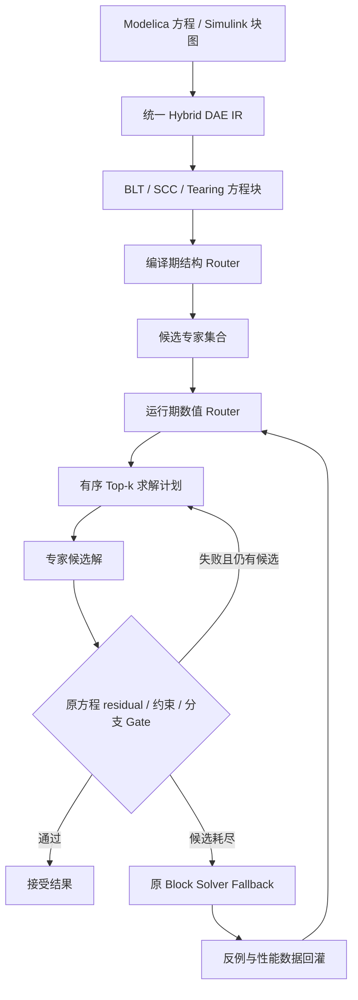

# SMAVE AI Solver

SMAVE AI Solver 旨在构建面向 Modelica 与 Simulink 模型/模型组的 Equation-MoE 神经数值求解引擎：从源方程和块图生成统一 Hybrid DAE IR，组合符号、传统数值与 Tensor AI 专家加速局部方程块，并只返回通过原方程数值验收的结果。

> “等价”在本项目中指**运行域内、可度量、可验证的行为等价**，而不是对任意输入和参数的全局数学等价。验收标准包括轨迹误差、事件时刻误差、约束违例、稳定性和跨工况泛化。

## 设计文档

完整系统设计见 [`DESIGN.md`](DESIGN.md)。该文档是项目的主设计规范，详细定义了 Hybrid DAE IR、Equation-MoE 两级 Router、异构专家 ABI、PINN/CEGIS、神经预条件器与 learned multigrid、神经算子、原方程 runtime gate、Tensor 调度、`0.01%` 精度与 Top-k `>95%` 指标、数值 fallback、专家生命周期、测试和实施路线。`kb/` 保存论文证据和研究展开，设计实现以 `DESIGN.md` 为准。

项目实现统一使用 **C++20 + CMake/CTest**。编译前端、IR、Router、专家适配、训练控制、原方程数值验收器、runtime、CLI 与测试均不得依赖 Python；Tensor 模型通过 ONNX/TensorRT 等 C/C++ 接口接入。

## 论文投稿目标

本项目的论文投稿目标期刊为 **IEEE Transactions on Parallel and Distributed Systems（IEEE TPDS）**。模块化英文稿件位于 [`paper/`](paper/README.md)，当前题目为 **“Complete-Cost Expert Fusion for Verified Repeated Numerical Solves”**。稿件使用 IEEE Computer Society Transactions 的 `IEEEtran` `journal,compsoc` 模板；作者与单位信息尚未提供，因此 `paper/authors.tex` 保留显式占位符，不虚构作者身份。

论文中心问题是：**能否融合异构经典与学习型求解专家，使 Router 最小化候选、校正、原方程验证、fallback 和设备搬运组成的完整 verified runtime，同时始终由原方程而不是学习模型决定结果是否返回？** 当前主要学术贡献收敛为：

1. 将数值加速形式化为 verification-aware expert selection，以 cascade reach probability 展开 candidate、transfer、correction、gate 与 fallback 的完整期望成本，并推导固定候选级联在 order-invariant 条件下的 cost-per-acceptance 最优排序规则；
2. 通过统一 Hybrid DAE IR 和 Equation-MoE plan，把结构直接法、Krylov/预条件器、学习 warm start/operator、CPU SIMD、设备 candidate、corrector、原方程复算 gate 和经典 fallback 组合为有角色约束的求解流水线；
3. 对线性、非线性、ODE、DAE、事件、互补与块图定义 family-specific 原方程验收合同，使 Router 或 learned candidate 的错误只增加完整成本或触发后续求解路径，而不能绕过最终数值验收；
4. 以完整成本和失败保留协议报告七个 PDEBench-derived workload、两类 held-out operator、routing、correction、gate fusion、batching、异构 placement 和负结果；固定级联排序在四阶段全部 24 个排列中与精确最小期望成本一致；请求条件模型在 12 个 expert--budget actions 上联合预测成本/接受率并由 exact DP 选路；同时在官方 HINTS 代码、架构、预训练权重和完整 750-case 1D Poisson 测试集上执行同方程比较；
5. 用线程内 gate scaling、完整路径 scaling 与 batch amortization 分离可并行部分和串行瓶颈：gate kernel 可以加速，但 candidate、correction、setup、transfer 与 fallback 决定最终收益。

项目主线只保留求解器创新与数值核心难点：完整成本路由、候选--校正--原方程
gate--fallback 流水线、学习型候选与经典内层求解器协同、固定级联排序、完整路径
并行化、batch 摊销、异构 placement、分布偏移校准和可复现实验。现有兼容性与
工程支撑代码不定义研究方向，也不产生论文贡献或评分门槛。

部署、运维与服务可用性架构不属于本项目的研究问题，也不进入论文贡献、评分条件、
未来工作或实现里程碑。兼容性与工程支撑只保留复现实验所需的最低范围，不牵引论文
叙事或后续研发优先级。

这里的 `gate` 是对原方程 residual、约束或离散缺陷的数值验收，`fallback` 是候选
被拒后继续下一条数值求解路径。验收量由原方程定义，而不是由 Router 分数或学习
模型自我判定。项目评审只据此考察数值正确性与完整求解成本。

当前研发优先级依次为：真实公共稀疏系统上的多专家、多预算请求条件路由；生产
Krylov/直接法执行链与逐候选原方程验收；成本预测尾部误差和专家交互建模；更困难
的学习型候选--经典校正器组合；以及能改变完整求解时间的算法、预条件器和求解器
内部并行优化。任何基础设施工作只有在直接支撑上述实验复现时才保留最低必要范围。

论文可通过以下命令构建：

```bash
cd paper
latexmk -pdf -interaction=nonstopmode -halt-on-error main.tex
```

并行扩展证据可由以下命令重新生成：

```bash
benchmark/run_pdebench_ns_parallel_scaling.sh build/release 30
benchmark/run_pdebench_ns_batch_scaling.sh build/release 30
benchmark/run_pdebench_repeated_timing.sh build/release 30
cmake --build build/release --target reproduce-gate-parallel-scaling
cmake --build build/release --target reproduce-cascade-ordering
cmake --build build/release --target reproduce-router-shift
cmake --build build/release --target reproduce-router-shift-matrix
cmake --build build/release --target reproduce-calibrated-correction-router
cmake --build build/release --target reproduce-joint-route-budget-shift
cmake --build build/release --target reproduce-request-conditioned-joint-route
cmake --build build/release --target reproduce-suitesparse-request-conditioned-route
cmake --build build/release --target reproduce-complete-cost-decomposition
# 需要固定 revision 的官方 HINTS checkout 与兼容 PyTorch 环境：
cmake --build build/release --target reproduce-hints-native-baseline
```

核心复现包可由以下命令生成并在全新解压目录中核验：

```bash
python3 artifact/make_core_repro_bundle.py
python3 artifact/verify_core_repro_bundle.py \
  build/core-repro-bundle/smave-core-repro.tar.gz
```

该流程固定归档路径顺序、时间戳、UID/GID，连续生成两份字节一致的归档，并核验逐文件清单；随后执行 Release 构建、29/29 CTest、完整成本排序证据、论文证据检查和 PDF 重建。核心包仅携带两个 CTest 所需的 Matrix Market fixture 与冻结报告，明确排除约 47 GB PDEBench 和其余 SuiteSparse 大规模数据。因此它是作者操作的本地 clean-tree 复现，不是完整数据复现、公开不可变归档、独立复现或外部性能证据。

IEEE TPDS 是当前研究工作的目标 venue，不代表论文已经达到投稿或录用要求。正式投稿前必须进一步收敛中心科学问题，补齐并行/异构求解机制、大规模 workload、强外部基线、完整消融、分布偏移和机制归因证据；不得以当前受限方程族、单机结果或局部 benchmark 外推通用并行求解能力。跨平台复测可以约束性能外推，但不构成求解器创新贡献或独立评分门槛。

## 下一阶段关键目标

当前评估确认，SMAVE 已具有可验证 Equation-MoE、原方程 gate、验证后 fallback、首版线性/强单调线性互补/非线性代数/平滑显式 ODE/受限显式事件/受限 index-1 DAE event/reinit C ABI 和可审计 benchmark 的系统研究价值。综合判断是：**系统研究层面的学术先进性具有中等偏上的潜力，组合式系统创新明确，工程研发价值较高；但单点算法原创性、理论贡献和真实客户价值证据仍不足，产品价值仅在受限场景下有条件成立。** 因此，当前不能把系统集成创新等同于基础算法突破，也不能把公开 benchmark 等同于客户验证。

上述先进性、创新性、工程/客户价值判断，以及全部学术、技术、工程和产品缺陷，统一记录在 **[`GOAL.md`](GOAL.md)**。其中“当前问题与缺陷”及“缺陷—目标追踪总表”是后续规划、实现和验收的唯一问题基线；新增能力只有在对应验收标准和机器证据同时满足后，才可视为关闭缺陷。当前最高优先级为：

1. 完成 correction-budget sweep，解释 candidate--corrector--gate--fallback 的成本耦合与 break-even；
2. 加强 distribution shift 下的路由校准、complete-cost regret 和 OOD 结构过滤；
3. 增加强外部 hybrid solver/preconditioner 基线以及原生 x86-64/CUDA 性能证据；
4. 扩展大规模稀疏、非线性、ODE/DAE 和 operator workload，并完善完整路径并行、batch 摊销与异构 placement。

四项目标分别绑定 `GOAL.md` 的 `D-P0-1`、`D-P0-2`、`D-P0-3`、`D-P0-4`，以及 `DESIGN.md` 中的
`REQ-CORR-001/REQ-COST-001`、`REQ-SHIFT-001/REQ-OOD-STRUCT-001`、
`REQ-EXT-BASE-001/REQ-NATIVE-X86-001/REQ-NATIVE-CUDA-001` 和
`REQ-WORKLOAD-001/REQ-FULLPATH-PAR-001/REQ-BATCH-001/REQ-PLACEMENT-001`。
四项是合取关闭条件：局部机制、单机结果、Apple Metal/ANE、ARM64 dry-run、纯 gate
kernel 或纯设备 kernel 都不能替代缺失的强外部、native x86-64/CUDA、完整 workload
和 full-path 证据。

在 [`GOAL.md`](GOAL.md) 的 P0 目标完成前，不得对外宣称通用 PDE/DAE `100×`、完整 Modelica/Simulink 替代能力、零错误接受风险或成熟生产级 SDK。具体 benchmark 数字必须同时给出 workload、硬件、精度、计时边界和验证契约。

## 代码索引要求

开发、代码审查和影响分析必须使用 **GitNexus** 索引本仓库。首次进入仓库或源码结构发生变化后，在仓库根目录执行：

```bash
gitnexus analyze --index-only --force .
gitnexus status
```

如果当前源码快照没有 `.git/`（例如解包后的交付目录），使用：

```bash
gitnexus analyze --skip-git --index-only --force .
gitnexus list
```

`gitnexus analyze --index-only --force .`（非 Git 快照再加 `--skip-git`）会强制执行完整代码分析但不向仓库注入 `AGENTS.md`、`CLAUDE.md` 或编辑器 skill；`gitnexus index` 仅用于把已经存在的 `.gitnexus/` 注册到全局 registry，不能替代分析。Git 仓库使用 `gitnexus status` 检查状态；无 `.git/` 的源码快照使用 `gitnexus list` 核对路径和索引时间。修改公共接口、Runtime、IR、Router、专家 ABI 或发布契约前，应使用 `gitnexus impact -r smave-ai-solver <symbol>` 检查影响范围；定位调用链时使用 `gitnexus context -r smave-ai-solver <symbol>` 或 `gitnexus query -r smave-ai-solver <concept>`。提交验证前必须重新运行对应的 `gitnexus analyze` 命令，确保索引与当前 C++ 源码一致；如果使用了自定义 `--name`，将示例中的 repo 名替换为 `gitnexus list` 显示的别名。

## 核心求解目标

SMAVE 的主目标不是实现 FMI master，而是求解由多物理域、多时间尺度、稀疏/稠密结构、线性/非线性、DAE 与事件共同组成的大型多种类复杂方程组。源方程首先进入 Hybrid DAE IR，经结构分析和低成本数值探针形成可审计的 `EquationAssessment`；AI Equation Expert 再依据方程家族、规模、稀疏性、对称性、正定性、条件估计、历史证据、成本和硬件，生成组合 `SolvePlan`。

组合计划可以组合或依次执行符号化简、稀疏/稠密直接法、Newton/Krylov、ILU/IC/AMG、专用物理求解器、AI warm-start、学习预条件器、learned multigrid、神经算子及其他加速后端。AI 只负责提出、排序或加速候选；正确性仍由原方程 residual/约束 gate 判定，失败时按 block 继续下一个后端，最终回退原求解路径。

FMI/SSP 仅在源方程不可见时作为 `blackbox-degraded` 兼容、部署和差分测试边界。黑盒协议隐藏 Jacobian、方程图、块结构和符号语义，无法支撑方程级判型、组合后端选择和大型稀疏求解，因此不作为核心架构或规模能力证据。

## 生产线性求解链

公共线性服务直接执行 Router 选中的真实 action：`pcg-ic0-cpu-v1`、
`pcg-jacobi-cpu-v1`、`gmres-ilut-cpu-v1`、`gmres-ilu0-cpu-v1` 及兼容直接法。
每个 Krylov action 使用计划中的 `work_iterations` 上限和调用方 restart dimension；
稀疏 ILUT 使用有界行填充而不构造稠密因子。

每次候选都记录 backend、计划预算、实际迭代、墙钟、状态和原矩阵 residual，并按
原矩阵 residual/backward error 重新验收。Top-k 候选失败或被拒绝后，求解器从原始
线性系统执行不可被 Router 删除的 terminal numerical cascade，最后才调用可选的
caller fallback；取消请求不会继续其他数值路径。

## 兼容性维护：动态库与结构化 ABI

动态库、C ABI、安装后宿主与错误栈只服务于调用兼容性和实验复现，不构成论文贡献、
评分条件、未来工作或研发里程碑。现有入口必须复用同一
`EquationAssessment → SolvePlan → backend → gate → fallback` 数值路径；未覆盖接口
只作为兼容性限制记录，不进入当前研究任务。

接口与回归命令见 [`docs/C_API.md`](docs/C_API.md) 和 [`DESIGN.md`](DESIGN.md) 的
“动态库嵌入与结构化方程 ABI”。接口维护不得挤占求解器算法、数值机制和核心实验资源。

## 大型 benchmark 执行状态

**结论：`benchmark/` 已全部执行，并完成了所有适用案例的 SMAVE-vs-传统求解器性能对比。** 截至 2026-07-20，机器报告为 `OVERALL_SMAVE_VS_TRADITIONAL_COMPLETE 1`。这里的“完成”表示每个清单案例/资产均有执行证据，且双方共同成功并满足同输入同精度契约的案例都报告了性能；它**不表示**所有案例均成功、SMAVE 在所有案例更快，或 fallback-only/timeout/无共同成功案例可以形成速度比。

| Benchmark | 全量执行证据 | 正确性与性能证据 | 诚实边界 |
|---|---|---|---|
| SuiteSparse | 39/39 系统均有刷新后的 checkpoint，非法资产 0 | 31 个双方共同成功案例完成 agreement 与性能比较 | 8 例无共同成功：SMAVE 未过门控，传统侧也失败或因直接法资源限制跳过；不制造速度比 |
| PETSc TS | 27/27 基线通过并完整分类 | 17/17 个独立方程案例完成同方程/轨迹与 solve-time 比较 | 10 个框架/布局/API 自测不重复计算求解器速度比 |
| OpenModelica MSL | 7/7 仿真完成 | 7/7 轨迹及端到端墙钟完成；6 个适用模型共 535,728 次 SMAVE 线性调用、0 外部 fallback | MovingCoilActuator 无适用线性系统，仅保留端到端对照 |
| COPS | Julia/JuMP/Ipopt 传统基线 68/68；KKT 线性层 68/68；MadNLP 完整 NLP 68/68 attempted | KKT 线性层 68 agreement/68 性能比较；完整 NLP 57 agreement，12 个非 fallback-only 原生性能比较，16,994 次 SMAVE KKT solve | 5 例 1800 秒 timeout；46 例 fallback-only、44 例资源门控、37,908 次外部 fallback 均不计入 SMAVE 性能比较 |
| PDEBench | 7/7 权威文件通过 size+MD5+h5dump；约 51 GB 数据完整 | 七族均完成同输入比较：Advection 150、Burgers 150、Diffusion-Sorption 150、Darcy 3、shallow-water 60、2D NS 40、1D CFD 90 次求解 | shallow-water、NS、CFD 明确是由真实数据场构造的受限离散子系统，不外推为完整 PDE 轨迹复现；2026-07-20 当前权威结果为 CFD 111.13×、Darcy 4.70×、Advection 3.25×、Burgers 2.74×、shallow-water 2.56×、NS 2.47×、Diffusion-Sorption 1.57×，仅 CFD 达到 100× |

PDEBench 七个权威文件现已全部完整落盘；原先仅约 2% 的两个超大文件也已通过断点续传恢复。下载仍保持幂等的后台同步方式：未完成时可执行 `nohup cmake --build build/release --target benchmark-pdebench-download > build/release/pdebench-download.log 2>&1 &`，脚本复用已有数据并继续下载，只有完整 size+MD5 验证成功后才提交目标文件；文件已验证完整时任务会安全跳过并退出，不维持无意义的常驻进程。

机器可读权威状态见 `build/release/benchmark-overall/summary.txt`。关键汇总为：SuiteSparse `31/39` 可比且 `8` 个 no-common-success；COPS full-NLP `68/68 attempted`、`57` agreement、`12` 原生性能比较、`5` timeout；PDEBench `7/7` 文件和 `7/7` 方程族比较完成。可用以下命令刷新证据：

```bash
cmake --build build/release --target benchmark-readiness -j2
cmake --build build/release --target benchmark-cross-checks -j2
cmake --build build/release --target benchmark-cops-madnlp-comparison
cmake --build build/release --target benchmark-pdebench-verify
cmake --build build/release --target benchmark-data-lock
cmake --build build/release --target benchmark-report
cmake --build build/release --target benchmark-100x-gate
cmake --build build/release --target benchmark-100x-feasibility
```

完整数据锁位于 `benchmark/data-lock/`。当前机器证据逐字节核验 7 个 PDEBench
DaRUS v8.0 文件（50,937,093,313 bytes）和 66 个 SuiteSparse 系统及 6 个 RHS
（3,911,822,320 bytes），同时检查官方 MD5、SHA-256、矩阵内嵌来源、两套 CC BY
4.0 许可与在线上游元数据；`west0479` 已从官方 Matrix Market 归档强制重新获取并
与锁一致。该锁不在核心包中再分发大型 payload，也不构成公开镜像或独立复现。

`benchmark-100x-gate` 与“benchmark 已执行完成”是两个独立条件。截至 2026-07-20，PDEBench 100× 门禁为 `1/7`：1D CFD 以同输入、FP64、完整 setup+kernel+原 residual gate 成本达到约 `111.13×`；Advection、Burgers、Diffusion-Sorption、Darcy、shallow-water 和 2D NS 仍会使该目标失败。门禁失败是当前真实状态，不得用执行完成、fallback 或较宽容差替代。

`benchmark-100x-feasibility` 进一步审计当前“逐实例、完整 FP64 原 residual gate”与 `100×` 总时间预算是否相容，机器报告位于 `build/release/benchmark-overall/feasibility-100x.txt`。当前五族即使假设 setup 和 solver kernel 都为零，仅**当前实现**的 gate 仍已超过完整预算：Advection `7.22×`、Burgers `2.91×`、Diffusion-Sorption `9.97×`、shallow-water `8.54×`、2D NS `7.33×`；Darcy gate 为预算的 `0.36×`，1D CFD 为 `0.19×`。这证明在现有机器、逐实例 gate 架构和计时定义下，单纯寻找更快 kernel 无法使五族达到 `100×`；任何继续尝试都必须先把 gate 路径本身降低 `2.91–9.97×`，并重新通过同一 FP64 原方程验证。若要改变 workload、精度或 gate 的计时/摊销语义，必须明确建立新的 benchmark 契约，不能静默替代当前门禁。

SuiteSparse checkpoint 记录双方 residual、已知解误差、耗时、内存与迭代；病态制造解仅在原 residual `<=1e-12` 时允许严格后向稳定例外。COPS 完整 NLP 采用相同 MadNLP 外层、`InertiaFree` 和 refinement 配置；SMAVE 原生 KKT 失败后从未污染的原状态切换 UMFPACK，fallback-only 不计性能。PDEBench 的 2D NS 对比限定为两个真实速度分量上的隐式黏性 Helmholtz 子系统（40 solves，cross error `1.35e-10`），1D CFD 限定为 density/Vx/pressure 三场的隐式耗散 Helmholtz 子系统（90 solves，cross error `7.89e-11`）；报告分别保留 classic/SMAVE solve-only 时间，HDF5 I/O 不计入内核时间。

PDEBench 训练链现额外区分“权威 next-state 预训练数据”和“同 benchmark 离散算子 solver label”。`pdebench-training-smoke` 已从六族权威 HDF5 生成连续 FP32 预训练 tensor，但 manifest 强制标记 `SOLVER_LABEL 0`、`DISCRETE_OPERATOR_ID "none"` 和 `ORIGINAL_RESIDUAL_CERTIFIED 0`，不能进入 solver-label trainer 或获得 Direct 权限。核心库的严格 reader 会复验字段顺序、用途、operator id、tensor 尺寸、FNV-1a checksum、尾部内容和 residual 认证，并有负向篡改测试。

Advection 首个同算子训练链使用 benchmark 未采用的 source samples `3..34` 生成 1,600 个 `1024` 维 FP64 标签，逐标签原 residual 最大值为 `1.91e-16`；样本 `35..42` 作为独立 held-out。受守恒约束的 learned periodic recurrence 拟合得到 `inverse_diagonal=0.49407114624508336`、`feedback=0.5059288537549167`，训练/held-out 原 residual 分别为 `2.14e-15` 和 `1.97e-15`。权威 benchmark 的 samples `0..2` 使用该 artifact 后仍通过逐步原方程 gate，cross error `1.07e-15`。Apple M4 路径现以三 lane 交错布局执行 ARM64 NEON 双空间点前缀递推、周期修正和独立向量化原 residual gate；150 solves 的完整 setup+kernel+gate 从约 `428 µs` 降至约 `185 µs`，当前刷新约 `3.25×`，仍不冒充 `100×`。

同一 learned operator 的 Apple Silicon 设备探测见 `build/release/pdebench-device/advection.txt`：Apple M4 Metal FP32 候选完整墙钟约 `39.5 ms`、原 residual `7.37e-8`；Core ML/ANE 候选约 `73.4 ms`、原 residual `5.37e-4`。二者虽然通过各自较宽的设备候选参考门禁，但均未通过最终 `1e-10` 原 residual，且远慢于 CPU FP64 learned recurrence，因此 auto 路由正确拒绝。该证据说明当前小 batch、微秒级系统不能仅靠搬运到 GPU/ANE 获得可信加速；后续必须使用更高查询复用、设备常驻且仍通过原方程 gate 的结构化模型。

Burgers 同算子链同样使用 source samples `3..34` 生成 1,600 个 FP64 训练标签，并以 `35..42` 的 400 个标签 held-out；两者最大原 residual 分别为 `2.45e-15` 和 `2.10e-15`。结构拟合从标签恢复 `diffusion_number=10.485760000003493` 与 `convection_scale=5.1200000000009052`，held-out 原 residual `3.60e-14`。权威 samples `0..2` 使用 learned artifact 后 cross error `3.05e-14`、原 residual `1.18e-14`。原方程 gate 现对三 lane interleaved state 使用 ARM64 NEON FP64 FMA，并由独立标量对照单元测试约束；gate 从约 `294 µs` 降至约 `60 µs`。cyclic solver 的无除法回代与 Sherman–Morrison 修正也改为两 lane NEON 加第三 lane 标量，并新增 batch=3 制造解测试；前向消元 SIMD 因没有实测收益已撤销。当前权威完整刷新约 `2.74×`。Apple M4 的周期变系数 Metal FP32 Jacobi 候选即使执行 1,024 轮，原 residual 仍为 `1.07e-6`，完整首次墙钟约 `194 ms`，因此不得获得 Direct 权限；当前 Core ML affine graph 也不能表达输入依赖的周期系数与迭代修正。设备证据见 `build/release/pdebench-device/burgers.txt`。

Diffusion-Sorption 使用相同的隔离 split 生成 1,600/400 个 frozen-retardation FP64 solver labels，训练/held-out 标签最大原 residual 分别为 `2.45e-15` 和 `2.44e-15`。learned artifact 从标签恢复按 diffusion number 缩放后的 retardation 结构：`constant_ratio=1.1062622070504325e-4`、`power_ratio=3.3607177734235099e-4`、`concentration_exponent=-0.126`，held-out 原 residual `3.20e-15`。权威 samples `0..2` 使用该 artifact 的等价缩放三对角系统后，cross error `6.89e-14`、原 residual `3.64e-15`，当前刷新约 `1.57×`，仍未达到 `100×`。Apple M4 上进一步实测了三条结构后端：现有 constant-off-diagonal NEON Thomas 路径稳定 kernel `614–718 µs`，慢于通用三 lane Thomas；Accelerate `DPTSV` 在完整 gather+三次 lane 因子化求解+scatter 下稳定约 `1.31–1.39 ms`，约慢 3×；NEON reciprocal estimate 加三轮 Newton 精化虽保持约 `3.61e-15` 原 residual，但 kernel 增至 `758–912 µs`。三条回归路径均已撤销，不进入 auto 路由。

Diffusion-Sorption 的 Apple M4 Metal FP32 weighted-Jacobi 探测在一个 command 内执行 4,096 轮，但因该缩放系统的最低频模态极慢，最终原 residual 仍为 `0.999953`；kernel 约 `7.51 ms`、首次完整墙钟约 `210 ms`，因此 auto 路由拒绝。证据见 `build/release/pdebench-device/diffusion-sorption.txt`。

Darcy 现从与权威评估 `0..2` 隔离的 source samples `9000..9511` 生成 512 个 `32×32` FP64 solver labels，`9512..9575` 的 64 个样本作为 held-out；标签最大原 residual 分别为 `2.86e-13` 和 `2.37e-13`。二值介质的 4×4 coarse-feature nearest operator held-out 平均/最大解误差为 `7.83%/31.34%`，最大原 residual `12.05`，artifact 因此被硬编码为 `warm-start-only`。移除热路径重复 payload 扫描后，三个权威样本的 nearest 推理总计约 `15.5 µs`，但候选 residual 最大 `6.18`，SSOR-PCG correction 仍需 94 次迭代，完整约 `2.04×`；当前最快仍是 Accelerate FP64 band Cholesky，约 `4.70×`。该结果不允许把近邻预测冒充 Direct。

Shallow Water 使用 source samples `3..34` 生成 640 个 `32×32` FP64 `RHS→periodic Helmholtz solution` 标签，`35..42` 的 160 个标签作为 held-out；标签最大原 residual 为 `3.60e-16/3.07e-16`。结构拟合恢复 `stencil_number=0.0040960000000000154`，held-out residual `3.24e-16`，权威 samples `0..2` 使用 learned artifact 后仍通过原 gate，当前约 `2.56×`。开发中发现 batch lane 更新把共享输出向量 swap 为空并导致第二 lane 空地址写入；现已改为独立 lane 状态更新。`32×32, batch=3` 的并行 FFT dispatch 实测慢于持久 scalar plan，因此 crossover 明确拒绝该 batch 路径，而不是保留回归。

同一 Shallow Water learned convolution 的 Apple M4 探测见 `build/release/pdebench-device/shallow-water.txt`：Metal FP32 原 residual `7.73e-8`、完整墙钟约 `51 ms`；Core ML/ANE 原 residual `6.29e-5`、完整墙钟约 `86 ms`。两者均未通过最终 `1e-10` 原方程 gate，auto 继续选择 CPU FP64 Accelerate FFT。

2D NS 使用与权威评估 samples `0..1` 隔离的 source sample `2` 生成 40 个 `64×64`、双速度分量 FP64 `RHS→periodic viscous Helmholtz solution` 标签，并以 source sample `3` 的 40 个标签作 held-out；标签最大原 residual 为 `4.00e-16/4.49e-16`。同算子拟合恢复 `stencil_number=0.040959999999998727`，训练/held-out residual 为 `5.37e-16/5.32e-16`。权威 40 solves 现在强制加载该 learned artifact，同时继续用物理参数构造的原 FP64 算子执行独立 residual gate；当前 cross error `1.36e-10`、原 residual 约 `5.7e-16`、完整 setup+FFT+gate 加速约 `2.47×`。Apple M4 上对 1/2/3/4/5/6/8/10 个 FFT worker 的完整扫描显示 8–10 worker 已接近最优，继续减少线程会显著回退，因此当前瓶颈不是简单的 dispatch 过度并发。

## 当前阶段

仓库已实现 **Phase 0–7 C++20 CPU 求解器基线**：受限 Modelica/ODE/DAE 前端、Hybrid IR、方程结构分析、候选专家注册与运行期 Router、affine warm-start、Newton corrector、CSR/稠密线性系统路径、PCG/GMRES/直接法级联、学习型预条件器与 multigrid、独立 residual/约束 gate、原 solver fallback、CEGIS verified cells、方程家族检索、Operator 基线、完整成本评估、held-out Router 评估、线程内 gate 并行、完整路径 scaling、batch 摊销和受限 hybrid 事件语义。发布存储与服务治理实现仅作为 legacy engineering regression，不计入当前科学主线；FMI/SSP 仍是兼容边界，不作为方程级证据。

经典直接法级联现包含 `sparse-ordered-threshold-pivot-cpu-v2`：先在列交集图上以稳定编号打破平局的 greedy approximate-minimum-degree 顺序生成列置换，再以活动行最大值归一化的 `0.1×max-score` threshold row pivot 执行稀疏消元，最后还原原变量顺序。Runtime trace 审计列顺序、row swap、原始/上三角 nonzero、ordered/natural symbolic fill edge 和最小 scaled pivot；失败后再进入独立 dense partial-pivot direct。两个 direct stage 均保留在 Router `top_k` 之外并继续接受统一 runtime residual/constraint gate。该小型确定性 CPU 基线仍不等同于 maximum matching、equilibration、supernodal/multifrontal factorization、KLU/UMFPACK 或工业规模性能。

FMI 2.0 缺失 `lastSuccessfulTime` 的内部事件、运行期连续状态维度变化、FMI 2 数组、运行期结构参数重配置、FMI 3 Scheduled Execution Clock 依赖图、并发抢占、动态优先级/周期重配置、带反馈迭代/事件/rollback/异步 deadline 的一般 SSP master、一般高指数 DAE、完整 Modelica 初始化优先级/fixed/homotopy、fully implicit/高指数 DAE 事件、冲突 reset 仲裁、同一事件或 transition 在单个事件时刻内的重复触发、一般接触/互补问题、非孤立或平坦 guard、单个接受步内多个未分辨极值、完整 SubSystem/bus/vector Simulink 语义、多控制器非整比/异步 rate、完整 Modelica superdense-time 时钟/事件语义、生产级 matching/equilibration/supernodal/multifrontal/AMG/KLU/UMFPACK 稀疏后端、GPU/NPU backend、FNO/Geo-FNO/GINO 仍按 [`DESIGN.md`](DESIGN.md) 后续推进。受限 SSP 1.0 固定步 feed-forward FMI 2 master 由 `reproduce-ssp` 覆盖；受限 DAE grazing root 已由 `reproduce-dae-grazing` 覆盖；FMI 2/3 Model Exchange 的单个光滑孤立 grazing indicator、continuous-state nominal change、完整数值/Boolean 标量 I/O 和 FMI 3 Clock decimal interval/shift 查询分别由 `reproduce-fmi-me-grazing`、`reproduce-fmi-me-nominal`、`reproduce-fmi-me-scalar-types` 覆盖；确定性多周期 Clock 激活、静态 priority 同刻排序与稳定 tie-break 由 `reproduce-fmi-se` 覆盖。这些证据均不外推到非孤立、平坦、多极值、接触/互补 guard、动态状态维度变化或一般 Scheduled Execution 调度。

默认 `smave compile` 仍有意只接受方形 `Real` 代数系统，并显式拒绝 `der/when/reinit/pre/edge/change`；连续模型必须走单独的 `smave compile-continuous`。`smave compile-dae` 是独立的受限 semi-explicit index-1 前端：由 `der(state)=expression` 自动识别微分状态，其余无 binding 的 `Real` 变量作为代数变量，要求代数约束数量与代数变量一致；可选 `initial equation` 必须提供与状态数量相等的无 `der/when` 方程，并与运行期代数约束共同形成方形、结构可匹配的初始化系统。受限 `when/reinit(state)` 会保存在 DAE IR v4 中。一致初始化后先执行 active guard、稳定 `pre(state)`、reset 级联和每轮代数约束 Newton 投影；运行期对端点变号 root 以一致 DAE 子步二分，对两端均 inactive 的单个光滑孤立 grazing root 以有界黄金分割定位内部切触点，再在 root 上执行相同的原子 reset/投影事务并继续剩余区间。初始化、事件投影及每个候选隐式步在提交前都会以变量 nominal 缩放的中心差分 `∂g/∂z` 执行数值秩门禁；门禁失败不提交状态。该采样点检查不证明整个连续运行域处处非奇异。高指数 DAE、状态 binding equation、完整 Modelica `fixed`/优先级语义、fully implicit grazing/接触/复杂事件系统、非孤立或平坦 grazing、多极值和接触/互补事件仍未实现。显式连续前端仍只接受一阶 ODE 和受限 `when/reinit`；代数约束、`elsewhen` 和其他未实现语义会硬拒绝，不会静默擦除。同一最早 root 时间容差内的多个事件可作为首轮批处理，随后继续执行 reset 新激活事件直至无新事件；每轮要求 reset 目标互不冲突，任一轮失败会回滚整个事件时刻。

## 构建与运行

### 原生外部性能工作流（尚无托管运行）

仓库现提供手动触发的 GitHub Actions 工作流
`.github/workflows/native-external-performance.yml`，用于在三个独立
`ubuntu-24.04`/x86-64 托管 VM job 上执行自包含 gate 与完整路径性能测量。
工作流不以加速比大于 1 作为成功条件：正确性必须通过，但加速、持平和变慢
结果都会连同 1,900 个原始 timing 样本、机器信息、完整 commit/run/job/workflow
来源和 SHA-256 一并保留。聚合只报告跨 job 的 median/min/max，并请求 GitHub
artifact attestation。上传前还会由独立 campaign verifier 从三个下载 artifact
重建 exact schema、replicate hash/metadata、共同 provenance 与全部跨 job 统计；
该 verifier 明确不能代替对后续 GitHub attestation 成功状态的外部核验。

截至 **2026-07-25**，这里只完成了本机 ARM64 dry-run；其证据强制写入
`performance_evidence=0` 与 `native_external_performance=0`。当前仓库没有可用
commit、remote 或可执行 GitHub workflow 的凭据，因此尚不存在真正的托管
x86-64 性能证据，论文分数和主张均不得据此上调。协议、命令和非主张边界见
[`docs/NATIVE_EXTERNAL_PERFORMANCE.md`](docs/NATIVE_EXTERNAL_PERFORMANCE.md)。

当前本机线程 gate 证据在十个 worker 下达到 `4.771× [3.980, 5.100]` 与 `2.605× [2.386, 2.701]`，分别对应线性与非线性 family；决策和 residual 与顺序 gate 一致。该结果只描述 gate kernel，并不替代完整 verified-path scaling。

七个 PDEBench-derived workload 的 30 次配对完整路径计时中，中位 verified speedup
范围为 `1.58×–135.14×`；该范围只适用于当前工作负载、数据切片和 Apple M4 主机，
不能外推为通用数量级加速。

要求支持 C++20 的编译器、CMake 3.20+ 和 zlib 开发库，不需要 Python：

```bash
cmake --preset release
cmake --build --preset release -j
ctest --preset release

# 所有配置统一位于 build/ 子目录；Sanitizer 使用 build/sanitize
cmake --preset sanitize
cmake --build --preset sanitize -j
ctest --preset sanitize

# 一条命令重建 IR、训练专家、发布 Bundle 并运行验证集
cmake --build build/release --target reproduce

# Phase 1：两个非线性方程族的 warm-start 收敛率与平均迭代退出门禁
cmake --build build/release --target reproduce-phase1

# Phase 1 路由消融：classic、固定 AI 级联与在线 Equation-MoE 的两族配对证据
cmake --build build/release --target reproduce-nonlinear-cascade

# 第二 Operator family：周期非对称五点 Helmholtz 的验收正确性与负性能复制
cmake --build build/release --target reproduce-operator-replication

# Phase 4 paired oracle：在线 Router 对逐场景最佳 gate-passing 专家的事后参考
cmake --build build/release --target reproduce-paired-oracle

# Phase 2：训练线性预条件器并验证 PCG + gate + fallback
cmake --build build/release --target reproduce-phase2

# Phase 2 大型退出证据：100 unknown SCC、配对 bootstrap、P99 与端到端扩展门禁
cmake --build build/release --target reproduce-phase2-large

# 大型稀疏真实执行：1089/1681/2401 unknown CSR 规模曲线及非对称 GMRES+ILU(0)
cmake --build build/release --target reproduce-large-sparse
cmake --build build/release --target reproduce-industrial-sparse
cmake --build build/release --target reproduce-complementarity
cmake --build build/release --target reproduce-index-two-dae

# 大型非线性：CSR Jacobian、Newton-Krylov、SPD/非对称内层后端判型与 gate
cmake --build build/release --target reproduce-large-nonlinear

# 大型 index-1 DAE：joint CSR Newton-Krylov 普通隐式步与代数 rank gate
cmake --build build/release --target reproduce-large-dae

# 大型 DAE 一致初始化、reset 后 CSR 流形投影与稀疏代数 rank gate
cmake --build build/release --target reproduce-large-dae-initialization

# 大型 DAE 横截事件：CSR root 定位、共同 root、reset、投影与 gate
cmake --build build/release --target reproduce-large-dae-events

# Phase 3：确定性 CEGIS 细分、反例回灌、证书绑定与安全回退
cmake --build build/release --target reproduce-phase3

# Learned multigrid：训练递归多层 V-cycle、CEGIS、PCG residual gate 与 fallback
cmake --build build/release --target reproduce-multigrid

# Nonlinear Jacobian multigrid：Newton 内层 PCG、非 SPD 拒绝和原 Newton fallback
cmake --build build/release --target reproduce-nonlinear-multigrid

# 非对称线性：restarted GMRES + ILU(0) + residual gate
cmake --build build/release --target reproduce-nonsymmetric

# Phase 4：源家族竞赛、held-out 实例评估并实际应用 Router profile
cmake --build build/release --target reproduce-phase4

# AI 方程专家：对称/非对称结构判型、PCG/GMRES/直接法候选组合与强制 fallback
cmake --build build/release --target reproduce-equation-routing

# 用户可审计 CLI：静态方程证据、AI/经典组合链、成本/风险和选择理由
cmake --build build/release --target reproduce-equation-assessment

# 单模型也可直接生成 assessment 报告
build/release/smave assess-equation build/release/demo/model.ir \
  --block block-1 --scenario examples/scenarios/id-1.conf \
  --output build/release/demo/equation-assessment.txt

# Phase 5：训练、CEGIS 验证并评估 many-query Operator break-even
cmake --build build/release --target reproduce-phase5

# Phase 6：导入块图、执行模型组 fallback 和离散事件 gate
cmake --build build/release --target reproduce-phase6

# 历史兼容性回归：CPU expert residency、调用热度与预算拒绝
cmake --build build/release --target reproduce-residency

# 历史兼容性回归：数据集快照与完整性检查
cmake --build build/release --target reproduce-data-registry

# 连续扩展：显式 ODE、自适应积分、zero-crossing 与原子 reinit
cmake --build build/release --target reproduce-continuous

# 同时事件扩展：同根事件、共享 pre-state 与原子批量 reset
cmake --build build/release --target reproduce-simultaneous

# 事件迭代扩展：稳定 pre(state)、reset 级联和事件时刻事务
cmake --build build/release --target reproduce-event-iteration

# 初始事件扩展：t=0 active guard、级联与原子回滚
cmake --build build/release --target reproduce-initial-events

# 切触 root 扩展：显式 ODE 的光滑孤立 grazing/tangential guard
cmake --build build/release --target reproduce-grazing

# DAE 切触 root：一致 Newton、代数秩门禁与流形投影
cmake --build build/release --target reproduce-dae-grazing

# FMI 2/3 Model Exchange：光滑孤立 grazing indicator 与 state replay
cmake --build build/release --target reproduce-fmi-me-grazing

# FMI 2/3 Model Exchange：continuous-state nominal 更新与正值门禁
cmake --build build/release --target reproduce-fmi-me-nominal

# FMI 2 数值/Boolean 与 FMI 3 完整数值/Boolean 标量 Model Exchange I/O
cmake --build build/release --target reproduce-fmi-me-scalar-types

# index-1 DAE：隐式 Euler/Newton、代数约束和 residual gate
cmake --build build/release --target reproduce-dae

# DAE 数值秩：运行期代数 Jacobian 奇异点门禁与失败步回滚
cmake --build build/release --target reproduce-dae-rank

# DAE 初始事件：一致初始化、reset 级联和代数流形投影
cmake --build build/release --target reproduce-dae-initial-events

# DAE 运行期事件：一致 root 定位、reset 级联和流形投影
cmake --build build/release --target reproduce-dae-events

# DAE 候选步内层：joint Jacobian learned V-cycle+PCG 与 dense retry
cmake --build build/release --target reproduce-dae-multigrid

# 多速率扩展：整数倍 sample time/offset、预激活保持和速率边界 delay
cmake --build build/release --target reproduce-multirate

# 联合调度扩展：连续积分、参数保持和采样边界原子控制更新
cmake --build build/release --target reproduce-coupled

# 联合偏移采样：首边界前保持、offset+n*period 调度和原子控制更新
cmake --build build/release --target reproduce-coupled-offset

# 联合初始化：t=0 连续事件先于采样 update/guard/reset 原子提交
cmake --build build/release --target reproduce-coupled-initial

# 跨域微步：采样 reset → 连续事件级联 → 后续采样 transition
cmake --build build/release --target reproduce-coupled-superdense

# FMI 3.0 包导入、真实 Co-Simulation smoke 和 state replay
cmake --build build/release --target reproduce-fmi

# FMI 3.0 Scheduled Execution：多周期 Clock、稳定分区激活和回调门禁
cmake --build build/release --target reproduce-fmi-se

# FMI 3.0 Model Exchange：宿主 RK4、连续状态 API 和 state replay
cmake --build build/release --target reproduce-fmi-me

# FMI 2.0 Co-Simulation：标量 Real 固定步和 state replay
cmake --build build/release --target reproduce-fmi2

# FMI 2.0 Co-Simulation：Discard/lastSuccessfulTime 事件切分与续算
cmake --build build/release --target reproduce-fmi2-event

# FMI 2.0 Co-Simulation：Pending 状态、stepFinished 回调与超时取消
cmake --build build/release --target reproduce-fmi2-async

# FMI 2.0 Model Exchange：RK4、横截 root、时间事件和 state replay
cmake --build build/release --target reproduce-fmi2-me

# FMI 3.0 Model Exchange：单 indicator root、事件 reset 和积分重启
cmake --build build/release --target reproduce-fmi-me-event

# FMI 3.0 Model Exchange：多 indicator 最早 root 与同宏步多事件
cmake --build build/release --target reproduce-fmi-me-multi-event

# FMI 3.0 Model Exchange：nextEventTime、时间切分和 state replay
cmake --build build/release --target reproduce-fmi-me-time-event

# FMI 3.0 Co-Simulation：通信点 event mode、离散固定点和 state replay
cmake --build build/release --target reproduce-fmi-event

# FMI 3.0 Co-Simulation：通信步内 early return、事件续接和 state replay
cmake --build build/release --target reproduce-fmi-early

# FMI 3.0 Co-Simulation：nextEventTime 时间事件、子步切分和 state replay
cmake --build build/release --target reproduce-fmi-time-event

./build/release/smave compile examples/Coupled.mo --top Coupled \
  --output build/release/coupled.ir
./build/release/smave inspect build/release/coupled.ir
./build/release/smave train-expert build/release/coupled.ir --block block-1 \
  --scenarios examples/training --output build/release/affine.expert
./build/release/smave bundle build/release/coupled.ir \
  --expert build/release/affine.expert --output build/release/development.bundle
./build/release/smave solve build/release/coupled.ir --scenario examples/case.conf \
  --config examples/smave.yaml \
  --expert build/release/affine.expert \
  --bundle build/release/development.bundle
./build/release/smave validate build/release/coupled.ir \
  --scenarios examples/scenarios --config examples/smave.yaml \
  --expert build/release/affine.expert \
  --bundle build/release/development.bundle \
  --output build/release/validation.txt
./build/release/smave compete build/release/coupled.ir \
  --scenarios examples/scenarios --expert build/release/affine.expert \
  --bundle build/release/development.bundle \
  --output build/release/competition.txt
# solve/validate 可用 --profile build/release/competition.txt 应用离线校准胜者

./build/release/smave compile-continuous examples/BouncingBall.mo \
  --top BouncingBall --output build/release/bouncing-ball.ir
./build/release/smave simulate-continuous build/release/bouncing-ball.ir \
  --end 1.2 --max-step 0.05 --reference examples/BouncingBall.ref \
  --output build/release/bouncing-ball-report.txt

./build/release/smave compile-dae examples/IndexOneDAE.mo \
  --top IndexOneDAE --output build/release/index-one-dae.ir
./build/release/smave simulate-dae build/release/index-one-dae.ir \
  --end 1.0 --max-step 0.1 --output build/release/index-one-dae-report.txt

./build/release/smave compile-continuous examples/CoupledThermostat.mo \
  --top CoupledThermostat --output build/release/coupled-continuous.ir
./build/release/smave simulate-coupled build/release/coupled-continuous.ir \
  --hybrid examples/hybrid/coupled-thermostat.hybrid \
  --end 2.5 --max-step 0.1 --output build/release/coupled-report.txt

./build/release/smave import-fmu build/release/fmi/SMAVEBlackbox.fmu \
  --output build/release/fmi/model.fmi.ir \
  --report build/release/fmi/import-report.txt
./build/release/smave inspect-fmi build/release/fmi/model.fmi.ir
./build/release/smave smoke-fmu build/release/fmi/SMAVEBlackbox.fmu \
  --end 0.3 --step 0.1 --input gain=3,u=2 \
  --allow-native-execution --output build/release/fmi/smoke.txt
./build/release/smave smoke-fmu-me build/release/fmi-me/SMAVEModelExchange.fmu \
  --end 0.3 --step 0.1 --input gain=1 \
  --allow-native-execution --output build/release/fmi-me/smoke.txt
./build/release/smave simulate-ssp build/release/ssp/feedforward.ssp \
  --end 0.3 --step 0.1 --allow-native-execution \
  --output build/release/ssp/report.txt
```

`smave simulate-ssp` 读取 SSP 1.0 ZIP 根部 `SystemStructure.ssd`，要求至少两个直接位于唯一顶层 `System` 的 FMI 2.0/3.0 Co-Simulation `Component`，source 必须为 `resources/*.fmu`，并允许在同一 feed-forward 系统中混用两个 FMI 版本。组件 connector 必须逐名匹配 FMU 元数据中的同名标量 input/output；FMI 2 只接受 Real，FMI 3 只接受 Float64。连接只允许 output→input、单 driver、全部 input 已连接的有向无环图。顶层 SSP `Units/Unit/BaseUnit` 支持 kg/m/s/A/K/mol/cd/rad 指数及有限、非零 factor 和有限 offset；未设置 `suppressUnitConversion` 时，仅在两端都声明 unit、BaseUnit 维度一致且 SSD 定义与各自嵌入 FMU UnitDefinitions 完全一致时，先按 `(source*sourceFactor+sourceOffset-targetOffset)/targetFactor` 转换。随后可选 `LinearTransformation` 再按 `target=factor*source+offset` 作用，系数和最终结果必须有限。宿主按稳定 source order 拓扑排序，在 `t=0` 和每个通信点传递上游输出。FMI 3 若声明 `hasEventMode=true`，可在完整到达通信点后请求本实例 event mode；宿主执行最多 1024 轮 `UpdateDiscreteStates` 固定点并返回 step mode。固定点给出的有限、严格未来且不超过 horizon 的绝对 `nextEventTime` 会成为全局内部通信点：只有全部 FMU 均声明可变通信步时，所有实例一起推进至该时刻、处理事件、传播信号并继续原宏步；每个原通信步最多 1024 个子步。`SMAVE_SSP_REPORT 5` 保存 package/component hash、各组件 FMI 版本、连接 unit、推导的单位变换与显式线性变换系数、逐组件及汇总 event/time-event 次数、内部切分、step order、全部外部和内部通信点输出及交换次数。原生执行仍需显式授权；嵌套 System、系统级 connector、参数绑定、SignalDictionary、非线性/离散 mapping transformation、其他变量类型、反馈环、FMI 2 `Discard/Pending`、FMI 3 termination/early return/incomplete step、continuous-state change、缺少全局可变步能力的 time event、跨实例 superdense 事件固定点、state rollback 和并发 stepping 均硬拒绝。

`smave import-block-graph` 接受版本化 `SMAVE_SIMULINK_EXPORT 1/2` 文本交换格式，也可直接读取受限原生 `.slx` ZIP 中的 `simulink/blockdiagram.xml`。原生路径校验 ZIP 安全属性，只接受显式 `SampleTime`、SID 端口连线和标量 `Constant/Gain/Sum/UnitDelay/Switch`。SubSystem 可递归包含恰好一个子 `System`，最大深度 64；每层只允许显式编号的标量 `Inport/Outport` 与同采样时间的支持块。导入器递归组合每层端口接口，以完整 `parent/child/...` 路径生成节点 id，重写边界连接并完全消除 connector/SubSystem 节点。每个 `System` scope 还可使用标量本地 `Goto/From`：非空 `GotoTag` 在本层唯一解析，`Goto` 输入源直接替换同 tag 的所有 `From` 输出，虚拟 tag 块不会进入 IR。缺失/重复 connector、未连接声明端口、多个 output driver、connector 直连、重复或未解析 tag、无消费者 tag、非 `local` visibility、connector/tag 虚拟链或采样时间不一致均拒绝。Branch、Sum 与 Switch 保持既有严格契约；库链接、bus/vector、`scoped/global` Goto visibility、跨 `System` tag lookup、绕过 connector 的任意跨层线、连续状态、mask callback 和完整 sample-time inheritance 仍不支持。

`smave run-model-group` 按拓扑顺序执行块图，`unit_delay` 作为调度边界；每个 `algebraic_model` 仍调用同一 C++ Runtime、原方程复算 gate 和原 solver fallback。只有整组成功后才原子提交延迟状态，报告确定性 commit order、逐节点 fallback 和连接误差。`smave run-hybrid` 仅执行明确版本化的固定采样离散程序：guard 使用 `pre_guard <= 0 && guard > 0` crossing，按 priority/source order 选择事件，全部 reset 从同一 pre-reset state 计算后原子提交；event candidate 的时刻、transition 和 source mode 必须与权威执行器一致，否则只记录拒绝，不能改变 mode/state。

`smave run-model-group-multirate` 要求每个块的 `sample_time` 是 `base_step` 的正整数倍（`0` 表示继承 base step），`sample_offset` 也必须是 `base_step` 的整数倍且严格小于该块周期。节点只在 `offset+n*sample_time` 边界执行；offset 到来前，非 `unit_delay` 节点必须显式声明 `initial_output`，`unit_delay` 使用 `initial`，以确定零阶保持值参与连接。未到期块继续保持上一输出；只有该 tick 全部到期块成功后才原子提交 held outputs 和 delay state。非整比 sample time/offset、offset 缺失初值或 offset 越过周期会硬拒绝，不会近似取整。

`smave simulate-coupled` 将一个受限连续 IR 与一个固定采样 Hybrid IR 联合执行。Hybrid IR v2 在 `SAMPLE_TIME` 后增加满足 `0 <= SAMPLE_OFFSET < SAMPLE_TIME` 的偏移，v1 按零偏移兼容读取；采样边界为 `offset+n*sample_time`。离散状态必须与连续模型中的同名 `parameter` 一一对应，并在两个采样边界之间零阶保持；离散 update/guard/reset 可读取采样边界处的连续状态。零偏移时联合初始化把 `t=0` 作为显式采样边界：先执行连续 active guard/reset 固定点事务，再让 tick 0 的离散 update/guard/reset 读取 post-event 连续状态。正偏移时 `t=0` 只执行连续初始化，离散初值保持到 offset，首个采样事务仍编号 tick 0。若运行期 continuous root 与采样边界重合，同样先完成连续事件事务；随后采样 transition 对保持参数的 reset 若新激活连续 guard，Runtime 在同一物理时刻执行连续 reset 级联，并允许其 post-state 再激活当前 mode 的下一条采样 transition，直至无新事件。采样 update 每个 tick 只执行一次；每个连续 event 和 sampled transition 每个物理时刻最多触发一次；全部微步共享边界前连续 `pre(state)` 快照，按各域 priority/source order 排序，并以一个事务提交，任一 NaN/Inf、reset 冲突、状态约束或迭代门禁失败都会回滚整个边界。报告中的 `SAMPLE_TIME`、`SAMPLE_OFFSET` 和 `SUPERDENSE_STEP` 给出时钟契约与权威跨域顺序。当前仅支持单一固定周期采样控制器，不包含多控制器非整比/异步调度、同一事件反复触发、冲突仲裁或完整 Modelica clock/DAE superdense-time 语义，也不等同于一般 Modelica/Simulink 混合 DAE 求解器。

`smave import-fmu` 原生读取 FMI 2.0/3.0 `.fmu` ZIP 或已解包目录中的 `modelDescription.xml`，生成版本化 `SMAVE_FMI_BLACKBOX_4` IR。导入器在不加载共享库的前提下校验 ZIP central/local entry、descriptor CRC、重复/穿越路径、FMI identity、ME/CS/SE `modelIdentifier`、变量 value reference/causality/variability/unit/start、FMI 2 Real derivative state index 与 `ModelStructure/Derivatives` 向量顺序、FMI 3 数组维度，以及 Scheduled Execution input Clock 的强制 UInt32 `priority`。旧 `SMAVE_FMI_BLACKBOX_1/2/3` 可只读升级；v1 缺失 derivative，v1/v2 缺失数组维度描述符，v1–v3 Scheduled Execution 缺失 priority 时仅按兼容优先级 0 升级，不得冒充新的 source-declared priority 证据。Scheduled Execution warning 明确限定为确定性周期 Clock 与静态 priority，不包含依赖图、并发抢占或动态重配置。该 IR 固定允许轨迹代理和差分测试，固定禁止方程级 residual 验证与 Direct expert 权限，反序列化也不能扩张权限。

`smave smoke-fmu` 仅接受 `.fmu` 包，并仅在显式给出 `--allow-native-execution` 后加载当前 host 的 Co-Simulation 库；package `source_hash` 因而同时绑定 XML、resource 和实际执行二进制。FMI 2.0 路径解析标量 Real input/parameter/output，执行 `Instantiate→SetupExperiment→Enter/ExitInitializationMode→DoStep→Terminate/FreeInstance`，OK/Warning 表示完成请求步；`Discard` 仅在声明 `canHandleVariableCommunicationStepSize=true` 且可通过 `fmi2GetRealStatus(lastSuccessfulTime)` 返回严格位于当前时间与目标通信点之间的有限时间，宿主从该点续算且每个宏步最多切分 1024 次；若声明 `canGetAndSetFMUstate=true`，首步必须保存、执行、恢复和重放，输出误差不超过 `10^-12`。它兼容 FMI 2 legacy `darwin64/linux64/win64` 和 FMI 3 host tuple binary 目录，但不实现并发异步调度、跨实例 deadline 协调、缺失 status query 的内部事件、通用 rollback 协商、Model Exchange、非 Real 或数组 I/O。FMI 3.0 路径解析标量 Float64；若接口声明 `hasEventMode=true`，允许 FMU 在已完成通信点返回 `eventHandlingNeeded=true`，随后严格执行 `EnterEventMode→UpdateDiscreteStates` 有界固定点（最多 1024 轮）`→EnterStepMode`；固定点可返回有限、绝对、严格未来且不超过 smoke horizon 的 `nextEventTime`，宿主会把后续宏步切到该时间并要求到点请求 event mode，再继续原通信端点。若同时声明 `canReturnEarlyAfterIntermediateUpdate=true`，允许同一宏通信步返回严格前进的 `earlyReturn=true`，宿主从 `lastSuccessfulTime` 继续子步推进，并在原通信端点统一采样。未声明却请求事件/early return、过去或越界的 `nextEventTime`、请求 termination、continuous-state/nominal 变更或无进展/越界的 `lastSuccessfulTime` 均硬拒绝。两种版本任一缺符号、错误 status 或 NaN/Inf 都会失败，实例、FMU state、动态库和临时安全解包目录由 RAII 清理。`reproduce-fmi2` 应报告 4 次 `DO_STEP_CALLS`（含首步 replay）和零 replay error；`reproduce-fmi2-event` 应报告 5 次 `DO_STEP_CALLS`、`DISCARD_RECOVERIES 1` 和零 replay error；`reproduce-fmi2-async` 应报告 4 次 `DO_STEP_CALLS`、`PENDING_STEPS 1`、`STEP_FINISHED_CALLBACKS 1`、`CROSS_THREAD_CALLBACKS 1`、`CANCELLED_STEPS 0` 和零 replay error；FMI 3 的 `reproduce-fmi-event` 应报告 `EVENT_MODE_ENTRIES 1`、`DISCRETE_UPDATE_ITERATIONS 2`，`reproduce-fmi-early` 额外报告 `DO_STEP_CALLS 6`、`EARLY_RETURNS 2`，`reproduce-fmi-time-event` 额外报告 `TIME_EVENT_SPLITS 1`、`TIME_EVENTS 1`。

`smave smoke-fmu-me` 对 FMI 2.0/3.0 Model Exchange 使用相同的包 hash/显式授权/RAII 门禁。FMI 2 从 `Real derivative` 元数据严格推导至少一个连续状态；FMI 3 从运行时 API 查询状态数，两者都接受最多 1024 个 event indicator。初始化输入和采样输出支持 FMI 2 标量 Real/Integer/Boolean/Enumeration，以及 FMI 3 标量 Float32/Float64、全部 8/16/32/64 位有符号/无符号整数、Boolean、Enumeration、标量 String/Binary/Clock，以及全部数值类型、Enumeration、Boolean、String 和 Binary 数组；FMI 3 Clock 按规范只接受标量；整数输入必须有限、精确且在 ABI 范围内，Boolean 与 Clock 输入必须精确为 `0` 或 `1`，非实数输出统一映射到报告中的 double；数值数组通过 `--array-input` 传入，String/Binary 数组分别通过逐元素重复的 `--string-array-input`/`--binary-array-input` 传入；数组维度可来自固定 extent，或来自 fixed unsigned scalar structuralParameter 的正整数 start；Clock 通过专用 `SetClock/GetClock` 传递激活值并归一化为 `0/1`；初始化离散固定点后，宿主调用 `GetIntervalDecimal/GetShiftDecimal`，验证 qualifier、有限正 interval、非负且小于 interval 的 shift，并以 `CLOCK_INTERVALS`、`CLOCK_SHIFTS` 和 `CLOCK_INTERVAL_QUALIFIERS` 写入报告，但不驱动模型分区；64 位整数还必须处于 IEEE-754 double 的精确整数域。宿主以固定步 RK4 驱动 setTime/setContinuousStates/getDerivatives 四个 stage；初始化或后续事件固定点可给出有限、严格未来且不超过 smoke horizon 的绝对 `nextEventTime`，宿主在计划时间与 root 中选择最早者并切分积分区间。每个宏步对端点变号 indicator 从宏步起点重复 RK4 并二分到 `10^-12` 时间宽度；对两端同号且远离零的 indicator，以黄金分割最小化 `|indicator|`，只有内部最小值不超过 `10^-8` 且两侧 prominence 严格超过 `10^-8` 时才接受为单个光滑孤立 grazing root。多 indicator 以 `(root_time, indicator_index)` 稳定选择最早 root，随后进入 event mode 执行最多 1024 轮离散固定点。允许 continuous-state value change 后重新读取状态、回到 continuous-time mode、重算 indicator 并继续剩余区间；若固定点声明 continuous-state nominal changed，宿主必须立即调用对应版本的 `GetNominalsOfContinuousStates`，要求数量与状态维度一致、全部有限且严格为正，并报告更新次数及观测范围。两版均拒绝未达到零的近切触、零/负/NaN nominal、过去或越过 horizon 的 time event、termination、非有限 indicator/derivative/state 和 completedIntegratorStep 的额外 step event；运行期状态维度变化仍不支持。声明 state save/restore 时，首步连同全部 root、time event、reset、nominal 与积分重启必须完整重放，输出误差不超过 `10^-12`。FMI 3 ME 若同时声明 `canSerializeFMUState=true`，首步还必须查询 1 byte–16 MiB 的 serialized size、序列化、释放原 state handle、反序列化为新 handle，再从新 handle 恢复和重放；报告记录 `STATE_SERIALIZATION_ATTEMPTED`、`STATE_SERIALIZATION_PASSED` 与 `SERIALIZED_STATE_BYTES`。报告分别记录 root、grazing root、nominal update 和 Clock interval/shift。ME 轨迹只是 FMU 导数 API 与宿主积分器的一致性证据，不是源方程 residual 验证。

三类 smoke 都在 CLI 进程中加载第三方 native code，不是生产沙箱；当前 FMI 2 CS 支持同步 `Discard+lastSuccessfulTime` 切分和单实例受限 Pending 轮询/回调一致性，FMI 3 SE 支持单周期 input Clock 驱动的单分区激活；仍不支持并发异步调度、跨实例 deadline 协调、缺失 status query 的内部事件、通用 rollback 协商、动态连续状态维度、Co-Simulation 数组 I/O、运行期结构参数重配置、SE 多分区优先级/抢占，以及带反馈迭代/跨实例 superdense 事件固定点/rollback/异步 deadline 的一般 SSP master。受限 SSP 1.0 FMI 2 scalar Real/FMI 3 scalar Float64 宏通信网格、内部 time-event 子步和 feed-forward 多 FMU 联调由 `simulate-ssp` 覆盖。smoke 成功不会升级为方程级验证或 Direct 权限；CS/ME `nextEventTime`、FMI 2 CS `lastSuccessfulTime`/`doStepStatus`、ME 横截/受限 grazing root/nominal 更新与 SE 单分区 tick 仅覆盖上述有限调度，不等同于完整 FMI master。

FMI 2/3 的基础 Model Exchange 与基础 Co-Simulation serialized-state replay 均已接入：只有同时声明对应版本的 state save/restore 与 serialize capability 时，宿主才查询 1 byte–16 MiB payload、序列化、释放原 handle、反序列化为新 handle并完整重放。报告记录尝试、通过和字节数；自有 FMI 3 fixture 为 32 bytes，FMI 2 Model Exchange/Co-Simulation fixture 分别为 35/32 bytes，损坏 payload 及缺失基础 state capability 均硬拒绝。该证据不覆盖 event-mode、early-return、Pending 等事件或异步 Co-Simulation 路径，也不承诺跨 FMU 版本、跨平台或长期存储兼容性。

`smave compile-dae` 只把代数方程—代数变量 incidence 存在完美匹配的系统标记为 `semi-explicit-index1-candidate`；这是一项必要的结构门禁，不是 Pantelides/index reduction。若存在 `initial equation`，运行时联合求解全部状态和代数变量；若不存在，则固定状态 `start`，只把代数变量投影到运行期约束。一致初始化后，active DAE 初始事件按 source order 执行受限固定点事务，每轮只允许互不冲突的状态 `reinit`，随后重新求解代数约束；任何 reset 或投影失败都回滚整个初始化事件事务。初始化、初始事件投影和每个固定 Backward Euler 候选步分别记录 Newton residual，并在提交前计算 nominal 缩放 `∂g/∂z` 的数值秩 margin；margin 不达门槛即拒绝，报告累计检查次数和最小 margin。运行期每个候选 root 都通过从当前已提交状态出发的 Backward Euler/Newton 子步求得，同时满足积分方程与代数约束；最早 root 批处理后执行 reset 固定点事务并继续原固定网格区间。该门禁只证明实际检查点，不证明步内或整个参数域全局非奇异。独立 `compile-implicit-dae` / `assess-implicit-dae` / `simulate-implicit-dae` CLI 已允许 `der(...)` 出现在普通运行方程任意位置，通过固定 state `start` 联合求解初始 derivative/algebraic，并输出可审计 `EquationAssessment` 与组合 `SolvePlan`；它不改变 `compile-dae` 的 semi-explicit ABI，也不支持 fully implicit 用户 `initial equation`/事件、`fixed=false` 变量选择、homotopy、grazing root、变步 BDF、index reduction 或高指数系统。

`smave simulate-continuous` 先在 `start_time` 收集全部 active guard，并用与运行期相同的 priority/source order、稳定 `pre(state)`、固定点级联和事务回滚语义执行初始事件。随后使用 RK4 step-doubling 控制局部误差；每个被接受区间先检查方向性 guard 变号，并以二分定位标准横截 root。若两个端点按方向归一化后均保持 inactive，则在区间内以 golden-section 搜索单个内部极大值；只有候选位于内部、guard residual 不超过门槛且两侧 prominence 严格超过门槛时，才接受为光滑孤立 grazing/tangential root。运行时收集 `tolerance.root_time` 内的同根事件，从一份共同的 pre-event state 计算首轮全部 `reinit`，并提交一份共享 post-event state；随后以该 post-state 检测新激活 guard，并在同一物理时刻继续原子 reset 微步直至无新事件。`pre(state)` 在整个事件时刻固定指向事件前状态，各轮裸状态名读取该轮 pre-state。每轮 reset 目标必须互不重叠，任一轮冲突、越界或 NaN/Inf 会回滚整个事件时刻，不留下部分状态或事件记录。受限 DAE 路径现采用相同的内部极值准入条件，但每次 probe 和最终 root 都通过一致 Backward-Euler/Newton 求解，并在 reset 前后保留代数秩与流形投影门禁。两条路径每个接受区间都只解析一个孤立切触，不是一般接触/互补求解器；非孤立或平坦 guard、一个区间内多个未分辨极值、单个事件在同一事件时刻内反复触发，以及连续/采样/DAE 统一的完整 Modelica superdense-time 语义仍不支持。

历史发布链实现（audit/sign/activate/rollback）保留在代码与 `docs/RELEASE_STORE.md` 中，仅用于工程回归；它不属于论文复现、科学贡献或下一阶段目标。

场景文件使用严格的 `name=value` 格式。未知字段会被拒绝；可用 `x_previous=value` 为代数变量提供 continuation warm-start。配置采用带 `schema_version` 的严格 YAML 子集，未知字段、禁用原 fallback、放宽 QoI 超过 `0.01%`、在线学习或关闭审计 trace 都会直接报错。`RuntimeBundle` 绑定源模型 hash、IR schema、域、容差、硬件、专家清单和原 fallback，并带完整性 hash；Runtime 只执行 bundle 内且证据授权兼容的专家。每次求解都会输出 Top-k `plan_id` 和 trace 路径，可用 `smave replay <trace-file>` 重放审计记录。

场景目录可先用 `smave snapshot-data <directory> --dataset <id> --store <root>` 固化为 `SMAVE_DATASET_MANIFEST_1` 内容寻址版本，再用 `smave verify-data --dataset <id> --version <sha256> --store <root>` 校验完整文件集、逐文件大小与 SHA-256。相同内容和 dataset id 幂等复用同一版本；内容变化产生新版本且旧版本不变。`train-expert`、`train-preconditioner`、`train-multigrid`、`train-operator`、`compete`、`evaluate-family-router`、`validate`、通用 `benchmark` 与 `benchmark-operator` 均可用 `--dataset-store <root> --dataset-manifest <file>` 替代 `--scenarios`；CLI 先复验 store 中的完整 payload 与外部 manifest 一致，再只把已验证版本目录交给算法。快照训练分别生成 Affine v2、Linear Preconditioner v2、Learned Multigrid v3 与 Latent Operator v2 artifact，将 training dataset id/version/manifest hash 纳入 artifact hash；验证统一生成 `SMAVE_VERIFIED_CELLS 2` 并复制相同 lineage，Expert 注册、bundle 和 release payload 复验拒绝不一致。目录训练继续生成兼容旧 schema，旧 schema 禁止伪装携带 lineage。训练集与 validation 集可以是不同快照。快照竞赛输出 `SMAVE_COMPETITION 4`，将 dataset lineage 纳入 report hash；快照 family Router 评估要求 source competition 已绑定 source 快照，并输出 `SMAVE_FAMILY_ROUTER_EVALUATION 3`，同时绑定 source 与 heldout dataset lineage 及两份 competition hash，拒绝目录/快照模式混配。通用快照 benchmark 输出 `SMAVE_PERFORMANCE 2`，将完整落盘性能统计与 dataset lineage 纳入 report hash，并提供严格读取、尾部检查和篡改拒绝；Phase 1 两个方程族分别使用独立 training/evaluation 快照。validation 快照输出 Validation v3，Operator benchmark 输出独立的 v2 契约；普通目录路径保留兼容 schema。`audit-release --dataset-manifest` 要求两份发布报告自证同一 validation lineage，再将其写入 ReleaseAudit v3；canary 必须与 shadow 绑定同一数据版本。`sign-release`、`activate-release`、回滚和 `release-status` 继续把同一 validation manifest 绑定到签名 ReleaseManifest v2 和不可变 release payload；复制 store 后篡改 dataset manifest 会验签失败。旧 artifact/certificate/report/audit/manifest schema 保持兼容。这仍不代表对象存储并发控制、访问控制、远端复制、数据 payload 签名或完整生产数据治理平台。

`smave validate` 按已通过加速准入的 block invocation 统计 Top-k 在进入原 solver fallback 前的 gate 通过率，同时报告 fallback、原 solver 失败和错误接受数。对所有非 full-fallback 的已提交加速路径另计兼容字段 `safety_evaluations`，以精确 Clopper–Pearson 方法计算单侧 `95%` 错误接受率上界。`safety_target_met` 仅表示本批观测错误为 0；`confidence_target_met` 才表示统计上界不超过当前 `5%` 门槛。它不会用场景平均误差替代数值正确性指标，也不会把没有候选专家的调用放入 `>95%` 分母。两次零错误的上界仍约为 `77.6%`，因此不能作为充分的数值正确性证据；64 次零错误的上界约为 `4.57%`，刚好通过当前门槛。

每次 Runtime block solve 还为计划中的每个候选写入一条结构化 `ATTEMPT` trace，包含 expert version、`skipped/rejected/accepted/fallback` 结果、原因、预测成本、迭代数和 residual。结构不兼容、PCG/GMRES/预条件器 breakdown 或停滞、gate 拒绝、expert 异常、candidate shape 错误、Newton 校正失败及原 solver fallback 都不会再只表现为“尝试过”或布尔标志。现有 `EXPERT` 行继续保留用于旧分析，`ATTEMPT` 是可重放故障链的权威补充。

`smave train-expert` 当前实现纯 C++ affine warm-start 基线：训练命令使用禁用 AI 专家的原 block solver 生成标签，artifact 固定源模型 hash、block fingerprint、特征/输出顺序、训练域、系数、样本量、RMSE 和完整性 hash；快照训练的 v2 还绑定训练 dataset lineage，并要求 v2 certificate 完全一致。该专家只能获得 E2 Warm-start 权限；域外上下文在 Runtime Router 阶段被剔除，最终结果始终由 Newton corrector 和独立 gate 验收。

`smave train-preconditioner` 从训练场景的原 residual 装配 SPD 线性系统，学习平均矩阵的对称正定逆作用并记录矩阵漂移与运行域；快照训练的 v2 artifact/certificate 共同绑定训练 dataset lineage。该 artifact 只能获得 E2 Corrected 权限：外层 PCG 每轮重新计算真实 residual；OOD、非 SPD、非正定作用、停滞、超预算或 gate 失败时切换经典路径。真实矩阵装配后，一般 SPD 块运行 PCG+IC(0)/Jacobi，满足规则五点能力合同的 SPD 块还可运行 aggregation AMG-PCG；非对称块运行 restarted left-preconditioned GMRES+ILU(0)，随后均经过独立原 residual gate，再级联经典直接法和原 block fallback。ILU(0) 固定使用原 Jacobian sparsity、无 pivoting；零/非有限 pivot、Arnoldi breakdown、停滞或超预算均保守退出，不冒充 ILUT、一般图 AMG、KLU/UMFPACK 或鲁棒工业稀疏后端。学习器不会把网络/预条件器输出直接当作最终解。

`reproduce-amg-backend` 提供正式 `pcg-aggregation-amg-cpu-v1` 强预条件后端证据。它只在 CSR、方形二维五点拓扑且运行期数值 SPD 时进入 Router；Runtime 和公共 C ABI 线性服务均再次执行能力探测，AMG-PCG 结果仍必须通过原矩阵 residual gate，不规则耦合或非 SPD 输入会拒绝该后端并继续经典 fallback。当前 256/1024/4096 unknown 单线程曲线显示层数 `3/4/5`，4096 unknown 的 AMG 存储约 703 KB、dense 等价存储约 128 MB，平均迭代由 IC(0)-PCG 的约 79 降至约 37，并在当前机器上获得约 `1.7×` 中位收益。该结果证明受限规则网格强预条件后端的工程接入与规模趋势，不代表一般图 AMG、并行 AMG、GPU AMG 或第三方生产库兼容性。

`smave benchmark` 在相同模型、配置、硬件进程和 gate 门槛下交替执行经典 portfolio 与带学习专家的 portfolio，计入完整 Runtime、Router、artifact、gate、trace 和 fallback 成本。每个场景保留首个 baseline/accelerated trace 供审计，其余样本在写入并完成计时后删除，防止目录无限增长反向污染后续 P99。报告包含 P50/P90/P99 墙钟、平均/中位 Krylov 或 Newton 迭代、逐对完整 Runtime 墙钟比的中位/P01 speedup、胜率及固定种子 2,000 次 bootstrap `95%` 区间、失败数和相对经典结果的 `0.01%` 混合 QoI 误差；不使用仅 kernel 时间作为性能证据。

`smave batch-solve` 按专家版本、block fingerprint、shape、FP64、容差类和 mode 形成 Tensor bucket，可用 `--device cpu|metal-gpu|coreml-neural-engine` 选择已实现路径。CPU 对同矩阵多 RHS 执行学习逆作用；Apple Metal 路径实际提交 FP32 affine compute kernel，并以 CPU FP64 参考门验证设备输出；CoreML 路径要求计算计划将 affine layer 首选到 `MLNeuralEngineComputeDevice`，再执行实际预测并通过同一参考门。两种异构路径都只生成预条件候选，随后以 CPU FP64 迭代精修并对每个实例单独执行原方程 residual/gate；OOD、设备、参考门或原方程 gate 的失败只局部走正常 Runtime fallback，不会污染同批其他状态提交。`reproduce-device-execution` 覆盖实际 Metal command buffer、ANE compute-plan/prediction、无效形状拒绝及 GPU 64 RHS、NPU 2 RHS 的原方程接受证据；它不证明异构稀疏直接法、通用 GPU/ANE 性能或设备权重驻留。

`smave train-operator` 当前实现纯 C++ POD/latent full-state Operator 基线，而不是把它冒充 FNO：先用原 solver 生成固定线性方程族的状态标签，再提取低秩状态基并回归参数到 latent 系数。artifact 明确保存 full-state 输出、单独的 QoI 清单、运行域、rank、retained energy、训练 RMSE/成本和完整性 hash；同权重保持稳定 expert version，测量元数据变化仍产生新 artifact hash。该专家默认仅获 E2 Corrected，原始候选必须提供全部状态，经 Newton corrector 和原方程复算 gate 后才能提交；QoI-only 名称不能冒充完整状态或获得 Direct 权限。

`smave benchmark-operator` 与强经典 Runtime 在同进程交替计时：经典侧逐请求执行完整 Runtime，Operator 侧先按同 expert/fingerprint/shape/FP64/tolerance/mode 形成一次矩阵×batch 推理，再让每个实例独立进入同一 Runtime Newton corrector 和原方程 gate，失败实例局部 fallback。CLI 可通过 `--device cpu|metal-gpu|coreml-neural-engine|auto` 选择折叠后的 full-state 仿射 Operator 后端；`auto` 只有在模型已常驻且 batch×feature×output 计算量达到设备 crossover 时才选择 ANE，避免小模型被 Core ML 调度和 mixed-precision correction 成本拖慢。设备 backend、上传、kernel、下载、拒绝原因和 FP64 参考误差写入 `operator-batch.trace`。报告在线每请求完整墙钟、batch 数/平均 batch、训练成本、break-even 查询数、给定调用量下的摊销加速、接受率、fallback、校正后 full-state/QoI 误差，以及校正前原始 candidate 的 full-state/QoI 误差。只有接受率不低于 `95%`、无失败、校正后和原始 candidate QoI 均满足 `10^-4` 门槛、在线与摊销均加速且预计调用量超过 break-even 时才通过 Phase 5 性能门槛。

`smave verify-expert` 对 artifact 声明域执行 CEGIS 风格 cell 验证：低维使用 corners+center，高维使用 center、各轴边界和确定性组合点；失败 cell 沿最长轴递归细分，最终保存无法认证的反例。同一上下文从相邻 cell 重复出现时按上下文去重，只保留风险/残差更高的记录。证书绑定 expert version、artifact hash、block fingerprint、verified cells、反例与 probe 数，并作为 RuntimeBundle 的 evidence hash；`--trace-dir` 可把全部验证探针审计 trace 放入指定的 `build/<config>/...` 子目录。`smave export-counterexamples` 将反例导出为训练器可直接读取的 `.conf` 文件；重新训练会产生新 artifact/version，必须重新验证和发布，不会在线修改当前权重。

`reproduce-phase3` 使用参数化非线性块 `x²=p²` 验证受限的 Jacobian 退化闭环：以 `p=-1,1` 训练 affine warm-start 后，45 个确定性 probe 将声明域细分为 6 个 verified cells，并把 `p=0` 的退化点去重为 1 个反例；同一构建配置内重复训练和重复验证必须逐字节一致。复现随后导出反例、回灌重新训练并再次得到相同的 6 个安全区间和单一困难点；原证书绑定 RuntimeBundle 后，`p=0.75` 必须由 learned warm-start 通过，`p=0` 必须禁止 learned expert 并进入原 `damped-newton` fallback，训练域外 `p=2` 必须禁止 learned expert并由经典 continuation/original portfolio 安全求解。该证据关闭当前一维光滑近奇异样例的 Phase 3 退出条件，不代表一般多根分支跟踪、区间证明、增广拉格朗日训练、高维全局 residual 最大化或所有 Jacobian 退化问题。

`smave index-family`/`retrieve-family` 提供方程基础表征与家族检索。Embedding 由 block 维度、稀疏密度、带宽、线性/平滑/事件/DAE index、上下文比例和操作符 token 构成；精确 fingerprint 继续用于兼容性和授权，embedding 只返回 `Shadow` 检索候选与 transfer risk。相似新实例不能继承 Direct/Corrected 权限，仍需实例校准、CEGIS 验证和新 Bundle。

`smave compete` 在同一场景集强制运行所有结构兼容专家与 mandatory 原 solver，并按 repetition 轮转候选顺序，降低系统漂移和冷暖顺序对微基准的偏置。报告统计 gate pass、fallback、失败、错误接受、预测/实测通过率、校准误差、完整 P50/P90/P99 墙钟和迭代数。只有所有场景均在进入原 fallback 前通过 gate、无失败且无错误接受的候选才可成为胜者；若原 solver 最快，profile 会保守禁用加速。目录模式保留 `SMAVE_COMPETITION 3`；快照模式生成 v4 并把 dataset id/version/manifest hash 纳入完整性 hash。`solve/validate --profile` 拒绝跨 block、篡改或未完全通过 gate 的胜者。Phase 4 的 family Router 评估使用独立 source/heldout 快照，v3 评估同时绑定两侧 lineage，防止用另一批 heldout 场景替换校准证据。

`smave evaluate-family-router` 将源实例的竞赛策略应用到 embedding 相似但 fingerprint 不同的 held-out 实例，再与固定 Router 首选和 held-out oracle 全专家竞赛比较。固定与校准策略使用同一 Runtime、同一 residual gate、同一 terminal fallback 和同一 trace 写入，按重复次数交替先后顺序形成逐场景配对样本；报告固定种子 2,000 次 bootstrap 的配对中位 speedup `95%` 区间、胜率、P99、精度差异、失败和 gate mismatch。只有 CI 下界至少达到配置的成本提升阈值、同精度、零校准失败/gate mismatch且危险误路由不高于固定策略时才生成可发布证据；P99保留为遥测，不作为 Phase 4 退出承诺。证据绑定源/目标 fingerprint、两份竞赛 hash、相似度、阈值、样本数和完整性 hash。`solve/validate --family-profile` 只接受精确 held-out fingerprint，并只迁移目标实例确实可用的内建策略；源实例专属 learned artifact 不会跨 fingerprint 获得权限。

`reproduce-paired-oracle` 不再把 held-out 全局竞赛 winner 冒充逐场景 oracle，而是对每个 held-out 场景实际执行所有在 100 次竞赛中零 fallback、零失败、零错误接受的安全专家及原求解 fallback；每个专家均使用强制单专家、完整 Runtime、原 residual gate 和 trace，随后按该场景 100 次中位墙钟选择 hindsight winner，并与不带校准限制的完整在线 Router、通过 Phase 4 发布门禁的 family-calibrated Router 做 6,400 个逐重复配对。部署校准的机器门禁要求其相对默认在线路径的配对 bootstrap 下界大于 1；具体 winner、增益、相对参考 gap 和 `5%` 覆盖率受实用等价类与系统负载影响，只以当次 `evidence.txt` 为准。该报告还以 leave-one-scenario-out 协议比较 1-NN、depth-3 Gini CART 和结构成本 selector；后者只使用查询前可得的 count/mean/variance/range/RMS/L1 聚合特征，分别拟合每个 expert 的对数完整 Runtime 成本，查询 winner 与查询计时均不进入训练。三个 selector 选择后都复用同一 forced Runtime/gate 样本并报告 practical regret、安全和失败字段；训练与推理成本仍排除。报告明确标记 paired oracle 为 post-hoc scenario reference、`strict_lower_bound=0` 且排除搜索成本，不得作为数学下界或可部署 oracle；exact winner accuracy 仅为负载敏感 telemetry，`5%` 实用等价率才是当前主指标。

微型竞争的 winner 不再由不可重复的亚微秒排序决定：`compete_experts` 先按完整 gate/失败口径筛出安全候选，再把墙钟位于 `max(2%, 100µs)` 实用等价带内的策略视为性能等价，最后按迭代数、校准误差和版本名确定性决胜。competition-router 单测、连续 Phase 4 双竞赛及完整 academic evidence 均通过；在不同系统负载下，dense direct、SuperLU 或其他安全后端可能落入同一等价类，因此原始最快版本不是跨运行合同，确定性决胜结果、安全性、等价类与下游校准收益才是机器门禁。`100µs` 是当前微型 workload 在统一证据高负载运行中观察到 `50µs` 阈值仍不足后采用的调度噪声容忍，不代表大型 benchmark 可以忽略相同绝对开销。

`reproduce` 目标把可审计产物写入 `build/release/demo/`：`model.ir`、`affine.expert`、`runtime.bundle`、逐场景 trace、`validation.txt` 和 `competition.txt`，并实际执行校准 profile。Bundle 同时绑定专家版本、artifact hash 与验证证据，不能以同版本替换权重。`reproduce-phase2` 使用 5×5 Poisson SCC，与 `PCG+IC(0)` 强经典基线比较，并额外生成 profile 验证、完整性能报告和 64 个 RHS 的 `batch.txt`；单实例或 P99 未超过强基线时，报告会保留回归结果而不会把迭代减少冒充端到端加速。

`reproduce-phase1` 为两个结构不同的 smooth nonlinear block 分别执行原 solver 标签生成、affine warm-start 训练、CEGIS verified-cell 验证、Bundle 绑定、独立 validation 与交替顺序 benchmark。当前协议为每族 100 次配对重复和固定种子 10,000 次 bootstrap。`Coupled` 的平均 Newton 迭代由 `3` 降为 `2`，但墙钟配对区间跨 1，因此机器摘要明确标记为迭代改善而非稳定墙钟加速；具有仿射根但三次非线性耦合 residual 的 `CubicCoupled` 由 `6.5` 降为 `0`，且墙钟 `95%` 下界大于 1。两族均要求 baseline/accelerated 零失败、零 gate mismatch、零错误接受、零 full fallback，且 trace 必须为 `WARM_START_ACCEPT`、`direct=0`，不能越权成为 Direct。该证据满足 Phase 1 的两个非线性 block 收敛与迭代退出条件，同时把 Coupled 的墙钟负结果保留在 `build/release/academic-evidence/summary.txt`。

`reproduce-nonlinear-cascade` 在相同两个非线性族上进一步运行 classic、固定 AI 级联和完整在线 Equation-MoE 三路消融，每族包含 classic-vs-fixed、classic-vs-online、fixed-vs-online 三组 100 次交错配对和 10,000 次 bootstrap。固定级联通过 allowlist 强制只使用 affine warm-start，在线路径的正式 `SolvePlan` 同时包含按成本/风险排序的 affine 与 continuation；验证器要求 plan id、步骤数和专家集合真实不同，并要求保留 probe trace 实际执行 affine expert。确定性拒绝 initializer 的故障注入还要求固定路径实际记录“拒绝→original damped Newton fallback”，而在线路径记录“拒绝→continuation warm-start 接管”，从动态行为而非静态配置证明级联差异。当前结果显示 Coupled 的两条学习路径均减少迭代但墙钟不显著；CubicCoupled 的 fixed 与 online 相对 classic 均显著加速；两个族的 fixed-vs-online 区间均跨 1。因此该实验支持学习 warm-start 的族相关收益，但不支持“在线 Router 在所有小型问题上必然快于固定级联”。权威报告位于 `build/release/nonlinear-cascade/`，汇总进入 `build/release/academic-evidence/summary.txt`。

`reproduce-component-ablation` 在同一个 Phase 5 `OperatorPoissonGrid10` workload 上形成机器可验收的六组件矩阵：默认在线 Router 与强制 Operator 各执行 6,400 次完整 Runtime 配对；raw candidate、correction、独立/fused gate 与完整 verified 路径使用同一批场景和 100 次重复；有限、完整形状但严重损坏的 candidate 被限制为一次 correction 后确定性进入原 solver fallback；正式 `solve` 路径还分别对尾随篡改的 expert、certificate 和 RuntimeBundle 执行负测。报告必须满足 Router 零结果 mismatch、两路均实际使用 Operator、fallback 成功、三类 artifact 非零拒绝、零 gate mismatch 和六个组件均有证据，并明确写入 `single_workload_complete_ablation=1`。1-NN selector 仍是 Phase 4 held-out family 的独立外部对照，不混入该同 workload 因果矩阵。权威报告位于 `build/release/component-ablation/evidence.txt`，并汇总进入 `build/release/academic-evidence/summary.txt`。

`smave train-multigrid` 针对至少 4 个未知量的 smooth 线性或 nonlinear block，从场景集装配真实矩阵，构造递归相邻聚合的 prolongation 与逐层 Galerkin coarse operator，直到最粗层不超过 4 个未知量；在候选 weighted-Jacobi 权重上用全部训练矩阵×basis residual probe 选择最坏 contraction 最小的对称 pre/post smoother。只有最坏 contraction `<1` 才生成 learned multigrid artifact；目录训练生成 v2，快照训练生成绑定 dataset lineage 的 v3，并要求 v2 certificate 同 lineage。artifact 绑定训练域、平均 fine operator、全部 level operator/prolongation、最粗层 inverse、平滑步数/权重、矩阵漂移和 contraction 证据，v1 artifact 只读升级为等价两层 v2。Runtime 递归执行 V-cycle 作为 PCG preconditioner，每轮仍计算真实 residual，CEGIS 证书、OOD 路由、独立 gate 与经典 IC(0)/Jacobi/direct/original fallback 均不被绕过。`reproduce-multigrid` 在 5×5 Poisson 上应得到 4 层 `25→13→7→4`、1 个 verified cell、0 个反例、2/2 验证场景接受和 0 次 full fallback；当前固定相邻聚合 CPU baseline 不等同于一般 AMG coarsening、图神经 multigrid、GPU kernel 或非线性 DAE multilevel solver。

同一命令也支持 smooth nonlinear block 的 `MODE 1` Jacobian artifact：每个训练场景先由原求解路径与独立 gate 得到接受解点，再以中心差分提取 Jacobian；只有训练 Jacobian 的相对反对称误差在门槛内且对称化后 SPD，才允许训练 V-cycle。Runtime 从 previous solution 或变量 start 开始 Newton，每轮重新形成当前 Jacobian；只有当前 Jacobian通过近对称/SPD 门禁时才调用 learned V-cycle+PCG。任一 artifact 不兼容、非 SPD、breakdown、stagnation、线搜索或 gate 失败均拒绝该学习专家并继续 Top-k。small/medium block 的原 `damped-newton` 仍使用 dense direct；large smooth block 的权威经典路径改用 CSR Newton–Krylov，并可处理 SPD 与一般非对称 Jacobian。`reproduce-nonlinear-multigrid` 仍只证明学习型 V-cycle 的 SPD 子域，不把学习专家权限扩张到非对称、非光滑/event block 或跨状态全域 SPD 证明。

`smave train-dae-multigrid` 为受限 semi-explicit index-1 DAE 生成独立 wrapper，并以同名 `.multigrid` payload 保存通用 Learned Multigrid 层级。普通目录训练保留 `SMAVE_DAE_MULTIGRID 1` + `SMAVE_LEARNED_MULTIGRID 2` 兼容契约；从已验证 DatasetStore 快照训练时生成 `SMAVE_DAE_MULTIGRID 2` + `SMAVE_LEARNED_MULTIGRID 3`，wrapper 与 hierarchy 必须逐字段绑定同一 training dataset id/version/manifest hash，并将 lineage 纳入各自 artifact hash，任一侧缺失或不一致均拒绝。wrapper 还绑定 DAE source hash、joint state+algebraic 未知量规模、训练步长域、样本数和 payload hash。`simulate-dae --multigrid` 只在普通 Backward-Euler 候选步中尝试加速：每个 Newton 迭代重算当前 joint Jacobian，经过相对近对称、对称化和 Cholesky/SPD 门禁后，才允许 learned V-cycle 预条件 PCG；增量仍需通过真实 DAE residual 的阻尼线搜索，候选提交前原 residual 与 `∂g/∂z` 数值秩门禁保持不变。artifact/hash/source/维度不匹配、步长 OOD、非 SPD、PCG breakdown/stagnation、线搜索失败均按同一候选初值重跑权威 Newton；large 普通步使用经典 CSR Newton–Krylov，small/medium 保留 dense Newton。初始化和事件后代数投影可按规模走经典 dense/CSR 权威路径，但 root 二分与共同 root 求解不调用 learned expert。`reproduce-dae-multigrid` 从同一不可变训练快照重复生成两份 artifact；域内 2-state/2-algebraic fixture 必须报告 3 个加速步、Krylov 迭代非零和 0 次 dense fallback，`0.05` OOD 步长必须逐步拒绝 learned 路径并由 dense Newton 成功完成，且训练 artifact 与两类报告均逐字节确定。该能力仅覆盖 smooth、当前 joint Jacobian 近对称 SPD 的候选步，fully implicit 普通步由独立 v3 wrapper 和证据覆盖；两者都不代表高指数、一般非对称或事件 Newton 的 multilevel DAE solver。

5×5 Poisson 基础复现中，学习逆作用通常把 PCG 中位迭代从 9 降至 1，64 RHS CPU batch 获得约 2 倍吞吐，但小型单实例墙钟/P99 可抖动，不单独作为 Phase 2 退出证据。对语法上严格证明为 context-independent linear coefficient 的 block，Runtime 会缓存矩阵/SPD 结构、每次只重算 RHS；参数乘 unknown、unknown 乘 unknown、unknown 函数和 unknown 分母等不安全形式自动回退完整装配。`reproduce-phase2-large` 使用 10×10 Poisson 的 100 unknown 单 SCC，以 16 个训练场景生成 learned inverse-action preconditioner，并在同一构建配置内重复训练、逐字节比较 artifact；在 64 个 held-out 场景、20 次交替重复形成 1,280 个配对完整 Runtime 样本。机器门禁要求 CEGIS verified cell、64/64 `CORRECTED_ACCEPT`、每次 1 个 Krylov 迭代、零 direct/full fallback/失败/错误接受、单侧 `95%` 错误接受率上界低于 `5%`、同 `0.01%` gate 精度、P99 不回归、配对胜率至少 `95%`，且逐对中位 speedup 的 2,000 次 bootstrap `95%` 下界严格大于 1。当前 release 复现通常得到中位约 `1.27–1.28×`、CI 下界约 `1.27×`、P99 约 `1.24–1.28×`、Krylov `13→1`，因此达到当前 CPU 100-unknown 基线对 Phase 2“大型 SCC 稳定端到端加速”的退出条件；浮点 artifact 确定性按构建配置声明，不要求不同优化/插桩配置产生同一 hash。这仍不代表工业级稀疏规模、一般 AMG/ILUT 或跨硬件性能泛化；设备路径仅证明受限 affine 预条件器作用真实执行且仍经原方程 gate。Phase 4 的 5×5→6×6 Poisson held-out 实验在 64 个场景上执行 20 次交替重复，形成 1,280 个配对完整 Runtime 样本；源竞赛胜者迁移后相对固定 `pcg-ic0-cpu-v1` 的中位完整墙钟通常提升约 `1.09×`，固定种子 bootstrap `95%` CI 下界约 `1.09×`，64/64 运行成功、零 full fallback/失败/gate mismatch/错误接受，并使错误接受率单侧 `95%` 上界低于 `5%`。P99 保留在 v2 报告中但可能受小模型系统抖动影响，不作为 Phase 4 退出承诺。具体胜者由当次完整成本竞赛决定而非文档硬编码；这证明当前手工 embedding + 校准 profile 基线达到受限 Phase 4 退出条件，但不等同于完整 GBDT/MLP/GNN Router。

非对称线性复现包含两条 4×4 Runtime 路径和一条直接 factorization 证据。带状系统的解析解为 `x1=x2=x3=x4=1`；Runtime 在真实矩阵装配后跳过 SPD-only PCG，优先构建带阈值丢弃与每行填充上限的 ILUT，失败后再尝试严格原稀疏模式 ILU(0)，由 restarted GMRES 收敛并通过独立 residual gate。零对角但非奇异的参数化系统让 ILUT/ILU(0) 均因无 pivot 预条件器失效；Apple 构建随后可由 Accelerate Sparse QR 接受，其他平台则继续进入 `sparse-ordered-threshold-pivot-cpu-v2`。额外 5×5 hub fixture 的全部系数仅为 `10^-16` 量级，旧绝对 `10^-14` pivot cutoff 无法处理；内置 v2 仍以最大解误差约 `2.22×10^-16` 成功，列顺序固定为 `3,4,0,1,2`，symbolic fill edge 从 natural order 的 5 降为 0。`reproduce-nonsymmetric` 双运行逐字节比较直接证据；`reproduce-industrial-sparse` 独立验证 Apple Accelerate Sparse QR 的真实 SuiteSparse 矩阵求解、数值秩拒绝与原 residual gate。前者覆盖小型 CPU ordering/scaled pivot/路由/审计正确性，后者只覆盖当前 macOS/CPU、公开 Accelerate API 与两组已测矩阵；均不代表 matching、supernodal/multifrontal 或跨平台工业性能。

Phase 5 的 `reproduce-phase5` 以 16 个原 solver 标签训练 rank-1 latent Operator，并通过 `tests/verify_phase5.cmake` 形成机器门禁：64 个域内场景、100 个 batch、6,400 个 corrected Runtime 请求，接受率 `100%`、fallback/失败为 0、错误接受观测数为 0，单侧 `95%` 错误率上界约 `4.57%`；artifact、CEGIS certificate 和 RuntimeBundle 的 expert/hash/evidence 绑定一致，64 条 validation trace 均为 `CORRECTED_ACCEPT`、`direct=0`。原始 candidate 与校正后 full-state/QoI 误差均通过 `10^-4` 相对门槛。性能不再只报告单一点估计：`operator-statistics.txt` 固定 seed `20260720` 对同一重复的完整端到端配对 speedup 做 10,000 次 bootstrap，并报告 median/P90/P99/worst；机器门禁要求 `95%` 区间下界大于 1。`operator-external-baselines.txt` 还要求 SuperLU 与 Accelerate 各 6,400 次原生执行、0 fallback/失败、同精度，并报告 verified Operator 相对两者的配对区间。具体倍数随机器负载变化，只以当次报告为准。`operator-ablation.txt` 分解 raw candidate、独立 gate、fused strict gate、correction/runtime gate 与完整路径。`reproduce-gate-architecture` 进一步在 Operator 线性块和 CubicCoupled 非线性块上证明 fused gate 与 reference gate 的 decision/residual 完全一致、无假接受/假拒绝，且两者配对 bootstrap `95%` 下界均大于 1；因此 fused 实现已晋升为正式 runtime，而 reference 路径保留作差分门禁。实验性固定矩阵 batch gate 仍因更慢且存在 residual 舍入差而不晋升。该证据只证明严格逐实例 FP64 gate 的实现优化和当前固定方程族的小幅稳定收益，不证明抽样/分层 gate 的风险安全性、零风险、GPU FNO 数量级或跨几何、非线性 DAE、事件模型的泛化。

`reproduce-nonlinear-operator` 将 latent Operator 从 linear-only 扩展到 smooth non-event nonlinear block，并以 block fingerprint、full-state corrected permission、CEGIS certificate 和原方程 strict gate 保持同一验收契约。生成的 `NonlinearOperatorGrid4` 是 16 变量 cubic grid 单 SCC：16 个训练场景、64 个 held-out 场景、100 个 batch 共 6,400 次请求，当前全部经 Newton correction 后接受，fallback/失败/gate mismatch 为 0，端到端相对原 solver 获得正收益。raw candidate 的归一化误差明显超限并被 gate 全部拒绝；同一 candidate 上的 weighted diagonal residual/Jacobi corrector 在 32 步上限内 0% 通过，作为保留的负对照。该实验说明 nonlinear Operator 可进入验证求解路径，但性能主要来自“廉价 candidate + 适配的 Newton correction”，不能把线性 workload 的一步 Jacobi 结论外推到非线性，也不代表 event、非光滑、DAE、跨几何或真实客户 workload。

`reproduce-risk-adaptive-gate` 使用单独的 `SMAVE_RISK_ADAPTIVE_GATE 1` 合同评估不可变重复输入的增量证书。默认 Runtime 仍逐请求执行 strict gate；只有显式注入 `ExperimentalExactCandidateGatePolicy` 的实验 Runtime 才允许对同一 block、Direct 权限和逐字段 bitwise 完全相同的候选复用证书。候选变化、跨 Runtime 使用或显式撤销都会触发完整 strict gate，每 16 次重复强制复验，漂移则拒绝并撤销。Operator 线性与 CubicCoupled 非线性 gate-only workload 各进行 100 次、每次 2,112 请求，当前配对 bootstrap 下界均大于 1，且相对逐请求 strict reference 零假接受、零假拒绝、零周期错配。完整 Runtime 实验包含线性 Operator、小型 CubicCoupled 对照和 64 变量单 SCC 非线性 workload，各进行 100 个配对重复、每次 32 次 solve：三者 gate 时间均显著降低，线性与规模化非线性端到端区间下界大于 1；小型非线性总时间对系统负载敏感，保留为控制性负结果而不承担第二 workload 结论。额外压力测试在 8 个 solve 线程、每线程 128 次完整求解期间并发执行 64 次撤销，并验证新 Runtime/policy 重建后的首个请求必做 strict gate；当前零结果 mismatch、零周期漂移。报告继续明确 `deployment_promoted=0`，不支持相近输入缓存、抽样 residual 或跨运行时证书；结论不外推为零错误接受。实验 API、锁、撤销、计时边界和排除项见 [`docs/INCREMENTAL_GATE.md`](docs/INCREMENTAL_GATE.md)。

`reproduce-operator-replication` 使用确定性 CMake 生成的 144 元周期非对称五点 Helmholtz family 复制同一 Operator 流程：16 个训练场景、rank-2 artifact、291 个证书 probe、64 个严格位于训练包络内但不与训练点重合的插值场景，以及 100 次 batch/6,400 次完整 corrected Runtime。当前机器证据为 100% 接受、0 fallback、0 failure、同精度，但配对 bootstrap 区间跨越 1；点估计及 online/amortized break-even 状态随系统负载变化，不能构成稳定收益结论。该负结果记录于 `build/release/operator-replication/evidence.txt`，证明当前 Poisson 正结果不能外推为跨稀疏拓扑的稳定 Operator 加速；后续必须解释经典后端强度、候选误差、校正成本和规模 crossover，而不能筛掉失败复制。

三个 Operator family（两个线性、一个 smooth nonlinear）的报告均保留完整安全、失败和负结果字段；两个线性 family 的 `operator-statistics.txt` 还将首个 measured batch 标记为 cold、其余 99 个 batch 标记为 hot，并报告 Runtime/Operator benchmark-local setup、setup 前后 RSS 和进程生命周期 peak RSS。RSS 是 `getrusage` 高水位而不是 benchmark 增量；当前平台没有可移植的进程级能耗计数器，报告显式写入 `energy_available=0`，不得将其解释为零能耗。统一字段汇总于 `build/release/academic-evidence/summary.txt`。

Phase 6 的 `reproduce-phase6` 同时覆盖导出桥与受限原生 `.slx`。递归 SubSystem fixture 将两层 `amplifier/inner` 内的 Gain(2) 扁平化为 `source → amplifier/inner/double → triple`，固定输出 `6/18`；嵌套 scope-local Goto/From fixture 消除虚拟 tag 块后形成 `routing/source → routing/double → triple`，固定输出 `8/24`。两者重复报告均逐字节一致；重复 connector Port、重复 Goto tag、未解析 From tag 和 connector/tag chain fixture 必须导入失败。导出桥仍证明局部原 solver fallback，事件样例仍以零漏检、零时刻/reset error 完成。该证据证明受限递归标量层级、本地 tag rewrite、Branch 扇出、固定采样执行和局部 fallback，不代表 library-linked、bus/vector、scoped/global 或跨层 tag、连续或任意跨层 Simulink 语义。

联合偏移复现使用 `sample_time=0.5`、`sample_offset=0.25`：连续状态在首采样前由保持参数 `u=1` 积分到 `x=0.25`，tick 0 再原子切换 `u=-1`；后续边界为 `0.75`，最终 `t=1` 得到 `x≈-0.5`。报告显式记录 `SAMPLE_TIME 0.5`、`SAMPLE_OFFSET 0.25` 和两条 sample，双运行逐字节一致；`tests/verify_coupled_offset.cmake` 门禁首边界前保持、tick/time 映射、状态结果和确定性。单元测试同时覆盖 Hybrid IR v1 零偏移兼容、v2 独立调度和 `offset>=period` 拒绝。

连续扩展复现使用弹跳球显式 ODE，在 `1.2 s` 内定位两次碰撞；相对解析事件表的最大时刻误差约 `1.5×10^-9 s`，最大 guard residual 约 `2.3×10^-9`，reset 误差为 0。两次独立运行报告逐字节一致，`tests/verify_continuous.cmake` 同时检查 IR 中的状态/事件语义、参考顺序和确定性。该结果只证明光滑显式 ODE、横截型 root 与原子 reset 基线，不外推到隐式 DAE、约束流形或初始化系统。

切触 root 复现使用 `x(start=-0.9)`、`x'=1` 和不发生端点变号的 guard `x*x<=0`，在 `t≈0.9` 定位孤立切触并将 `y` 增加 1；当前 root 时刻误差约 `2.0×10^-11 s`，guard residual 约 `3.9×10^-22`，两次报告逐字节一致。`tests/verify_grazing.cmake` 检查 grazing 标记、事件数量、参考时刻和确定性。该证据只覆盖显式 ODE 单个接受区间内的光滑孤立切触，不代表一般机械接触、互补约束、平坦/非孤立 guard、多极值区间或 DAE grazing 已实现。

同时事件复现让两个事件在同一 root 分别重置 `y` 与 `z`：两者从同一 pre-event state 求值，在相同事件时刻以共享 post-event state 原子提交，并按 priority/source order 稳定记录；双运行报告逐字节一致。单元测试还验证两个事件同时重置同一状态时整批失败，不发生部分提交。该证据覆盖同根、reset 目标互不冲突的首轮批处理，不代表冲突仲裁。

事件迭代复现先由 `x>=1` 将 `y` 从 0 重置为 1，再由新激活的 `y>=1` 在同一物理时刻将 `z` 重置为 `pre(y)+10=10`；这验证 `pre(y)` 在各微步间保持 root 前值，而裸 `y` 可驱动下一轮 guard。双运行报告逐字节一致，`tests/verify_event_iteration.cmake` 检查 IR 中的稳定 pre 名称、事件顺序/时刻、逐轮 post-state 和最终状态；单元测试还证明后续微步出现冲突 reset 时整个事件时刻回滚。该结果不外推到同一事件反复触发、一般接触/互补语义、离散—连续统一 superdense time 或隐式混合 DAE。

初始事件复现从 `x(start=1)` 的 active guard 开始，在 `t=0` 先将 `y` 重置为 1，再级联触发 `y>=1` 并得到 `z=pre(y)+10=10`。`tests/verify_initial_events.cmake` 对双运行确定性、事件顺序/时刻、稳定 pre IR 和最终状态做机器门禁；单元测试还验证两个初始事件同时重置同一状态时整个初始化事务失败且状态不提交。该证据只覆盖显式 ODE 的 start 值后事件处理，不替代 Modelica 初始化方程优先级或 `fixed`/homotopy。

联合初始化复现从连续 `x(start=1)` 的 active guard 在 `t=0` 将 `y` 重置为 2，再由 tick 0 控制器读取 `y-1>0`、切换 `waiting→fired` 并将保持参数 `u` 重置为 -1；报告记录同一时刻的连续事件、采样事件和 post-state，双运行逐字节一致。单元测试另验证 tick 0 离散 reset 产生 NaN/Inf 时，连续初始 reset、离散状态、mode、事件和 sample 记录全部回滚。

跨域 superdense 复现于 `t=1` 先执行 sampled `arm`、将保持参数 `u:0→1`，由此新激活连续 `event-1` 并令 `x=pre(x)+1`，再级联 `event-2` 得到 `y=pre(y)+2`，最后由 post-event `y` 激活 sampled `finish` 并将 `u=-1`。报告以四条 `SUPERDENSE_STEP` 固化 sampled→continuous→continuous→sampled 顺序，并记录 4 个微步、2 轮跨域迭代；双运行逐字节一致。单元测试还在末端 sampled reset 注入 NaN，证明整个 `t=1` 边界的连续状态、离散状态、mode 和事件记录均不提交。该证据仅覆盖单控制器、单次触发的受限固定点，不外推到完整 Modelica superdense-time、clock calculus、冲突仲裁或隐式混合 DAE。

FMI 复现由 CMake 编译当前平台的真实 FMI 3.0 Co-Simulation 共享库并确定性打包 `.fmu`。导入器读取 4 个变量、默认实验、event indicator、状态保存/方向导数/可变通信步能力和 host binary；随后两次显式 opt-in smoke 均执行 initialization、3 个固定步、4 次输出采样、首步 state save/restore/replay、terminate/free，得到 `y=6,6.1,6.2,6.3` 且 replay error 为 0。两次 IR、导入报告与 smoke 报告分别逐字节一致；`tests/verify_fmi.cmake` 同时门禁 `PERMISSIONS 1 1 0 0`、逐变量元数据、native 输出和 state replay。单元测试另覆盖默认拒绝 native execution、FMI 2.0 `ScalarVariable`、FMI 3 数组维度、缺能力 warning、权限篡改拒绝、ZIP 路径穿越拒绝和 descriptor CRC 篡改拒绝。该自有 fixture 证明 lifecycle/ABI 路径，不代表任意第三方 FMU 兼容性、恶意代码隔离或生产级 FMI master。

FMI 2 Co-Simulation 复现同样构建真实 C++20 动态库并打包为 `.fmu`。`reproduce-fmi2` 校验 3 个标量 Real 变量、FMI 2 capability 大小写、固定步生命周期、首步 state save/restore/replay、4 次 `DoStep`（含 replay）、`y=6,6.1,6.2,6.3` 和逐字节确定性报告。`reproduce-fmi2-event` 让第二个 0.1 s 宏步在内部 `t=0.15` 发生离散切换并返回 `Discard`；宿主通过 `fmi2GetRealStatus(lastSuccessfulTime)` 验证严格内部前进，将剩余 0.05 s 作为子步续算，只在原通信点采样，得到 `y=6,6.1,16.2,16.3`，报告 `DO_STEP_CALLS 5`、`DISCARD_RECOVERIES 1`。新增 `reproduce-fmi2-async` 声明规范属性 `canRunAsynchronuously=true`，第二个宏步返回 `Pending`；宿主仅调用 `fmi2GetStatus(doStepStatus)` 轮询，在默认 100 ms、可由 `--async-timeout-ms` 配置为 1–60000 ms 的期限内要求完成状态与 `stepFinished` 回调一致，再恢复采样，报告 `PENDING_STEPS 1`、`STEP_FINISHED_CALLBACKS 1`、`CROSS_THREAD_CALLBACKS 1`、`CANCELLED_STEPS 0` 和 replay error 0。单元测试另拒绝未声明异步能力、完成但不回调，以及永久 Pending；最后一种路径调用 `fmi2CancelStep` 清理后失败。该证据限定于单实例、轮询状态并接收真实 worker-thread 回调的受限 Pending 基线；复现显式使用 25 ms；该 deadline 是单次 smoke 策略而非生产 SLA，不支持并发多 FMU、任意第三方回调线程模型或跨实例调度保证、通用 rollback 协商或第三方兼容性。

FMI 2 Model Exchange 复现使用独立 C++20 FMU：IR v2 从 `der_x` 的 `derivative=1` 保留连续状态映射；宿主在首个 0.1 s 宏步先定位 `x=0.05` 横截 root、reset 到 `0.5`，再切到 `nextEventTime=0.075` 并增加状态 1，继续积分得到 `y≈1.55`，第二步得到 `y≈1.65`。正常执行和首步 replay 合计报告 2 个 root、2 个 time event、4 次 event-mode entry、零 replay error，两次报告逐字节一致。单元测试同时证明旧 IR v1 可安全读取升级但 derivative 默认为 0，且未授权与错误版本执行器均拒绝。相邻的 `reproduce-fmi-me-grazing` 与 `reproduce-fmi-me-nominal` 已补充两版 grazing 和 nominal update 证据；整体仍不覆盖刚性/自适应积分、动态状态维度或一般 FMI master。

FMI Model Exchange 基础复现把同一真实测试库按独立 `modelIdentifier` 打包，宿主对 `x'=x,x(0)=1` 执行三个 0.1 s RK4 步，报告 `x=1,1.1051708333,1.2214025709,1.3498584971`，与解析轨迹一致，首步 state replay error 为 0，两次报告逐字节一致。单事件复现增加 indicator `x-1.05`：首宏步内二分定位 root，将连续状态 reset 为 `0.5`，再继续积分。多事件复现使用 `x-1.03` 与 `x-1.07`，两个 root 都位于首宏步；fixture 只接受 `1.03→1.07` 顺序，正常执行和 replay 合计报告 `MODEL_EXCHANGE_ROOTS 4`、`EVENT_MODE_ENTRIES 4`。`tests/verify_fmi_me.cmake`、`tests/verify_fmi_me_event.cmake` 与 `tests/verify_fmi_me_multi_event.cmake` 门禁无事件、单事件和多事件 lifecycle、输出、state replay 与黑盒权限；另有独立 time event、grazing 和 nominal update 复现。该证据仍不覆盖刚性积分、自适应步长、动态状态维度或通用 Model Exchange master。

DAE 扩展复现使用 `x'= -y, y=2x`，声明 `start=0` 但通过 `initial equation x=1` 独立求得一致初值 `x≈1,y≈2`，随后 10 个 Backward Euler 步得到 `x≈0.16150558,y≈0.32301117`。初始化 residual 与最大步 residual 均低于 `10^-8`，双运行报告逐字节一致；单元测试还验证无 `initial equation` 时固定状态 start/求解代数一致值，以及不可解初始化不会推进时间。该证据只覆盖受限 semi-explicit index-1 candidate，不外推到一般 Modelica 初始化、fully implicit 或高指数 DAE。

DAE 数值秩复现使用约束 `(0.2-time)*y=0`：`t=0` 初始化和 `t=0.1` 第一步的 `∂g/∂y` 非零，`t=0.2` 候选步 residual 虽仍为 0，但代数 Jacobian rank margin 降为 0。运行时拒绝该候选，最终提交时刻保持 `t=0.1`，报告 `ALGEBRAIC_RANK_CHECKS 3`，双运行失败报告逐字节一致。单元测试另覆盖初始化点 `y*y=0,y=0` 的 residual-zero 奇异情况。该证据是采样点数值门禁，不等同于符号正则性证明、区间秩证明或 index reduction。

DAE 初始事件复现先由初始化方程得到 `x=1,z=0,y=1`，再以 `y>=1` 重置 `z=1` 并投影得到 `y=2`，继而触发 `y>=2`、重置 `x=2` 并投影到 `y=3`。`tests/verify_dae_initial_events.cmake` 检查 DAE IR v4、稳定 pre 名称、两轮事件、投影 residual、最终一致初值和双运行确定性；单元测试还验证初始 reset 冲突整组回滚。该结果不证明相同的多轮初始事件级联已覆盖 fully implicit，也不代表高指数 DAE。

DAE 运行期事件复现由 `x'=1, y=x+z` 在 `t=1` 定位 `x>=1`，先重置 `z=1` 并投影到 `y=2`，再由新激活的 `y>=2` 在同一时刻重置 `x=0` 并投影到 `y=1`，最后推进至 `t=1.1` 得到 `x≈0.1,y≈1.1`。`tests/verify_dae_events.cmake` 检查 IR v4、事件顺序/时刻、guard residual、每轮投影 residual、最终状态和双运行确定性。该证据不外推到 fully implicit、高指数、grazing 或一般 Modelica superdense-time DAE。

多速率扩展复现使用 0.1 s 快速累加器驱动带 `0.1 s` offset 的 0.2 s 慢增益和慢延迟：慢块只在 `0.1/0.3 s` 执行，`0/0.2/0.4 s` 使用预激活初值或上一输出保持；最终慢延迟为 `20`、慢增益为 `40`，连接误差和 fallback 均为 0。两次报告逐字节一致，`tests/verify_multirate.cmake` 检查 offset IR、executed node set、预激活保持和最终状态。该结果不外推到非整比时钟、异步任务或连续—离散联合事件迭代。

历史 `reproduce-phase7` 与 ReleaseStore 回归可按需运行，但其中的签名、密钥、跨进程锁、恢复和回滚证据不进入求解器 claim surface。当前核心复现只要求 solver-related tests、数值证据检查与论文构建。

训练侧借鉴 PINN 的物理残差、约束编码和自适应配点机制：以少量原求解器收敛解锚定正确解支，以大量无标签方程配点降低数据生成成本，再通过残差最大化主动寻找反例。PINN loss 只作为训练信号；部署时仍由独立生成的原方程 residual gate 验收。

项目不会把这些研究成果实现成彼此孤立的 solver。统一集成方案见 [`kb/04-架构/综合研究成果技术栈.md`](kb/04-架构/综合研究成果技术栈.md)：以方程 IR 为事实层，以 PDE foundation model 思路构建方程表征和专家检索，以 PINN/CEGIS 训练局部候选与初值，以 NeuralPCG/GNP/UGrid 类方法加速 Newton/Krylov 内层，以 FNO/Geo-FNO/GINO 类神经算子服务高调用量方程族，再由两级 Router、原方程复算 gate 和原 solver fallback 将它们组合成一条可验证求解路径。

## Equation-MoE 两级求解路由

项目采用类似 MoE 的专家化求解思想，但不使用一次 softmax 路由后无条件接受结果。系统先在编译期根据方程结构筛选可用专家，再在运行期根据当前数值状态生成有序 Top-k 求解计划；每个专家的候选结果都必须通过原方程复算 gate，失败则继续计划中的下一条数值求解路径，最终局部 fallback 到原数值求解器。



### 一级：编译期结构 Router

编译期 Router 基于不随仿真状态改变的结构信息筛选专家，避免让神经路由器处理编译器已经能够确定的问题：

- 方程块维度、incidence graph、BLT/SCC 与 Jacobian 稀疏模式；
- 线性/非线性、显式/隐式、连续/离散及 DAE index；
- 操作符类型、分段函数、事件、互补约束和多根风险；
- 单位、nominal、物理组件类型以及可符号消元性；
- 目标设备、可批处理性和 residual/Jacobian 生成成本。

其输出不是一个最终专家，而是经过结构与能力过滤的候选专家集合。例如线性块直接进入稀疏线性求解路径，高指数 DAE 先做 index reduction，事件块保留原模式逻辑。

### 二级：运行期数值 Router

运行期 Router 为每次方程块调用选择成本最低且预计能够通过 gate 的有序 Top-k 路径，其特征包括：

- 当前参数、上游变量、离散模式、步长和求解容差；
- 前一收敛解、continuation 方向及最近的 residual；
- Jacobian 条件数、与训练/验证域的距离；
- 是否接近事件、分岔、奇异区域或根分支边界；
- 各专家在相似上下文中的通过率、迭代次数和墙钟时间；
- CPU/GPU/NPU 队列、batch 大小和数据搬运成本。

Router 优化的是风险约束下的端到端期望成本，而不是普通分类准确率：

$$
j^*=\arg\min_j\left[T_j+(1-P_j^{pass})C_j^{fail}+\lambda C_j^{risk}\right].
$$

错误接受的代价远高于慢路由，因此高风险或分布外上下文应直接选择保守专家。

### 异构专家池

专家不局限于神经网络，而是组合符号、传统数值与 Tensor AI 方法：

| 专家 | 适用场景 | 结果保障 |
|---|---|---|
| 符号/解析专家 | 可消元或存在闭式解 | 原方程 residual |
| 稀疏线性专家 | 线性稀疏方程块 | backward error |
| Tensor Direct Expert | 平滑、单根、重复调用的已验证子域 | residual + 条件数 + 分支 gate |
| PINN Block Expert | 标签少但原方程可微的方程族 | 独立 runtime residual |
| AI + Newton Corrector | 候选接近正确根但不可直接接受 | 原 Newton 收敛标准 |
| Warm-start Expert | 刚性、高风险或近奇异方程块 | 最终由原求解器收敛 |
| Jacobian/Preconditioner Expert | 大型稀疏非线性系统 | Krylov/Newton residual |
| Multi-root/Continuation Expert | 多根、分岔和分支跟踪 | 分支规则 + residual |
| Event Expert | guard、零交叉和 reset | 原事件语义 |
| Classical Expert | OOD 或所有候选失败 | 原始数值求解路径 |

### Top-k 验证级联

典型运行路径不是一次路由，而是按证据逐步增加稳健性；首版默认从低风险 warm-start/预条件器开始，只有获得 Direct 权限的方程家族才在最前加入 Tensor Direct：

```text
AI Warm Start / Neural Preconditioner
  → Newton/Krylov residual 校正
已授权 Tensor Direct Candidate（可选）
  → residual/误差 Gate 失败
AI Candidate + Newton 校正
  → 未收敛
AI Warm Start + 完整 Newton
  → 未收敛
原始 Robust Block Solver
```

目标成功率定义为：对于已通过 AI 加速准入的方程块，在声明运行域内，Top-k 专家组合进入原始 solver fallback 前的调用级通过率不低于 95%。该指标不等同于第一个神经专家的通过率，也不承诺任意模型都具备可加速性。所有路径仍需满足指定 QoI 的 `0.01%` 混合绝对/相对误差门槛和近零错误接受率。

### 专家复用与 Tensor 加速

不同模型中的方程块经变量重命名、无量纲化、图规范化和操作符归一化后形成方程指纹。系统依次尝试复用全局专家、方程家族专家和实例 adapter；没有相似专家时保留原求解器并收集训练证据。相同专家和相近维度的调用按 bucket 聚合成 tensor batch，只有预期收益覆盖调度与数据搬运成本时才送入 GPU/NPU，小块默认使用 CPU SIMD。

## 知识库

研究资料记录在 [`kb/`](kb/) Obsidian vault 中，入口为 [`kb/00-索引/Home.md`](kb/00-索引/Home.md)，内容包括：

- 相关论文、开源实现与商业工具现状；
- 近年 AI 方程求解论文的加速比、精度、基线和证据等级矩阵；
- AI 增强数值求解、代理动力学和模型选型原理；
- PINN 方程残差、约束和反例采样的可复用机制；
- 面向 Modelica/Simulink 的统一架构与接口策略；
- 分阶段原型路线、实验矩阵、验收指标与风险清单。
- 专家从研究、shadow、warm-start、校正到 direct 的持续学习和晋级流程。

重点论文综述见 [`kb/02-相关工作/AI加速方程求解论文矩阵.md`](kb/02-相关工作/AI加速方程求解论文矩阵.md)，架构映射见 [`kb/04-架构/论文原理到Equation-MoE映射.md`](kb/04-架构/论文原理到Equation-MoE映射.md)。当前证据支持两类不同目标：神经算子在固定方程族、多查询摊销条件下可报告 `10²–10⁵×` 推理加速，但通常不满足逐实例原方程认证和 `0.01%` 精度；学习型迭代器、multigrid 与预条件器加速比较保守，却能保留 residual 收敛和原求解 fallback，应作为 Equation-MoE 的可验证主路径。

下一阶段论文的中心问题、三项核心主张、可证伪假设、必需消融和威胁模型见 [`kb/01-目标与范围/学术主张与威胁模型.md`](kb/01-目标与范围/学术主张与威胁模型.md)。该文档明确区分系统创新、工程实现与新算法贡献，并把外部基线、完整 Router 消融和统计区间列为结论成立的必要条件。

使用 Obsidian 时选择 **Open folder as vault**，打开本仓库下的 `kb` 目录即可。

## 建议的首个原型

1. 选择连续、无复杂事件的低维 Modelica 基准模型；
2. 通过 OpenModelica Compiler API 提取扁平方程、变量、连接和 Backend DAE；
3. 建立 incidence graph、BLT/SCC 和 tearing，选择昂贵隐式方程块；
4. 实现规则型编译期 Router，先区分线性、平滑单根、近奇异和事件方程块；
5. 为平滑隐式块训练 Newton Warm-start 专家，为重复 Jacobian 系统实现神经预条件器实验；
6. 保持 Newton/Krylov 原 residual 和经典 ILU/AMG fallback，证明同精度端到端收益；
7. 实现运行期 Router，依据 residual 历史、条件数和设备成本生成 Top-k 路径；
8. 用原方程 residual、约束和正确解支重新计算验收量，并将失败反例与性能数据回灌；
9. 只有前述路径稳定后，再为高调用量方程族引入 Tensor Operator/Direct 候选。

## 目录规划

```text
.
├── CMakeLists.txt
├── README.md
├── GOAL.md                  # 下一阶段问题、目标、优先级与验收标准
├── DESIGN.md                # 主设计规范
├── include/smave/            # C++20 公共接口
├── src/                      # 编译器、IR、Router/runtime 与 CLI
├── tests/                    # CTest 单元与端到端测试
├── examples/                 # 可复现 Modelica 子集示例
└── kb/                       # Obsidian 研究知识库
    ├── 00-索引/
    ├── 01-目标与范围/
    ├── 02-相关工作/
    ├── 03-原理/
    ├── 04-架构/
    ├── 05-实现路线/
    ├── 06-实验与评估/
    ├── 07-风险与决策/
    └── 08-参考资料/
```
