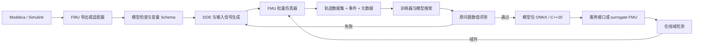

# 总体架构

> 本页原方案保留为数据驱动代理的备选架构。项目主架构已调整为 [[04-架构/源方程IR与可验证求解]]；FMU 流水线只适用于源码不可得或部署兼容场景，验证等级较低。

## 核心模块

### 1. Adapter（降级模式）

接收 FMU，读取 `modelDescription.xml`，建立变量、单位、因果性、可调参数、状态与事件能力清单。Modelica/Simulink 原生文件转换由独立适配器负责。

### 2. Experiment Designer

根据运行域配置生成参数、初值和输入轨迹。支持 Sobol/LHS、约束采样、边界强化与主动学习。

### 3. Simulation Orchestrator

并行运行 FMU，记录求解器、平台、FMU hash、参数、输入、状态、输出、事件和失败原因。数据集需可复现。

### 4. Dataset Contract

建议采用 Parquet/Zarr 加 JSON/YAML manifest：

- `trajectory_id`, `time`, inputs, outputs, optional states；
- parameter/initial-condition table；
- event table；
- units and variable schema；
- provenance: FMU hash、工具版本、容差和随机种子。

### 5. Trainer

统一模型接口：`initialize(context)`、`step(state, input, dt)`、`observe(state)`、`rollout(scenario)`。模型和归一化器一起版本化。

### 6. Numerical Evaluator

读取冻结模型和保留场景，按原问题 residual、轨迹误差、事件与约束生成机器可读报告。
这里描述的是离线数值评测，不要求额外服务或进程。

### 7. Runtime

提供批量和单步推理、状态初始化、域检测、置信度以及原 FMU 回退。最终可把代理重新封装为 Co-Simulation FMU，以便接回现有工程工具。

## 历史技术栈与当前约束

下表是早期数据驱动代理方案的历史选择，不再作为仓库实现方案。当前项目自有前端、训练控制、验证器、runtime、CLI 和测试统一使用 C++20 + CMake/CTest；外部 Tensor artifact 只能通过 ONNX Runtime、TensorRT 等稳定 C/C++ 接口接入，Python 不得成为构建、验证或部署依赖。

| 层 | 第一选择 | 备注 |
|---|---|---|
| FMU | C/C++ FMI runtime + FMI 2.0/3.0 | FMPy/PyFMI 只作为外部研究参考，不进入项目 runtime |
| 数据 | C++ 数据管线 + Arrow/Parquet 等稳定接口 | 依赖必须固定版本并证明必要性 |
| 训练 | C++ CLI + C/C++ Tensor backend | 可交换不可变 ONNX artifact，不引入 Python 运行时 |
| 配置 | YAML/JSON + C++ schema 校验 | 明确运行域和数据契约 |
| 实验 | MLflow 或轻量本地 registry | 首版可先用文件 manifest |
| 部署 | C++20 runtime + ONNX Runtime/TensorRT C/C++ API | 可进一步封装为 surrogate FMU |
