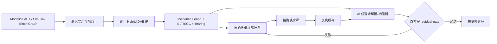

# 源方程 IR 与可验证求解

## 架构修正

以 FMU 为中心会丢失或隐藏原始方程结构，只剩可执行接口；这不利于快速验证 AI 候选解，也迫使训练退化为高维输入空间的轨迹采样。本项目应把编译器中间表示作为主干，FMU 降级为兼容和部署适配器。

## 统一 Hybrid DAE IR

IR 至少保存：

- 连续方程 $F(\dot x,x,z,u,p,t)=0$；
- 离散更新、采样时钟、pre/edge/change 语义；
- zero-crossing/guard 与事件重初始化方程；
- 变量因果角色、单位、维度、名义值和范围；
- 方程—变量 incidence graph；
- 源位置和组件层级，便于解释与局部替换；
- 雅可比/稀疏结构以及可生成的残差函数；
- 原数值求解计划和每个 BLT block 的调用接口。

当前 C++ Hybrid IR v2 已把固定采样时钟表示为 `sample_time` 与 `sample_offset`，并要求 `0 <= sample_offset < sample_time`；v1 读取时默认 offset 0。连续—采样联合调度按 `offset+n*sample_time` 形成边界：零 offset 在连续初始化事件之后执行 tick 0，正 offset 则保持离散初值直到首边界。该表示目前只覆盖单一固定周期控制器，不等同于完整 Modelica clock calculus 或异步多控制器调度。

Modelica 可优先复用 OpenModelica 的 flattening、BackendDAE、alias elimination、index reduction、BLT 与 tearing。Simulink 应从块类型、端口、采样时间、状态、代数环和零交叉构建同一 IR；无法访问模型源码时才退化到 FMU 黑盒模式，并明确降低验证等级。

## AI 的正确插入点

### A. 非线性方程块候选解

对 BLT 中的隐式块

$$R_b(v_b;c_b)=0,$$

其中 $v_b$ 是待求块变量，$c_b$ 是已知上下文。AI 预测 $\hat v_b=N_\theta(c_b)$，随后直接计算原方程残差 $R_b(\hat v_b;c_b)$。

### B. 数值求解器 warm start

不直接接受 AI 输出，而是用其初始化 Newton/Krylov。即使预测不精确，只要减少迭代次数就能获得安全加速，且最终解仍由原求解器收敛准则保证。

### C. Jacobian/预条件器近似

AI 预测 Jacobian、逆 Jacobian作用或预条件器，但每步仍由原 residual 驱动。相比端到端轨迹代理，这种方式更容易验收和回退。

### D. 可证明安全的显式子表达式

只对纯函数、无状态且有明确输入域的昂贵子表达式使用近似；利用区间误差界或 Lipschitz 界决定是否接受。

## Residual Gate

对第 $i$ 个方程使用量纲一致的缩放：

$$r_i=\frac{|F_i(q)|}{a_i+r_i^{rel}s_i},$$

并要求 $\|r\|_\infty\le1$。缩放来自变量 nominal、求解器绝对/相对容差和方程尺度。仅使用未缩放 MSE 会让不同单位和量级的方程不可比较。

Gate 还应检查：

- 不等式、边界、守恒和互补约束；
- 候选解是否落在训练/证明域内；
- Jacobian 条件数或局部收敛证据；
- 多根方程的分支连续性；
- 事件 guard 的符号和定位精度。

## PINN 机制的接入

训练侧按照 [[03-原理/PINN可借鉴机制]]，将原方程 residual 作为无标签训练信号，与少量原求解器标签、物理约束和正确解支约束联合训练。训练用残差函数与运行时 gate 分开生成：前者追求可微和批处理，后者追求与原求解器语义、精度和容差完全一致。

因此，PINN 不替代图中的 residual gate，也不改变 fallback：它只提高候选解通过 gate 的概率，并减少生成标签所需的原求解器调用。

## 分层正确性

| 等级 | 能证明什么 | 证据 |
|---|---|---|
| L0 | AI 输出接近历史样本 | 数据误差，仅作训练诊断 |
| L1 | 当前代数方程块被满足 | 原方程缩放 residual/约束 |
| L2 | 当前积分步满足数值误差要求 | residual + LTE/step rejection |
| L3 | 一段轨迹在声明域内可信 | 事件、稳定性、闭环和全局误差界 |
| L4 | 属性在连续域内成立 | 区间、SMT、可达性或证明证书 |

项目首个可行目标是 L1–L2，而不是用有限轨迹数据声称 L3/L4。

## 方程级 Fallback

fallback 不需要回到整个 FMU：

1. AI 对某个 block 给出候选解；
2. residual gate 失败，或置信域检查失败；
3. 用该候选解作为 warm start 调用原 block solver；
4. 若收敛，继续全局求解计划；
5. 将失败上下文、正确解、Newton 轨迹和 residual 写入反例缓存；
6. 在线模型保持冻结，离线增量训练并重新验证后发布。

这种粒度保留原模型语义，不会因为一个局部困难点而回退整个系统。

## 可借鉴实现

- OpenModelica Compiler：flattening、BackendDAE、BLT、tearing、index reduction 和代码生成；
- ModelingToolkit/Symbolics.jl：符号—数值 IR、结构化简、稀疏 Jacobian 和生成求解函数；
- CasADi：符号图、自动微分、稀疏非线性求解和 codegen；
- SUNDIALS IDA/KINSOL：DAE/非线性方程的 residual 驱动求解与收敛门槛；
- JModelica.org 历史工作：Modelica/Optimica 到符号优化表示的架构经验。
- DeepXDE、NVIDIA Modulus/PhysicsNeMo：PINN residual、约束和自适应采样的工程实现参考。

这些项目提供编译和数值内核，但“按方程块训练 AI 候选求解器 + residual gate + 反例闭环”仍是本项目需要实现的集成层。
