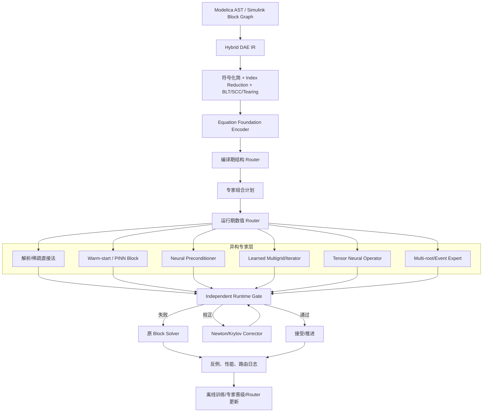

# 综合研究成果技术栈

## 设计目标

项目不选择某一种 AI 方程求解方法作为唯一核心，而是建立一个能够持续吸收新研究成果的 **Equation-MoE 求解平台**。所有方法通过统一方程 IR、专家 ABI、验证协议和证据等级接入，避免形成彼此割裂的实验代码。



## 七层统一技术栈

### S1：源模型与方程编译层

借鉴 OpenModelica、ModelingToolkit、CasADi 和传统 DAE 编译技术：

- 展开 Modelica 连接、继承、数组方程和函数；
- 保留 Simulink block、采样时间、状态和零交叉语义；
- 执行 alias elimination、index reduction、BLT/SCC 和 tearing；
- 生成 residual、Jacobian、JVP/VJP、约束和事件函数；
- 保留源映射、单位、nominal、参数域和模式信息。

这一层是所有 AI 方法共享的事实来源。任何专家都不能绕开它自行解释方程。

### S2：方程基础表征层

借鉴 PDEformer、PROSE-PDE 和 Poseidon，但将目标从“直接输出解”调整为：

- 编码 AST、操作符图、方程—变量二部图和 Jacobian 图；
- 融合单位、物理组件、数值尺度和求解历史；
- 生成跨模型可检索的 equation/block embedding；
- 识别相似方程族，初始化 Router 和专家 adapter；
- 预测可用专家、训练成本、break-even 和风险等级。

基础表征只提供先验和检索，不提供最终正确性。

### S3：两级路由与计划层

- **编译期 Router**：基于结构和专家证据等级进行硬过滤；
- **运行期 Router**：根据 residual、条件数、模式、历史迭代和设备负载生成 Top-k 计划；
- **计划器**：允许组合专家，而非只能选择单个专家；
- **安全约束**：E0/E1 专家不得直接接受，安全关键块只能走可校正路径；
- **成本目标**：优化 `setup + inference + correction + expected fallback` 的端到端时间。

### S4：局部可验证神经求解层

综合 PINN、CEGIS 和 learned warm-start：

- 少量原求解器标签锚定正确根；
- 大量方程 residual 配点降低标签成本；
- 增广拉格朗日/硬参数化编码约束；
- residual 最大化和事件邻域搜索反例；
- 输出候选根、多个分支候选或 Newton 初值；
- 默认先作为 warm-start，证据充足后再晋级为 direct candidate。

适用于中小型平滑非线性 SCC，不负责大型线性内层系统。

### S5：学习增强的经典迭代层

综合 NeuralPCG、GNP、UGrid 和 learned iterator：

- 学习稀疏预条件器、预条件器作用或 Krylov 子空间；
- 学习 multigrid smoother、restriction/prolongation 和 coarse correction；
- 保持原解为固定点，每轮重新计算真实 residual；
- 线性系统由 CG/GMRES，非线性系统由 Newton/KINSOL 外层控制；
- 专家失败时切回 ILU/AMG/经典 smoother，不影响原求解能力。

这是项目最优先的高可信 Tensor 加速层，尤其适合相邻时间步重复出现的 Jacobian 序列。

当前 C++20 实现已覆盖一个可审计的递归多层 learned multigrid 基线：平均 SPD fine operator、固定相邻聚合的逐层 prolongation、Galerkin coarse correction、训练选择的 weighted-Jacobi 对称 smoother，以及 basis residual contraction 证据。它通过统一 Expert ABI 接入 PCG，真实 residual、CEGIS/域门禁和经典 fallback 不变；一般 AMG coarsening 与 learned graph coarsening 仍是后续层级。Apple 设备侧已验证受限 affine 预条件器：Metal 实际 command buffer/kernel，以及 CoreML 计算计划首选 ANE 后的实际 prediction，均先过 CPU FP64 参考门、再过原方程 gate；该证据不外推为 GPU multigrid、通用 NPU 图执行或异构性能结论。

当前线性 Expert ABI 还提供一个受限平台工业后端：Apple 构建通过公开 Accelerate Sparse QR 注册 `accelerate-sparse-qr-cpu-v1`，执行 CSC 转换、行均衡、factor status 检查、确定性数值秩探针和原线性 residual gate。Router 将其放在 Krylov 之后、内置 ordered threshold-pivot 之前；不可用或任一门禁失败时，从原始线性系统继续经典回退。`west0479` 与 `dw1024` 复现仅证明当前 macOS/CPU 集成和已测矩阵，不代表 KLU/UMFPACK/PARDISO/MUMPS、跨平台工业性能或 GPU/NPU 稀疏直接法。

接触/互补当前采用独立强单调线性 LCP 基线：源构造 `complementarity(z,gap)` 只在 gap 可证明为常系数仿射式且矩阵对称部分正定时进入 Direct 候选。Equation Expert 顺序组合 projected Gauss–Seidel、Fischer–Burmeister 半光滑 Newton 和小于等于 20 变量的枚举 active-set terminal fallback；每条路径从原始状态重跑并通过原 gap、primal/dual 不等式与互补乘积 gate。该路径仅面向小型无摩擦静态接触子问题，不外推到摩擦锥、冲击、动态接触 DAE、非单调 NCP 或大型稀疏 LCP。

### S6：摊销神经算子层

综合 FNO、Geo-FNO、GINO 和后续 operator foundation model：

- 对已识别的稳定方程族学习参数/边界/几何到解场或 QoI 的算子；
- 使用规则潜网格、FFT、图到网格映射和 batch tensor 推理；
- 仅在调用量足以摊销数据与训练成本时创建；
- 场输出用离散 residual 和误差估计校验；
- QoI-only 专家只能用于筛选、优化早期阶段或提供初值；
- 未达到项目自身 E3/E4 证据前，不允许承担 `0.01%` direct accept。

### S7：原方程数值验收与离线学习

- `runtime_residual` 由原方程 codegen 生成，不使用训练 loss 或 Router confidence；
- 同时验证 residual、backward/forward error、QoI、约束、分支和事件；
- 记录 direct accept、corrected accept、warm-start benefit 和 full fallback；
- 反例、专家竞赛和设备性能进入统一 experience store；
- 离线更新 Router/专家，并在新的 held-out 数值实验中重新评估；
- 当前求解请求不因在线学习改变候选权重或数值验收合同。

## 方法不是并列堆叠，而是协同链

### 非线性 DAE 方程块

```text
Foundation Encoder 检索相似方程族
  → PINN/监督混合网络给 Newton 初值
  → Newton 产生 Jacobian 线性系统
  → GNP/Neural Multigrid 预条件 Krylov
  → 线性 residual 收敛
  → 非线性 residual 与分支 Gate
  → 失败则经典预条件器/原 Newton
```

当前 C++20 learned DAE wrapper 已覆盖受限 semi-explicit index-1 和 fully implicit first-order 的普通 Backward-Euler 候选步。`SMAVE_DAE_MULTIGRID 3` 新增 residual-family 绑定，全隐式 artifact 还绑定 source hash、joint dimension、步长域、样本、payload hash和可选训练 lineage；Equation Expert 只有在这些契约匹配时才选择 learned multigrid PCG。每轮 Newton 重建当前 joint CSR Jacobian，只有 SPD 与训练矩阵 drift 门禁通过才使用 learned V-cycle；任何 OOD、契约、SPD、drift、Krylov 或线搜索失败都从原始 candidate 重跑经典 IC(0)/ILU(0) CSR Newton，原 residual gate与 dense terminal fallback 保持权威。全隐式初始化、root 定位、原子 `reinit` 后 derivative+algebraic 一致性投影仍不使用 learned 路径。该实现是可运行、可回退的 CPU 学习预条件器基线，不代表工业 AMG、非对称 multilevel DAE、用户 initial-equation 选择、高指数或一般 contact/grazing fully implicit 系统。

高指数当前增加受限 Hessenberg index-2 路径：对 $\dot x=f(x,\lambda),0=g(x)$ 的仿射 state constraint 精确微分一次，显式形成 $g_xf=0$ 和 hidden Jacobian $g_xf_\lambda$ rank gate。初始化执行原约束投影与隐藏乘子求解，Backward-Euler 步联合求原 dynamics/constraint，并在提交前复验隐藏约束；AD KKT 失败从已提交原状态重跑 dense finite-difference KKT。该路径证明一次真实 index reduction，但不代表一般 Pantelides、dummy derivative、index-3 多体、高指数事件或大型稀疏 KKT。

这里 PINN、GNP 和传统 Newton 并非竞争关系，而是分别负责初值、线性内层和最终收敛。

### 大规模重复线性系统

```text
方程图 embedding + Jacobian 漂移估计
  → 复用上一步预条件器
  → GNP/UGrid 专家更新
  → CG/GMRES 到目标 residual
  → 漂移过大则重建 AMG/ILU
```

### 固定方程族的 many-query 场景

```text
调用量/break-even 评估
  → FNO/GINO family expert
  → residual/误差估计
  → 必要时作为 Newton 初值或低保真筛选
  → 高精度候选进入经典校正器
```

神经算子的超大加速比通过“代理 + 校正”进入系统，而不是无条件替代求解器。

## 统一 Expert ABI

所有专家实现同一逻辑契约：

```text
match(block_descriptor) -> capability, evidence_level
prepare(block_ir, domain, device) -> expert_artifact
estimate(context) -> pass_probability, cost, risk
solve(context, tolerance) -> candidate, certificate, telemetry
validate(candidate, runtime_gate) -> decision
update_offline(experience_set) -> new_version
```

`certificate` 可以是 residual 轨迹、contraction 估计、条件数界、verified cell、迭代收敛记录或空值。空证书的专家只能进入候选/初值路径。

## 专家证据与晋级

| 阶段 | 权限 | 必要证据 |
|---|---|---|
| Research | 离线对比 | 能复现实验，不影响运行时 |
| Candidate-only | 只记录候选，不返回结果 | held-out 集报告原方程 gate 结果 |
| Warm-start | 只能初始化原 solver | 不降低收敛率，P99 墙钟有收益 |
| Corrected | 必须经过固定次数/收敛校正 | residual、分支和 QoI 达标 |
| Direct | gate 后可直接接受 | E3/E4、`0.01%` 门槛、近零错误接受 |
| Retired | 不再路由 | 漂移、回归或已有更优专家 |

专家晋级按方程家族、运行域、硬件和容差分别进行，不存在脱离上下文的“全局已验证专家”。

## 综合利用原则

1. 新论文先映射到已有层和 Expert ABI，不为每篇论文建立独立管线；
2. 优先吸收保持 residual/固定点/迭代收敛的方法；
3. 高倍神经算子必须经过调用量和 break-even 准入；
4. foundation model 用于表征和迁移，不越权承担验证；
5. 同一个方程块允许组合多个研究成果形成求解计划；
6. 所有加速最终用同硬件、同精度、端到端墙钟评估；
7. 原方程、原求解器和 fallback 永远是系统组成部分。
