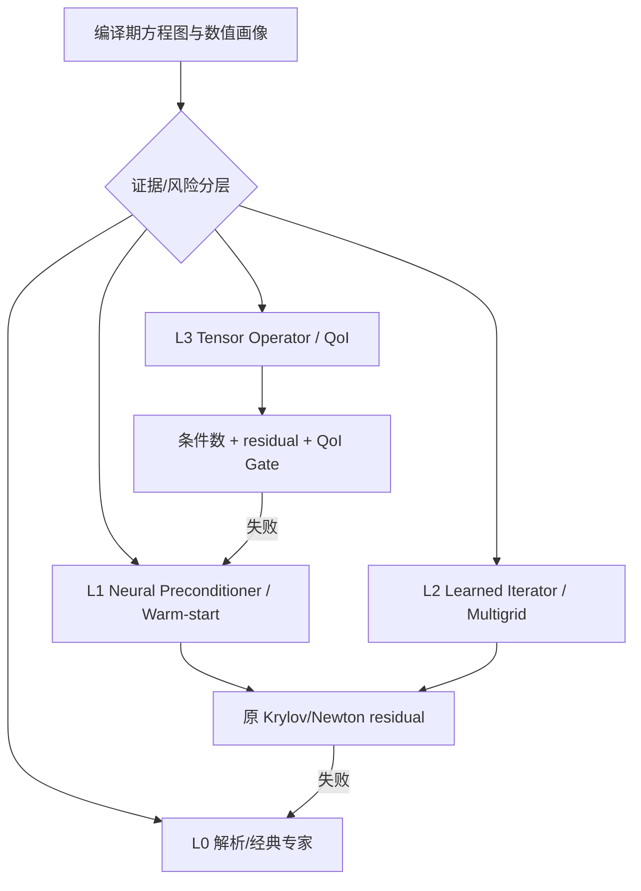

# 论文原理到 Equation-MoE 映射

## 核心结论

高水平论文支持的不是“一个网络取代所有求解器”，而是四种互补专家：

1. **摊销 Operator Expert**：高倍数，低保证，适合固定方程族的多查询；
2. **Learned Iterator/Multigrid Expert**：学习误差传播，保留迭代收敛；
3. **Preconditioner/Warm-start Expert**：最稳健，最终由原 residual 验收；
4. **Foundation Router/Initializer**：跨方程复用表示，降低新专家训练成本。

Equation-MoE 应把专家按证据和风险分层，而不是放在同一个 softmax 中平等竞争。

## 专家层级



### L1：Neural Preconditioner / Warm-start

借鉴 NeuralPCG、GNP 和 Neural-Preconditioned Poisson Solver：

- 输入：稀疏 Jacobian 图、residual、参数、前一时间步解；
- 输出：预条件器作用 $z=P_\theta^{-1}r$、低秩子空间或初值；
- 外层：CG/GMRES/Newton/KINSOL 保持原收敛判据；
- 失败：禁用神经预条件器，切换 ILU/AMG/原配置；
- 优先场景：相邻时间步 Jacobian 拓扑相同、数值缓慢变化的大型 SCC。

这是首个生产专家，目标不是直接接受率，而是 `迭代减少率`、`setup amortization` 和 `端到端墙钟`。

### L2：Learned Iterator / Neural Multigrid

借鉴 ICLR 2019 learned iterator 与 UGrid：

- 保证原方程解仍是迭代固定点；
- 网络学习 smoother、restriction/prolongation 或 coarse correction；
- 每次循环重算真实 residual；
- 用谱半径、能量范数或 contraction 估计选择是否启用；
- Router 对线性/近线性、规则多尺度图优先选择该专家。

对于 Modelica，大型线性 BLT block、离散 PDE 组件以及 Newton 内层线性系统可以使用；非线性块先由 Newton 线性化，再路由内层 Jacobian 系统。

当前仓库已提供 C++20 递归多层基线：场景矩阵决定训练域与平均 fine operator，相邻聚合递归形成各级 prolongation，Galerkin 投影形成各级 coarse operator，最粗层精确求逆；训练在 weighted-Jacobi 候选中最小化全部训练矩阵×basis probe 的最坏 residual contraction。artifact 只有在 contraction `<1`、各层 SPD/形状门禁通过后才能作为 PCG preconditioner 注册，外层真实 residual、CEGIS、OOD gate 和经典 fallback 保持权威。这是论文原理到 Expert ABI 的可运行映射，不是完整 learned AMG、图 coarsening 或 GPU 实现。

对于 smooth nonlinear algebraic block，当前实现还可在原 solver 接受解点训练 Jacobian-mode artifact；Runtime 每个 Newton 迭代重新检查当前中心差分 Jacobian 的近对称与 SPD 条件，再用相同 V-cycle 驱动 PCG。非 SPD 或 Krylov/线搜索/gate 失败立即退出该专家，原 dense Newton 仍是 terminal fallback。这实现了“非线性块先线性化，再路由内层系统”的受限闭环，但不覆盖 DAE 或一般非对称 Jacobian。

### L3：Tensor Operator / QoI Expert

借鉴 FNO、Geo-FNO 和 GINO：

- 对稳定方程族训练从参数/边界/几何到场或 QoI 的摊销映射；
- 通过规则潜网格、FFT 或图到网格映射提升 Tensor 吞吐；
- 只在 many-query、训练成本可摊销且验证域明确时启用；
- 完整场输出必须经过离散 residual 和误差估计；
- QoI-only 输出不能冒充完整方程解，只能服务筛选、优化早期阶段或提供初值。

`0.01%` 门槛下，当前默认不允许 L3 直接接受，除非项目自己的验证证明该方程家族满足 E3/E4。

### Foundation Router / Initializer

借鉴 PDEformer、PROSE 和 Poseidon：

- 把方程 AST/计算图、单位、稀疏结构和数值上下文编码成 embedding；
- 从专家库检索结构相似方程族；
- 初始化 Router、预条件器或 Operator Expert；
- 通过 instance adapter/小规模微调适配新方程；
- 不直接承担最终正确性。

## 两级 Router 新增特征

### 编译期 Router

除已有结构特征外，加入论文启发的特征：

- PDE/DAE 操作符 token 和表达式树 embedding；
- Jacobian 图的谱特征、强连接与多尺度结构；
- 是否存在规则/近规则网格，可否使用 FFT/FNO；
- AMG setup 成本预测与矩阵序列复用潜力；
- QoI-only 与 full-state 任务标识；
- 预计调用次数和训练 break-even 次数。

### 运行期 Router

- 当前相对 residual 和 residual 下降率；
- 最近 $k$ 步 Krylov/Newton 迭代数；
- 预条件器 setup 与 apply 时间；
- Jacobian 漂移量 $\|J_t-J_{t-1}\|$ 的低成本估计；
- learned iterator 的 contraction 估计；
- Operator Expert 的域距离和误差估计；
- 当前 batch 是否足以抵消 Tensor 调度成本。

## 专家级联顺序

对大型非线性 SCC，默认计划为：

```text
Foundation embedding 检索相似专家
  → AI warm-start
  → Newton linearization
  → Neural Preconditioner / Neural Multigrid
  → Krylov residual 验收
  → Newton residual 验收
  → 失败时 ILU/AMG/原 Newton 路径
```

若编译期确认属于已验证的固定方程族且调用次数足够多，可在最前加入 Tensor Operator 候选，但失败仍进入上述路径。

## Router 的训练标签

每个上下文对所有安全可用专家执行竞赛，记录：

```text
expert_id
setup_time
apply_time
iterations
final_residual
estimated_solution_error
memory
device
fallback_reason
```

Router 标签是“满足精度和风险约束的最低端到端成本专家”，而不是最低训练 loss。对错误接受施加不可接受惩罚；对仅仅较慢的路由施加较小惩罚。

## 项目实施优先级

1. **P0：经典基线与测量协议**——KLU/UMFPACK、KINSOL、GMRES、ILU、AMG；
2. **P1：前一步解 + 小网络 warm-start**——低风险，快速验证价值；
3. **P2：GNP/NeuralPCG 风格预条件器**——针对重复 Jacobian 序列；
4. **P3：UGrid 风格 learned multigrid**——仅用于可识别的多尺度线性块；
5. **P4：方程图 foundation embedding**——提升跨模型专家复用；
6. **P5：FNO/GINO Operator Expert**——只为高调用量且容差适合的方程族建立。

这一顺序与论文证据强度一致：先获得可验证的小到中等加速，再追求分布受限的超大摊销加速。

## 必做实验

- 同 CPU/GPU、同 residual/解误差的端到端比较；
- 分离 assembly、setup、AI inference、iteration 和 gate 时间；
- 同时报告 cold-start、warm-cache、batch 和单实例；
- 计算训练 break-even：$N_{BE}=T_{train}/(T_{base}-T_{AI})$；
- 在 `10^-4` QoI 误差门槛下重新测量，而不是继承论文百分比误差数字；
- 对 OOD、事件邻域、奇异 Jacobian 和专家误路由执行压力测试；
- 分别报告 direct accept、corrected accept、warm-start benefit 和 full fallback。
