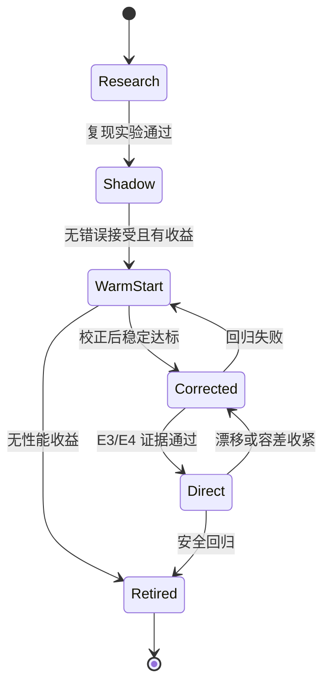

# 专家生命周期与持续学习

## 目标

让项目能够持续吸收新论文、新模型和新硬件，而不牺牲既有模型的正确性。更新单位是版本化专家、Router 和验证域，不是在线原地修改网络。

## 生命周期

## Experience Store

每次 block 调用记录：

- equation fingerprint、IR/version、专家/version；
- 上下文、模式、步长、容差和设备；
- Router Top-k 与估计成本/风险；
- setup、inference、gate、correction、fallback 时间；
- residual 历史、迭代数、最终解和分支；
- 是否 OOD、失败原因和原 solver 配置。

敏感模型可只保存无量纲统计、embedding 和匿名稀疏图，不强制集中上传原方程。

## 专家竞赛

离线对代表性上下文运行所有结构兼容专家，选择满足约束的最低成本路径：

$$
\min_e T_e \quad
\text{s.t.}\quad
E_{QoI}\le10^{-4},\;
R_e\le\tau_R,\;
P_{wrong}\le\epsilon.
$$

竞赛必须包括经典基线，并分 cold/warm、CPU/GPU、单实例/batch。Router 学习竞赛结果，而不是从论文标签猜测专家。

## 新研究成果接入流程

1. **归类**：属于表征、Router、warm-start、预条件器、迭代器、算子或验证；
2. **封装**：实现统一 Expert ABI；
3. **复现**：在论文原 benchmark 上复现精度和墙钟；
4. **迁移**：在 Modelica/Simulink 方程块 benchmark 上比较；
5. **Shadow**：并行运行，所有结果仍采用原 solver；
6. **晋级**：按证据等级开放 warm-start/corrected/direct 权限；
7. **监控**：检测 drift、fallback、P99 延迟和错误接受；
8. **回滚**：Router registry 原子切换到上一验证版本。

## 防止专家爆炸

- 相同结构家族共享 backbone，仅保留小型 adapter；
- 定期蒸馏性能相近的专家；
- 用 Router 负载和收益淘汰长期无调用专家；
- 相似专家必须通过增量收益门槛才能入库；
- 设备端只加载高频专家，其余按需加载或只在 CPU 运行；
- 保持经典专家常驻，避免模型缓存失效造成不可用。

## 发布门槛

- Shadow 阶段错误接受必须为零，因为结果不应被采用；
- Warm-start 不得降低原 solver 的收敛成功率；
- Corrected 必须达到与原 solver 相同 residual/约束标准；
- Direct 必须在声明域达到 QoI `0.01%`、Top-k 成功率 `>95%` 和近零错误接受；
- 任一 P99 延迟或 fallback 成本回归超过阈值即自动降级；
- Router 与专家必须作为一个兼容版本集合发布。

